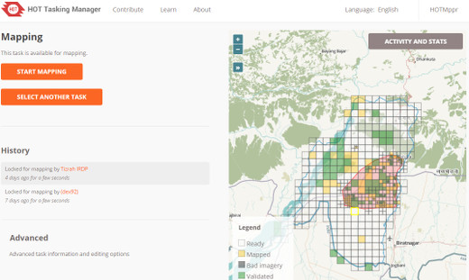

# HOT Tasking Manager

The Tasking Manager is the tool for any organised OpenStreetMap editing and coordination.

The Tasking Manager is Free and Open Source Software, feel free to use the code and set up your own instance. It has been initially designed and built by and for the [Humanitarian OpenStreetMap Team](https://www.hotosm.org/), and is nowadays used by many other communities and organizations. The purpose of the tool is to divide up a mapping job into smaller tasks that can be completed rapidly. It shows which areas need to be mapped and which areas need the mapping validated. You can see the tool in action: log into the widely used [HOT Tasking Manager](https://tasks.hotosm.org/) and start mapping.

[](./screenshot.jpg)

## Installation

**Get the code**

`git clone https://github.com/hotosm/tasking-manager.git`.

**Configure**

* Copy the example configuration file to start your own configuration: `cp example.env tasking-manager.env`.
* Adjust the `tasking-manager.env` configuration file to fit your configuration.

**Connect with OpenStreetMap**

The Tasking Manager uses OpenStreetMap accounts for users to login. 

In order to configure this connection you have to go to `https://www.openstreetmap.org/user/<Your_OSM_UserName>/oauth_clients/new` and fill in the form:


Afterwards copy the consumer key and secret from OpenStreetMap into your configuration file `tasking-manager.env`, and set the two variables: `TM_CONSUMER_KEY` and `TM_CONSUMER_SECRET`.

**Run the Tasking Manager**

The easiest way to run the Tasking Manager requires [Docker](https://docs.docker.com/get-started/) and [Docker Compose](https://docs.docker.com/compose/) to be installed on your system.  Afterwards you'll just need:

* One command to get everything together and start the Tasking Manager: `docker-compose up -d`
* Visit with your browser `http://127.0.0.1:5000`
* Incase the browser shows an Error 404, execute the following code after running the above docker-compose command:-
  ' sudo docker exec -it tasking-manager_app_1 /bin/bash -c 'cd client && npm install && gulp build' '
* Again visit `http://127.0.0.1:5000` with your browser.

For stopping this command do the job: `docker-compose stop`
And you can check the logs with `docker-compose logs -f`

Alternatively you can install a [development setup](./README.md#development-setup).

## Get involved!

* Come, attend the [working group meetings](https://github.com/hotosm/tasking-manager/wiki/TM-Working-Group-Meeting-Details)
* Review our [roadmap](https://github.com/hotosm/tasking-manager/projects/1)
* Review our [Contributor guidelines](https://github.com/hotosm/tasking-manager/blob/develop/CONTRIBUTING.md)
* Feel free to submit pull requests to this repository!


## Development setup

### Architecture

The Tasking Manager is composed of two parts:

* **Client**: A front-end user interface built using AngularJS.
* **Server**: A back-end database and API built using python3.

The two parts can be developed independently of each other.

### Client

The client is the front-end user interface of the Tasking Manager. If you're interested in developing the client alone, you can build it using `gulp`, without having to worry about the server set up. You can point the client at a non-local API url (e.g. a staging environment), by changing the environment in `client/taskingmanager.config.json`. All the files pertaining to the client are available in the `client/` directory.

**Dependencies**

The following dependencies must be available _globally_ on your system:
* Download and install [NodeJS LTS v6+](https://nodejs.org/en/) and [NPM](https://www.npmjs.com/)
* Install [Gulp](http://gulpjs.com/).
  * `npm install gulp -g`
* Install [Karma](https://karma-runner.github.io/1.0/index.html)
  * `npm install -g karma karma-jasmine karma-chrome-launcher`

**Build**

Once you have the above dependencies, install and run the client dependencies using `npm` and `gulp`
```
cd client
npm install
gulp build
```

**Run**

Once you've built the dependencies, run the client using
```
cd client
gulp run
```

**Tests**

The client has a suite of [Jasmine](https://jasmine.github.io/) Unit Tests. These can be run using [Karma](https://karma-runner.github.io/1.0/index.html) as follows

```
 cd client
 karma start ../tests/client/karma.conf.js
```

### Server

The backend server is made up of a postgres database and an associated API that calls various end points to create tasks, manage task state, and produce analytics.

**Dependencies**

* [Python 3.6+](https://www.python.org/downloads/)
  * Note: The project does not work with Python 2.x. You **will** need Python 3.6+
* [postgreSQL](https://www.postgresql.org/download/) with [postGIS](https://postgis.net/install/)
* [pip](https://pip.pypa.io/en/stable/installing/)

**Configuration**

* Copy the example configuration file to start your own configuration: `cp example.env tasking-manager.env`.
* Adjust the `tasking-manager.env` configuration file to fit your configuration.
* Make sure that the following variables are set correctly in the `tasking-manager.env` configuration file:
  - `TM_APP_BASE_URL`=web-server-endpoint
  - `POSTGRES_DB`=tasking-manager-database-name
  - `POSTGRES_USER`=database-user-name
  - `POSTGRES_PASSWORD`=database-user-password
  - `TM_SECRET`=define-freely-any-number-and-letter-combination
  - `TM_CONSUMER_KEY`=oauth-consumer-key-from-openstreetmap
  - `TM_CONSUMER_SECRET`=oauth-consumer-secret-key-from-openstreetmap

**Build**

* Create a Python Virtual Environment, using Python 3.6+:
    * ```python3 -m venv ./venv```
* Activate your virtual environment and install dependencies:
    * Linux/Mac:
        * ```. ./venv/bin/activate```
        * ```pip install -r requirements.txt```
    * Windows (use installer because of precompiled libs):
        * ```.\venv\scripts\activate```
        * ```.\devops\win\install.bat```

**Tests**

The project includes a suite of Unit and Integration tests that you should run after any changes

```
python -m unittest discover tests/server
```

### Database

**Create a fresh database**

We use [Flask-Migrate](https://flask-migrate.readthedocs.io/en/latest/) to create the database from the migrations directory. If you can't access an existing DB refer to DevOps page to [set up a local DB in Docker](https://github.com/hotosm/tasking-manager/wiki/Dev-Ops#creating-a-local-postgis-database-with-docker) create the database as follows

```
python3 manage.py db upgrade
```

**Migrating your data from TM2**

You can use [this script](devops/tm2-pg-migration/migrationscripts.sql) to migrate your data from the prior tasking manager version (v2) to the current one. Please see [this wiki page](https://github.com/hotosm/tasking-manager/wiki/Migrating-from-TM2-to-TM3) for important information about this process.

**Set permissions to create a task**

To be able to create a task and have full permissions as an admin inside TM, login to the TM with your OSM account to populate your user information in the database, then execute the following command on your terminal (with the OS user that is the owner of the database):

`psql -d <your_database> -c "UPDATE users set role = 1 where username = '<your_osm_username>'"`

### API

If you plan to only work on the API you only have to build the server architecture. Install the server dependencies, and run these commands:

* Run the server:
    * ``` python manage.py runserver -d -r```
* Point your browser to:
    * [http://localhost:5000/api-docs](http://localhost:5000/api-docs)

## DevOps
If you encounter any issues while setting up a dev environment, please visit our [FAQ ❓ page](https://github.com/hotosm/tasking-manager/wiki/Dev-Environment-FAQ) to find possible solutions.

## Localisation

Go to the [Transifex repository](https://www.transifex.com/hotosm/tasking-manager-3/dashboard/) to translate the tasking Manager to your language.

## Troubleshooting

We keep track of issues we troubleshoot during the installation at https://github.com/hotosm/tasking-manager/wiki/Dev-Environment-FAQ. Please feel free to extend this document with additional issues you find.

## Wiki

In addition to this README, you might want to check the [Tasking Manager Wiki](https://github.com/hotosm/tasking-manager/wiki)
