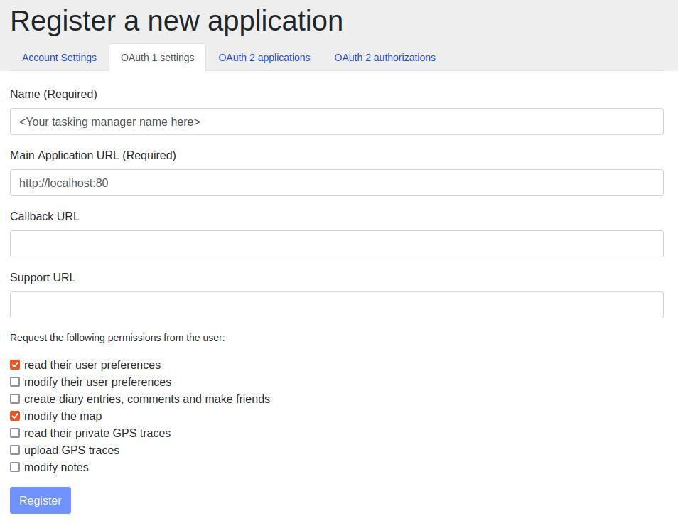

# Tasking Manager

The Tasking Manager is the tool for any organised OpenStreetMap editing and coordination.

The Tasking Manager is Free and Open Source Software, feel free to use the code and set up your own instance. It has been initially designed and built by and for the [Humanitarian OpenStreetMap Team](https://www.hotosm.org/), and is nowadays used by many other communities and organizations. The purpose of the tool is to divide up a mapping job into smaller tasks that can be completed rapidly. It shows which areas need to be mapped and which areas need the mapping validated. You can see the tool in action: log into the widely used [HOT Tasking Manager](https://tasks.hotosm.org/) and start mapping. For information on how to use the Tasking Manager please have a look on the Tasking Manager [user manuals on LearnOSM](https://learnosm.org/en/coordination/tasking-manager3/).

## Installation

**Get the code**

`git clone https://github.com/hotosm/tasking-manager.git`.

**Configure**

* Copy the example configuration file to start your own configuration: `cp example.env tasking-manager.env`.
* Adjust the `tasking-manager.env` configuration file to fit your configuration.

**Connect with OpenStreetMap**

The Tasking Manager uses OpenStreetMap accounts for users to login. 

In order to configure this connection you have to go to `https://www.openstreetmap.org/user/<Your_OSM_UserName>/oauth_clients/new` and fill in the form:

Afterwards copy the consumer key and secret from OpenStreetMap into your configuration file `tasking-manager.env`, and set the two variables: `TM_CONSUMER_KEY` and `TM_CONSUMER_SECRET`.

**Run the Tasking Manager**

The **easiest way** to run the Tasking Manager requires [Docker](https://docs.docker.com/get-started/) and [Docker Compose](https://docs.docker.com/compose/) to be installed on your system.  Afterwards you'll just need:

* One command to get everything together and start the Tasking Manager: `docker-compose up -d`
* Visit with your browser `http://127.0.0.1:5000`

For stopping this command do the job: `docker-compose stop`
And you can check the logs with `docker-compose logs -f`

**Alternatively** you can review how to install a [development setup](./docs/setup-development.md).

## Get involved!

* Review our [Contributor guidelines](./docs/contributing.md)
* Join our [working groups](./docs/working-groups.md)
* And help us to [translate the TM](./docs/contributing-translation.md)
* Make sure you are aware of our [Code of Conduct](./docs/code_of_conduct.md)

## Developers

* See how you can [customize your instance of the TM](./docs/customize.md)
* Learn how to [setup the TM for development](./docs/setup-development.md)
* Setup a [live TM](./docs/setup-live.md)
* Feel free to submit [pull requests](https://github.com/hotosm/tasking-manager/pulls)!
* Need an upgrade? Check out the [Migration coming from TM2](./docs/migration-from-tm2.md)
