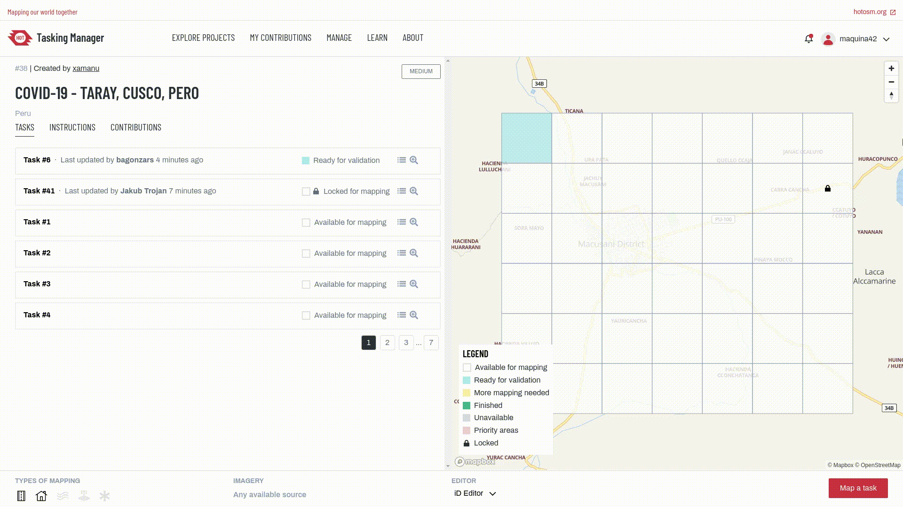

# Tasking Manager

The most popular tool for teams to coordinate mapping on OpenStreetMap.

With this web application an area of interest can be defined and divided up into smaller tasks that can be completed rapidly. It shows which areas need to be mapped and which areas need a review for quality assurance. You can see the tool in action: log into the widely used [HOT Tasking Manager](https://tasks.hotosm.org/) and start mapping.

This is Free and Open Source Software. You are welcome to use the code and set up your own instance. The Tasking Manager has been initially designed and built by and for the [Humanitarian OpenStreetMap Team](https://www.hotosm.org/), and is nowadays used by many communities and organizations.

## Get involved!

* Get familiar with our [contributor guidelines](./docs/contributing.md)
* Join the [working groups](./docs/working-groups.md)
* Help us to [translate the user interface](./docs/contributing-translation.md)

## Developers

* [Install TM with Docker](./docs/setup-docker.md)
* [Setup the TM for development](./docs/setup-development.md)
* [Learn about migrations between major versions](./docs/migration.md)
* Help us and submit [pull requests](https://github.com/hotosm/tasking-manager/pulls)
