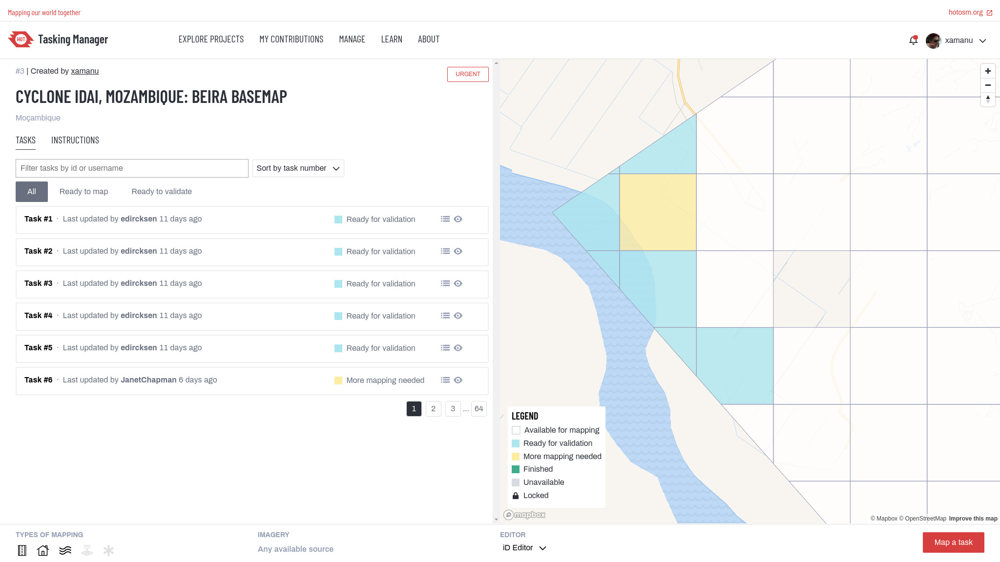

# Tasking Manager

The tool for coordination of volunteers and organization of groups to map on OpenStreetMap

With this tool an area of interest can be defined and divided up into smaller tasks that can be completed rapidly. It shows which areas need to be mapped and which areas need a review for quality assurance. You can see the tool in action: log into the widely used [HOT Tasking Manager](https://tasks.hotosm.org/) and start mapping.

This is Free and Open Source Software. You are welcome to use the code and set up your own instance. The Tasking Manager has been initially designed and built by and for the [Humanitarian OpenStreetMap Team](https://www.hotosm.org/), and is nowadays used by many communities and organizations.

## Get involved!

* Review our [Contributor guidelines](./docs/contributing.md)
* Join our [working groups](./docs/working-groups.md)
* And help us to [translate the TM](./docs/contributing-translation.md)
* Make sure you are aware of our [Code of Conduct](./docs/code_of_conduct.md)

## Developers

* Easy [install the TM with Docker](./docs/setup-development.md)
* See how you can [customize your instance of the TM](./docs/customize.md)
* Learn how to [setup the TM for development](./docs/setup-development.md)
* Help us and submit [pull requests](https://github.com/hotosm/tasking-manager/pulls)
* Setup a [live TM](./docs/setup-live.md)
* Need an upgrade? Check out the [Migration coming from TM2](./docs/migration-from-tm2.md)
