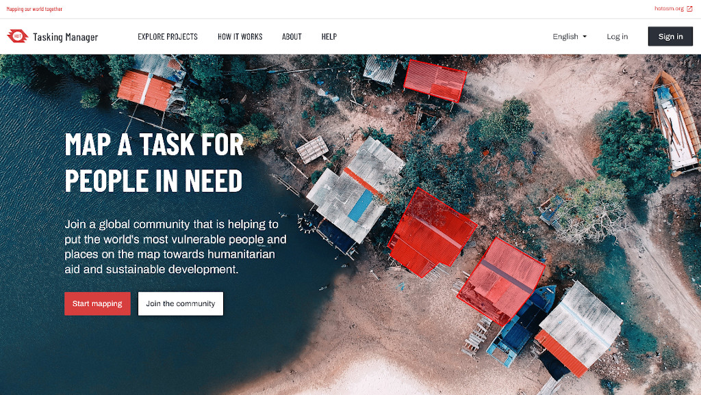

# Tasking Manager

The most popular tool for teams to coordinate mapping on OpenStreetMap. With this web application, an area of interest can be defined and divided up into smaller tasks that can be completed rapidly. It shows which areas need to be mapped and which areas need a review for quality assurance. You can see the tool in action: log into the widely used [HOT Tasking Manager](https://tasks.hotosm.org/) and start mapping.

This is Free and Open Source Software. You are welcome to use the code and set up your own instance. The Tasking Manager has been initially designed and built by and for the [Humanitarian OpenStreetMap Team](https://www.hotosm.org/), and is nowadays used by many communities and organizations.

## Get involved!

* Start by reading our [Code of conduct](docs/developers/code_of_conduct.md)
* Get familiar with our [contributor guidelines](docs/developers/contributing.md) explaining the different ways in which you can support this project! We need your help!
* Join the Tasking Manager Collective Meet up - an opportunity to meet other Tasking Manager contributors. The meet ups take place on the second Wednesday of the month at 9:00 or 15:00UTC! Register to receive a calendar invite: https://bit.ly/3s6ntmV or join directly via this link: https://meet.jit.si/TaskingManagerCollectiveMeetUp
* Read the monthly update blogs on [OSM Discourse](https://community.openstreetmap.org/c/general/38/all).

## Product Roadmap

✅ Completed: Finished, available on [production instance](https://tasks.hotosm.org)

🔄 In Progress: Task or milestone is actively being worked on

📅 Planned: Task or milestone is scheduled for a future date

Status | Feature | Release
-------|---------|---------
✅ | Up-to-date OSM Statistics: Integrated with [ohsome Now](https://stats.now.ohsome.org/) for real-time data insights.| Released in [v4.6.2](https://github.com/hotosm/tasking-manager/releases/tag/v4.6.2).

### 2024

Status | Feature | Release
-------|---------|---------
✅ | Downloadable OSM Exports: Export data directly from each project. | Available in[ v4.7.0](https://github.com/hotosm/tasking-manager/releases/tag/v4.7.0).
✅ | Rapid Editor Upgrade: Enhanced mapping experience with the latest rapid editor updates.| Last updated in [v4.8.2](https://github.com/hotosm/tasking-manager/releases/tag/v4.8.2)
✅ | Public-Facing Partner Pages: Create and display dedicated pages for partners running remote mapathons.| [v4.8.2](https://github.com/hotosm/tasking-manager/releases/tag/v4.8.2)
✅ | Downloadable Project List View: Allow users to explore projects via a downloadable list. [View issue](https://github.com/hotosm/tasking-manager/issues/3394).| [v4.8.2](https://github.com/hotosm/tasking-manager/releases/tag/v4.8.2)
✅ | MapSwipe Stats Integration: Display MapSwipe statistics on Partner Pages.|[v4.8.2](https://github.com/hotosm/tasking-manager/releases/tag/v4.8.2)

### 2025

Status | Feature | Release
-------|---------|---------
✅ | FastAPI Migration: Improve performance and scalability of Tasking Manager to handle large scale validation and mapping efforts.| [v5 launch 🎉](https://github.com/hotosm/tasking-manager/releases/tag/v5.0.0)
✅ | iD Editor Latest Features: Integrate the newest features of the iD editor.|[v5.0.5](https://github.com/hotosm/tasking-manager/releases/tag/v5.0.5)
✅ | Super Mapper: Redefine Mapper Level Milestones | [v5.2.0](https://github.com/hotosm/tasking-manager/releases/tag/v5.2.0)
✅ | Ability to unlink projects and subsequent team deletion | [v5.3.1](https://github.com/hotosm/tasking-manager/releases/tag/v5.3.1)
✅ | User account deletion (self-service + admin initiated) | [v5.4.0](https://github.com/hotosm/tasking-manager/releases/tag/v5.4.0)

### 2026

Status | Feature | Release
-------|---------|---------
✅ | Markdown support in Project Q&A | [v5.4.1](https://github.com/hotosm/tasking-manager/releases/tag/v5.4.1)
✅ | Improved panel arrangement in task contribution section | [v5.4.1](https://github.com/hotosm/tasking-manager/releases/tag/v5.4.1)
✅ | OSM Practice Projects (sandbox): Enable users to engage in OSM practice projects within Tasking Manager workflow. |[v5.5](https://github.com/hotosm/tasking-manager/releases/tag/v5.5)
✅ | Complete migration to MapLibre libraries | [v5.5](https://github.com/hotosm/tasking-manager/releases/tag/v5.5)
✅ | [Digital Public Goods](https://www.digitalpublicgoods.net/registry) badge display | [v5.5](https://github.com/hotosm/tasking-manager/releases/tag/v5.5)
✅ | Filter by imagery type using API | [v5.5](https://github.com/hotosm/tasking-manager/releases/tag/v5.5)
✅ | Backend support for messaging all Campaign Contributors | [v5.5](https://github.com/hotosm/tasking-manager/releases/tag/v5.5)
🔄 | Allow data downloads for sandbox projects through frontend |
🔄 | Custom data reference layer for sandbox projects |
🔄 | Choropleth layer to highlight most invalidated tasks |
🔄 | Dependency & Framework health check |
🔄 | Additional imagery filter under explore projects section |
📅 | Expanding Project Types beyond basemap features
📅 | AI Integration: task assignment, difficulty estimation, and validation
📅 | External tools Integration: MapSwipe, uMap, Maproulette
📅 | Latest Translations Update: Keep all content current with the latest translations.
📅 | Improved Project Sorting & Filtering: Enhance the user experience with better sorting and filtering options.
📅 | UI/UX Enhancements: Continuous improvements to the user interface and experience.

## Developers

* [Understand the code](./docs/developers/understanding-the-code.md)
* [Setup the TM for development](./docs/developers/development-setup.md)
* [Learn about versions and releases](./docs/developers/versions-and-releases.md)
* Help us and submit [pull requests](https://github.com/hotosm/tasking-manager/pulls)

## Instances
* [HOT Tasking Manager (production)](https://tasks.hotosm.org)
* [HOT Tasking Manager (staging)](https://tasks-stage.hotosm.org)
* [TeachOSM](https://tasks.teachosm.org/)
* [OpenStreetMap Indonesia](https://tasks-indonesia.hotosm.org/)
* [OpenStreetMap US](https://tasks.openstreetmap.us/)
* [Map My Kerala](https://mapmykerala.in/)
* [OpenHistoricalMap](https://tasks.openhistoricalmap.org)
* [Oceania Tasking Manager](https://tasks.smartcitiestransport.com/)
