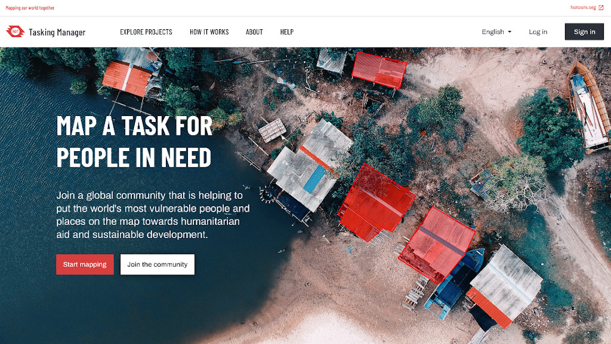

# Tasking Manager

La herramienta más popular para que los equipos coordinen el mapeo en
OpenStreetMap. Con esta aplicación web, se puede definir un área de interés
y dividirla en tareas más pequeñas que pueden completarse rápidamente.
Muestra qué áreas necesitan ser mapeadas y qué áreas requieren una revisión
para el aseguramiento de la calidad. 

Este es un software libre y de código abierto, diseñado y construido inicialmente por y para el [Humanitarian OpenStreetMap Team](https://www.hotosm.org/),
y hoy en día es utilizado por muchas comunidades y organizaciones.