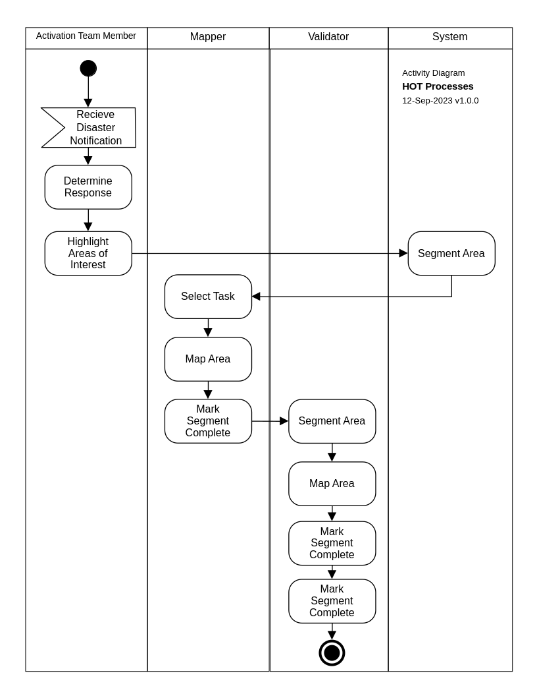
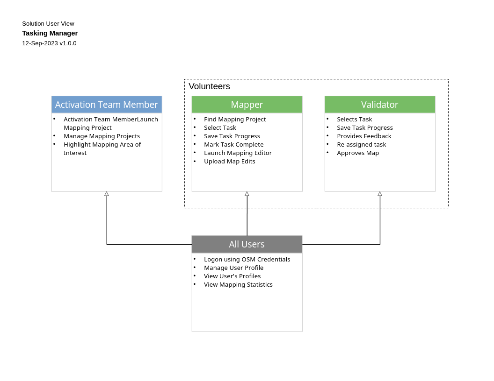
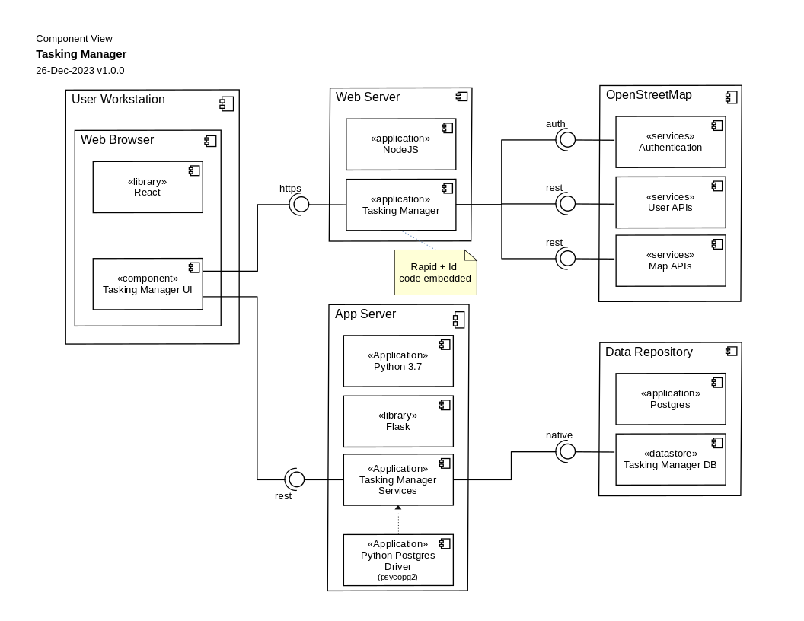
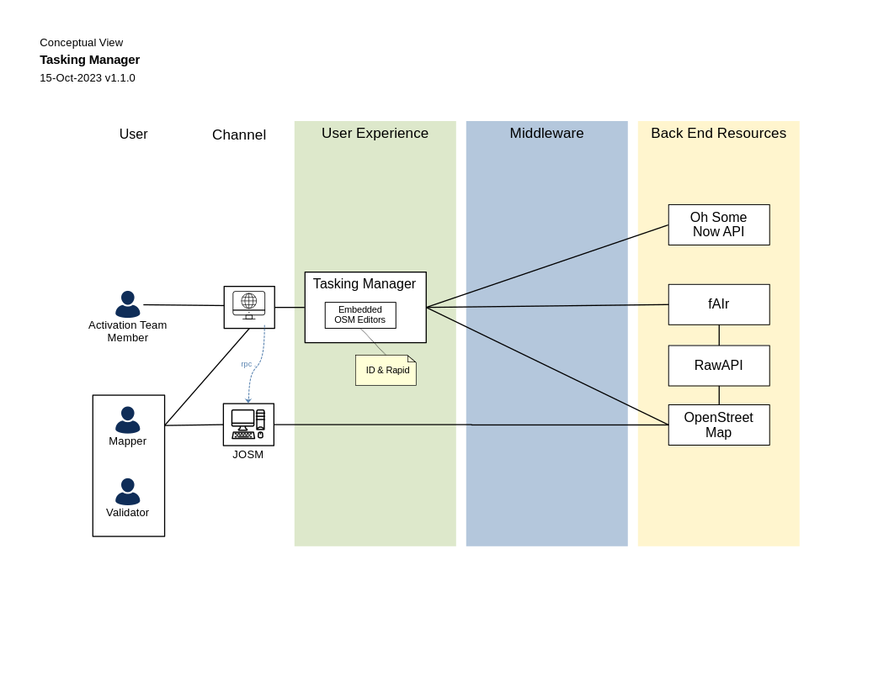
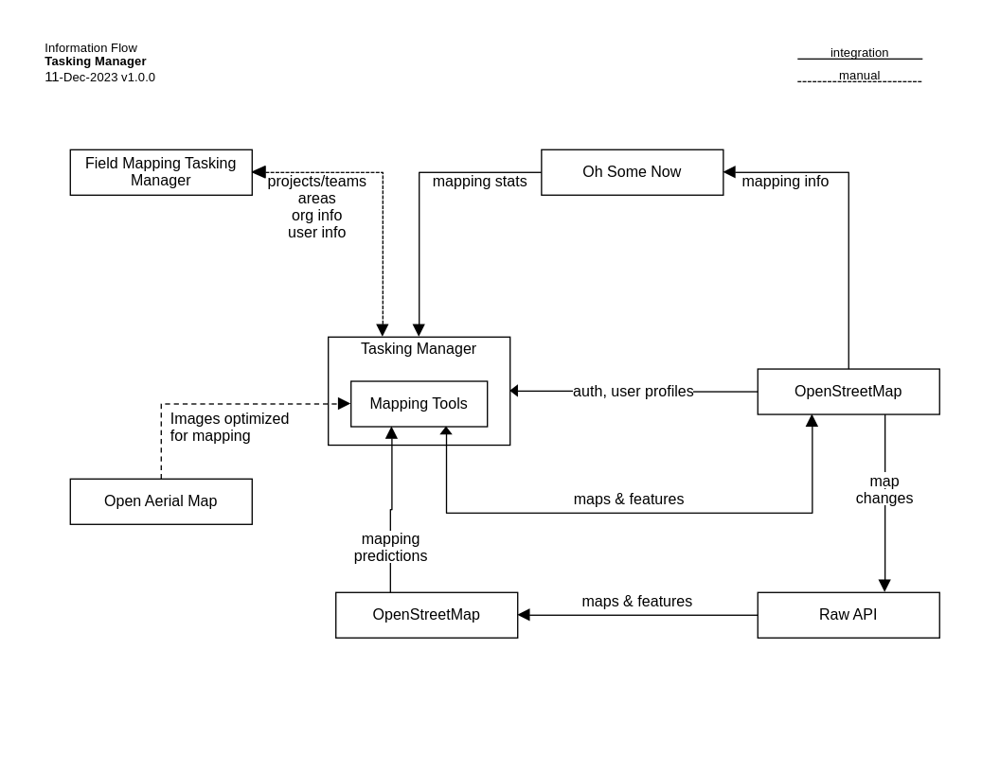

# Tasking Manager Dataflow

## Activity

The Tasking Manager has several user data flows, as there are
differences between a project manager, a mapper, and a validator as
seen in this diagram.

<a href="images/activity.png">
{ width=30%,height:30px }</a>

Initially most Tasking Manager projects start with a disaster
notification. The activation team discusses the notification, and if a
response is needed creates a project. The project is an Area Of
Interest (AOI) as a polygon, and a description and instructions. Then
the AOI is split into tasks.

Then when the project is announced, mappers select a task, and map the
desired features for the project. Once the complete a task, it's
marked as mapped, and then the mapper can select another task, and so
on.

Then the validator reviews all the tasks marked as mapped. There is
more information on the [Validation process](validation.md) at this
link.

# Solution User

<a href="https://raw.githubusercontent.com/hotosm/tasking-manager/develop/docs/images/solution-user.png">
{ width=30%,height:30px }</a>

## Component

The Tasking Manager has multiple components. WHat the user sees is the
REACT based frontend in their browser.
<a href="https://raw.githubusercontent.com/hotosm/tasking-manager/develop/docs/images/component.png">
{ width=40%,height:30px }</a>

The backend for the Tasking Mamnager is written using Flask, which is
in python. This supplies the REST API, which the frontend uses. This
API is also open to other projects.

The data of course is OpenStreetMap, which is stored in a postgres
database.

## Conceptual

The Tasking Manager uses other projects for some of it's data needs of
the backend. This includes Oshome for mapping statistics, the HOT raw
data API for data extracts, and OpenStreetMap of course.

<a href="https://raw.githubusercontent.com/hotosm/tasking-manager/develop/docs/images/conceptual.png">
{ width=30%,height:30px }</a>

# Information Flow

This diagram shows the other projects that the Tasking Manager
exchanges informstion with. OpenStreetNap(OSM) of course supplies
data, and data from Tasking Manager projects goes into
OSM. OpenAerialMap may be used as a source of imagery. Also projects
may be transfered thh the Field Mapping Tasking Manager(FMTM).

<a href="https://raw.githubusercontent.com/hotosm/tasking-manager/develop/docs/images/information_flow.png">
{ width=30%,height:30px }</a>
