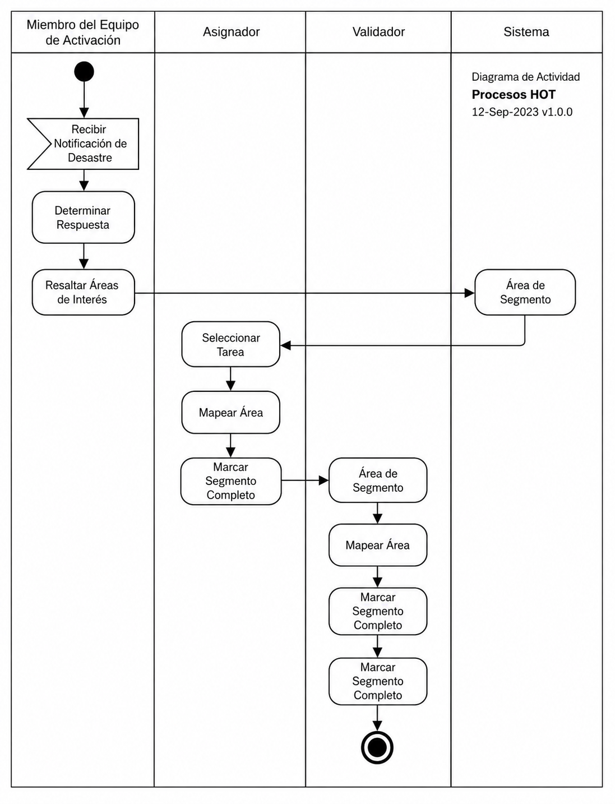
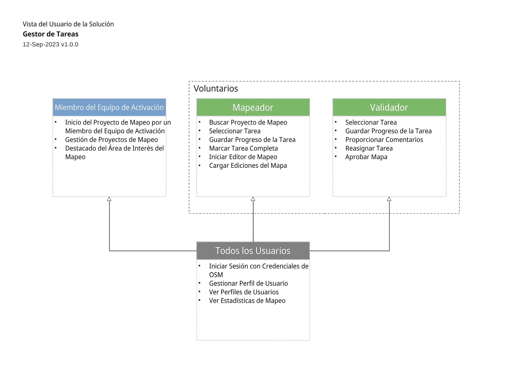
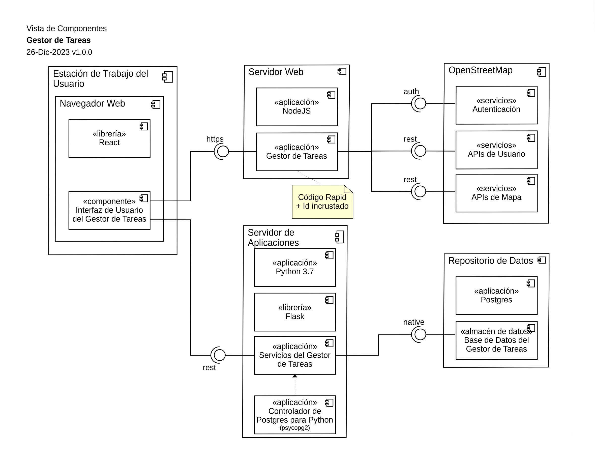
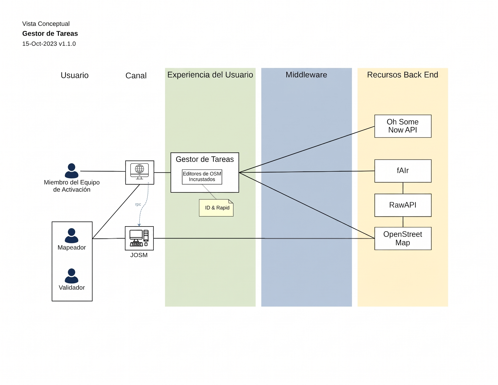
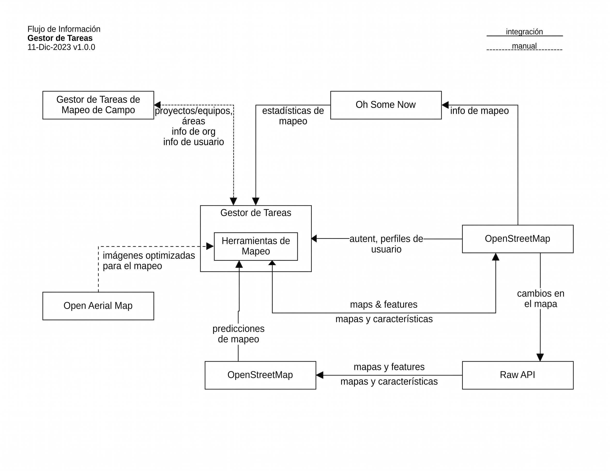

# Flujo de Datos del Tasking Manager

## Actividad

El Tasking Manager tiene varios flujos de datos de usuario, ya que existen
diferencias entre un gerente de proyecto, un mapeador y un validador, como
se ve en este diagrama.

<a href="images/activity.png">
{ width=30%,height:30px }</a>

Inicialmente, la mayoría de los proyectos del Tasking Manager comienzan con una notificación de desastre. El equipo de activación discute la notificación y, si se necesita una respuesta, crea un proyecto. 

El proyecto consiste en un Área de Interés (AOI) representada como un polígono, junto con una descripción e instrucciones. Luego, el AOI se divide en tareas.

Cuando se anuncia el proyecto, los mapeadores seleccionan una tarea y mapean los elementos requeridos para el proyecto. Una vez que completan una tarea, se marca como mapeada, y luego el mapeador puede seleccionar otra tarea, y así sucesivamente.

Posteriormente, el validador revisa todas las tareas marcadas como mapeadas. Hay más información sobre el [Proceso de validación](validation.md) en este enlace.

# Solución de Usuario

<a href="https://raw.githubusercontent.com/hotosm/tasking-manager/develop/docs/images/solution-user.png">
{ width=30%,height:30px }</a>

## Componente

El Tasking Manager tiene múltiples componentes. Lo que el usuario ve es el frontend basado en REACT en su navegador.
<a href="https://raw.githubusercontent.com/hotosm/tasking-manager/develop/docs/images/component.png">
{ width=40%,height:30px }</a>

El backend del Tasking Manager está escrito usando Flask, que está en Python.
Este proporciona la API REST que utiliza el frontend. Esta API también está abierta para otros proyectos.

Los datos, por supuesto, provienen de OpenStreetMap, los cuales se almacenan en una base de datos Postgres.

## Conceptual

El Tasking Manager utiliza otros proyectos para algunas de las necesidades de datos del backend. Esto incluye Oshome para estadísticas de mapeo, la API de datos brutos de HOT para extracciones de datos y, por supuesto, OpenStreetMap.

<a href="https://raw.githubusercontent.com/hotosm/tasking-manager/develop/docs/images/conceptual.png">
{ width=30%,height:30px }</a>

# Flujo de Información

Este diagrama muestra los otros proyectos con los que el Tasking Manager intercambia información. OpenStreetMap (OSM), por supuesto, suministra datos, y los datos de los proyectos del Tasking Manager se integran en OSM.

OpenAerialMap puede utilizarse como fuente de imágenes. Además, los proyectos pueden transferirse a través del Field Mapping Tasking Manager (FMTM).

<a href="https://raw.githubusercontent.com/hotosm/tasking-manager/develop/docs/images/information_flow.png">
{ width=30%,height:30px }</a>