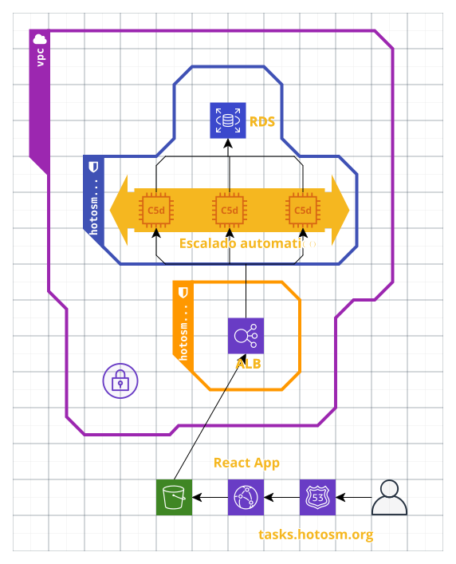

# Arquitectura

**TaskingManagerASG** AutoScalingGroup configura las propiedades del Grupo de Autoescalado. Existe una condición que determina tres niveles de autoescalado: desarrollo (1 sola instancia), demo (máximo 3 instancias) y producción (mínimo 2 y máximo 6 instancias).

**TaskingManagerScaleUp** La Política de Escalado determina el umbral en el cual el ASG escala hacia arriba. Utilizamos la métrica de CloudWatch `ALBRequestCountPerTarget` para mantener el número de solicitudes por instancia por debajo de un nivel determinado.

**TaskingManagerLaunchConfiguration** contiene una serie de archivos de metadatos y comandos que se cargan y ejecutan durante la instanciación de un nuevo servidor dentro del ASG. Las variables de entorno del Tasking Manager se configuran en este recurso.

**TaskingManagerEC2Role** El rol de IAM permite que los servidores del backend se comuniquen con CodeDeploy, el monitoreo de CloudWatch, Cloudformation y la base de datos RDS.

**TaskingManagerDatabaseDumpAccessRole** es un Rol de IAM para EC2 que solo se utiliza si se proporciona un archivo de volcado (dump) de la base de datos en la configuración, permitiendo el acceso al bucket de S3 que contiene dicho archivo.

**TaskingManagerEC2InstanceProfile** es un recurso requerido para otorgar a un servidor acceso programático a los servicios de AWS.

**TaskingManagerLoadBalancer** configura los grupos de seguridad y las subredes para el recurso de AWS Application Load Balancer.

**TaskingManagerLoadBalancerRoute53** conjunto de registros de Route53 para el balanceador de carga.

**TaskingManagerTargetGroup** configura las verificaciones de estado (health checks) para cada objetivo en el Balanceador de Carga.

**TaskingManagerLoadBalancerHTTPSListener** asigna el Certificado SSL, el protocolo y el puerto al Listener HTTPS.

**TaskingManagerLoadBalancerHTTPListener** redirige las solicitudes a HTTPS.

**TaskingManagerRDS** configura todas las propiedades de la base de datos RDS.

**TaskingManagerReactBucket** es el bucket donde se almacena y desde el cual se sirve el código del frontend.

**TaskingManagerReactBucketPolicy** otorga acceso de lectura a los objetos almacenados en el bucket.

**TaskingManagerReactCloudfront** configura la Distribución de CloudFront para el frontend estático almacenado en S3.

**TaskingManagerRoute53** es el Registro de Route53 para el frontend, por ejemplo, `tasks.hotosm.org`

### Parámetros

**GitSha** es el hash del commit del repositorio de HOTOSM Tasking Manager que se va a desplegar.

**NetworkEnvironment** tiene solo dos opciones: `staging` y `production`, y determina los grupos de seguridad utilizados para las instancias EC2 y el Balanceador de Carga.

**AutoscalingPolicy** puede ser `development`, `demo` o `production` y determina el número mínimo/máximo de instancias.

**DBSnapshot** es un parámetro opcional. Especifica el ID de la Instantánea (Snapshot) de RDS para crear la base de datos a partir de una instantánea.

**DatabaseDump** es un parámetro opcional. Especifica la ruta del objeto en el bucket de S3 para crear la base de datos a partir de un archivo de volcado en texto plano.

**NewRelicLicense** licencia de New Relic.

**PostgresDB** es el nombre de la base de datos.

**PostgresPassword** es la contraseña de la base de datos.

**PostgresUser** es el usuario de la base de datos.

**DatabaseEngineVersion** versión del motor de PostgreSQL en AWS.

**DatabaseInstanceType** es el tipo de instancia de la base de datos de AWS (por ejemplo, db.t3.large).

**DatabaseDiskSize** es el tamaño (en GB) de la instancia RDS. Se recomiendan al menos 100 GB para un mejor IOPS.

**DatabaseParameterGroupName** utiliza el grupo de parámetros por defecto si no sabes qué es esto.

**DatabaseSnapshotRetentionPeriod** período de retención para las instantáneas automáticas (programadas) en días.

**ELBSubnets** es una cadena de texto separada por comas con las subredes para tu región de AWS. Asegúrate de que las subredes sean compatibles con el tipo de instancia EC2.

**SSLCertificateIdentifier** el ID para el Certificado SSL de AWS.

**TaskingManagerLogDirectory** la ruta en la instancia donde se almacenan los registros (logs) en el servidor, por ejemplo, `/var/log/tasking-manager/`.

**TaskingManagerClientId** es una clave generada al crear una Aplicación Cliente OAuth en OSM.

**TaskingManagerClientSecret** es una clave secreta generada al crear una Aplicación Cliente OAuth en OSM.

**TaskingManagerRedirectUri** URIs permitidas a las que el usuario puede ser redirigido después de autorizar la aplicación.

**TaskingManagerScope** son los alcances (scopes) que pueden ser solicitados por un cliente.

**TaskingManagerSecret** una cadena de texto aleatoria para la comunicación entre el frontend y el backend.

**TaskingManagerAppBaseUrl** la URL base completa del sitio, por ejemplo, `https://tasks.hotosm.org/`.

**TaskingManagerEmailFromAddress** una dirección de correo electrónico desde la cual se enviarán los mensajes a los usuarios.

**TaskingManagerEmailContactAddress** una dirección de contacto que aparecerá en varios lugares del sitio.

**TaskingManagerLogLevel** puede ser `DEBUG` o `INFO`.

**TaskingManagerImageUploadAPIURL** URL de la API para la carga de imágenes.

**TaskingManagerImageUploadAPIKey** clave de la API para la carga de imágenes.

**TaskingManagerSMTPHost** la URL del host para el Servicio de Correo Simple de AWS (AWS SES).

**TaskingManagerSMTPPassword** la contraseña de autenticación para AWS SES.

**TaskingManagerSMTPUser** el usuario de autenticación para AWS SES.

**TaskingManagerSMTPPort** el puerto para AWS SES.

**TaskingManagerDefaultChangesetComment** el hashtag del comentario por defecto del proyecto para los conjuntos de cambios (changesets).

**TaskingManagerURL** la URL sin el protocolo, por ejemplo, `tasks.hotosm.org`.

**TaskingManagerOrgName** nombre de la aplicación u organización que aloja la app.

**TaskingManagerOrgCode** código de 3 letras para el nombre de la organización.

**SentryBackendDSN** si usas Sentry, ingresa la URL del DSN aquí.

**TaskingManagerLogo** URL para un logotipo.