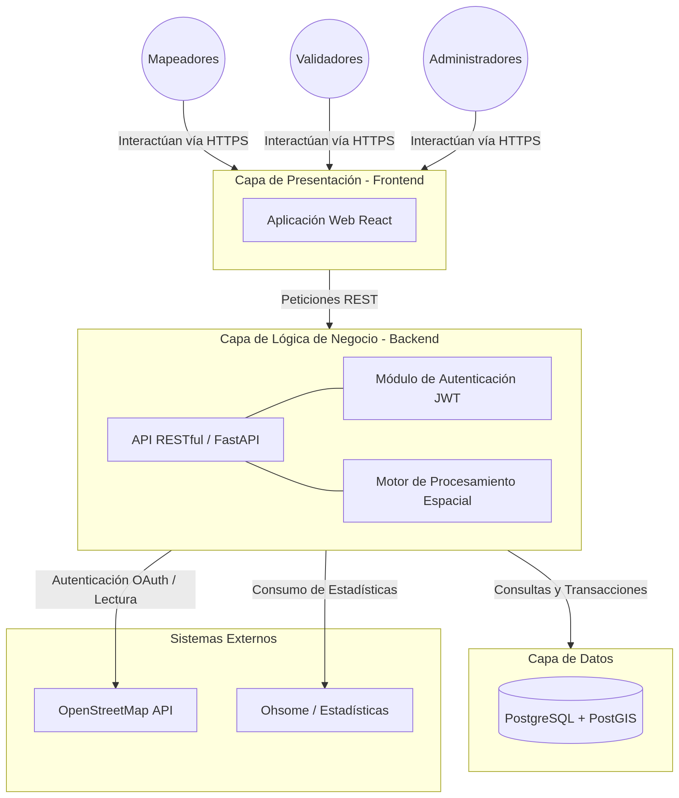

# Plan Maestro de Pruebas: Introducción y Alcance

**Proyecto:** HOT OSM Tasking Manager  
**Estándar de Referencia:** ISO/IEC/IEEE 29119-3:2013 (Documentación de Pruebas)  

## 1. Propósito del Documento
El presente documento constituye la base del **Plan Maestro de Pruebas (Master Test Plan)** para el proyecto Tasking Manager. Su objetivo es definir el contexto, el alcance global, los límites de la intervención de QA y la arquitectura funcional del sistema. Este documento actúa como la máxima directriz de la cual se derivan los planes de las fases subsiguientes (Unitarias, Integración, Sistema y Aceptación).

## 2. Contexto General del Proyecto
El **Tasking Manager (TM)** es una herramienta de código abierto desarrollada por el *Humanitarian OpenStreetMap Team (HOT)*. Permite la coordinación masiva de mapeadores voluntarios. El sistema delimita áreas geográficas de interés afectadas por desastres o necesidades humanitarias, subdividiéndolas en cuadrículas (tareas) más pequeñas. Estas tareas pasan por un ciclo de vida estricto: **Disponible, Mapeada, Validada (QA) y Completada**.

Dada la criticidad humanitaria de los datos y el alto volumen de concurrencia, el aseguramiento de la calidad funcional, espacial y de seguridad del código es un requisito innegociable.

## 3. Arquitectura y Módulos Bajo Prueba (SUT)
Desde la perspectiva del Aseguramiento de Calidad, el Sistema Bajo Prueba (System Under Test - SUT) se compone de una arquitectura distribuida que interactúa con servicios externos críticos.

### 3.1. Topología del Sistema
El siguiente diagrama detalla las capas arquitectónicas que serán sometidas a los distintos niveles de prueba.

 

*(Nota: Este diagrama debe utilizarse para comprender el flujo de los datos al diseñar las pruebas de integración y sistema).*

### 3.2. Módulos Funcionales Críticos
1. **Gestión de Proyectos (Administración):** Creación de áreas de interés (AOI), definición de instrucciones y asignación de prioridades.
2. **Ciclo de Vida de Tareas (Mapeo y Validación):** Lógica de bloqueo concurrente de tareas, cambios de estado y gestión de polígonos.
3. **Usuarios, Roles y Permisos:** Niveles de acceso (Principiante, Intermedio, Avanzado), control de acceso basado en roles (RBAC) y autenticación OAuth 2.0 con OpenStreetMap.
4. **Comunicaciones y Estadísticas:** Mensajería interna, notificaciones, e integración de métricas (Ohsome API).

## 4. Objetivos del Plan General de Pruebas
1. Garantizar que la migración e implementación de la API en **FastAPI** cumple con los estándares de seguridad y lógica espacial requeridos.
2. Validar que la concurrencia masiva no genere condiciones de carrera (Race Conditions) al bloquear o liberar tareas cartográficas.
3. Establecer un marco de trazabilidad documental total utilizando el estándar **ISO/IEC/IEEE 29119**, conectando el diseño de pruebas directamente con el código fuente del repositorio.

## 5. Alcance del Testing
Este Plan General cubre el aseguramiento de la calidad mediante pruebas dinámicas.

**Dentro del Alcance (In-Scope):**
*   Pruebas Unitarias de Backend (FastAPI, Lógica de servicios, DTOs).
*   Pruebas de Integración (API REST y Base de Datos PostGIS).
*   Pruebas de Sistema y Funcionales End-to-End (E2E) simulando los flujos de Mapeadores y Validadores.

**Fuera del Alcance (Out-of-Scope):**
*   Pruebas de la API externa de OpenStreetMap (está fuera de nuestro control).
*   Pruebas de Estrés y Carga masiva (serán abordadas en un plan de operaciones paralelo, a menos que el alcance cambie).

## 6. Estructura de Niveles de Prueba
Para cumplir con el ciclo de vida del estándar, el proyecto se dividirá en las siguientes fases (Sub-planes):
1. **Fase 1: Pruebas Unitarias** (Foco en el código Backend - Servicios, Modelos y Seguridad).
2. **Fase 2: Pruebas de Integración** (Interacción entre la capa FastAPI y PostGIS).
3. **Fase 3: Pruebas de Sistema** (Validación funcional de la UI interactuando con la API).
4. **Fase 4: Pruebas de Aceptación** (Validación de flujos cartográficos con usuarios finales).

## 7. Supuestos, Restricciones y Riesgos
*   **Supuestos:** El equipo de desarrollo mantendrá actualizado el archivo `README.md` y la documentación técnica de despliegue con Docker para facilitar la creación de los entornos de prueba.
*   **Restricciones:** El testing espacial (Validación de geometrías PostGIS) requerirá datos mokeados (mock data) de alta precisión que deben ser diseñados previamente.
*   **Riesgos Globales:**
    *   *Riesgo:* Cambios abruptos en las APIs externas (OSM, Ohsome) pueden romper las pruebas de integración. 
    *   *Mitigación:* Implementar contratos de prueba (Contract Testing) y uso extensivo de Mocks durante las Fases 1 y 2.

