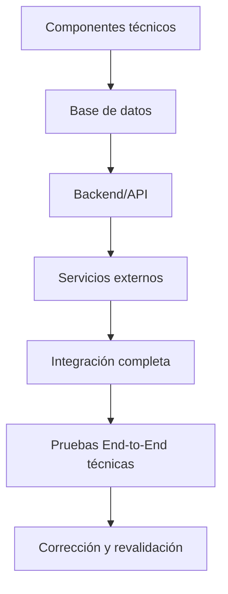

[# Plan de Pruebas de Integración

**Proyecto:** HOT OSM Tasking Manager  
**Equipo:** Escarabajo Rinoceronte  
**Fase:** Sprint 2 — Hito 2  
**Versión:** 2.0  
**Fecha:** Junio 2026  

---

## 1. Objetivo y Alcance

### 1.1 Objetivo

Validar la comunicación e interoperabilidad entre los componentes técnicos principales del sistema HOT OSM Tasking Manager, verificando que los contratos de integración entre base de datos, backend/API y servicios externos funcionen correctamente cuando operan de forma conjunta.

### 1.2 Alcance

**Incluido en este plan:**

| Punto de integración | Componente origen | Componente destino | Protocolo |
|---|---|---|---|
| INT-IF-01 | Backend API (FastAPI) | Base de datos (PostgreSQL/PostGIS) | SQL / ORM (SQLAlchemy) |
| INT-IF-02 | Backend API (FastAPI) | Servicio OpenStreetMap (OAuth2) | HTTPS / OAuth2 |
| INT-IF-03 | Backend API (FastAPI) | Sistema de notificaciones interno | Eventos internos / BD |
| INT-IF-04 | Backend API (FastAPI) | Endpoints REST internos | HTTP REST / JSON |

**Excluido de este plan:**

- Lógica interna de cada módulo por separado, ya que corresponde a pruebas unitarias.
- Pruebas completas de interfaz gráfica del frontend.
- Servicios RENIEC/SUNAT, Django legacy y Tauri, por estar fuera de la arquitectura activa.
- Despliegue en producción.

**Nota:** También podría probarse la ruta funcional completa desde la interfaz, incluyendo autenticación, proyectos, tareas, mapeo y validación. Sin embargo, por limitaciones de tiempo en este hito, se priorizará la primera ruta de integración técnica: base de datos → backend/API → servicios externos → integración completa.

---

## 2. Estrategia de Integración

Se aplica una estrategia **Bottom-Up**, integrando primero los componentes técnicos base y avanzando hacia los servicios superiores.

```txt
Nivel 1: PostgreSQL/PostGIS + Alembic
      ↓
Nivel 2: Backend FastAPI + Servicios de negocio
      ↓
Nivel 3: Servicios externos y notificaciones
      ↓
Nivel 4: Integración técnica completa
```

**Justificación:** Se integra desde la capa más estable, que es la base de datos, hacia el backend y los servicios externos. De esta manera, cuando se detecta un error, es más sencillo ubicar si el problema está en la persistencia, en la API, en los contratos de datos o en la comunicación con servicios externos.

**Stubs y Drivers:**

| Etapa | Qué se simula | Herramienta |
|---|---|---|
| Nivel 2 | Peticiones HTTP al API | Postman / pytest + httpx |
| Nivel 3 | Respuesta OAuth2 de OSM | WireMock / pytest monkeypatch |
| Nivel 4 | Componentes técnicos integrados | Docker Compose completo |

---

## 3. Diagrama de integración funcional

El diagrama representa únicamente la ruta técnica que será probada en este hito. La ruta funcional desde interfaz también podría evaluarse, pero no será priorizada por el tiempo disponible.



---

## 4. Criterios de Entrada

Antes de iniciar las pruebas de integración, se deben cumplir:

- [ ] Las pruebas unitarias del backend superan el **85% de cobertura** en los módulos de autenticación, proyectos y tareas.
- [ ] El entorno Docker Compose levanta correctamente con `docker compose up` sin errores.
- [ ] Las migraciones Alembic se aplican hasta `head` sin conflictos.
- [ ] La base de datos de pruebas se encuentra aislada del entorno de desarrollo principal.
- [ ] Los endpoints documentados en el README del backend responden en el entorno local.

---

## 5. Matriz de Interfaces

| ID | Módulo Origen | Módulo Destino | Operación | Endpoint / Contrato | Dato enviado | Respuesta esperada |
|---|---|---|---|---|---|---|
| INT-IF-01a | API | BD | Persistir estado de tarea | SQL UPDATE tasks | Estado + user_id | Confirmación de transacción |
| INT-IF-01b | API | BD | Consultar historial | SQL SELECT task_history | task_id | Lista de eventos |
| INT-IF-01c | API | BD | Crear proyecto | SQL INSERT projects | Datos del proyecto | Proyecto registrado con status DRAFT |
| INT-IF-01d | API | BD | Consultar proyectos | SQL SELECT projects | Filtros de búsqueda | Lista de proyectos filtrados |
| INT-IF-02a | API | OSM OAuth2 | Validar token de usuario | `GET https://www.openstreetmap.org/api/0.6/user/details` | Bearer token | Datos del usuario OSM |
| INT-IF-02b | API | OSM OAuth2 | Manejar token expirado | Servicio OAuth2 | Token inválido | HTTP 401 controlado |
| INT-IF-03a | API | Notificaciones | Crear notificación al validar | Evento interno | user_id + message | Registro en tabla notifications |
| INT-IF-04a | Cliente HTTP de prueba | API | Bloquear tarea | `POST /api/v2/projects/{id}/tasks/actions/lock-for-mapping/{taskId}/` | Token JWT | Tarea bloqueada correctamente |
| INT-IF-04b | Cliente HTTP de prueba | API | Liberar tarea mapeada | `POST /api/v2/projects/{id}/tasks/actions/unlock-after-mapping/{taskId}/` | status + comment | Estado actualizado e historial registrado |

---

## 6. Casos de Prueba de Integración

| ID | Punto de integración | Precondición | Acción | Resultado esperado | Tiempo est. |
|---|---|---|---|---|---|
| INT-01 | API → BD | Base de datos levantada y migrada | Consultar proyectos con filtros | La API devuelve proyectos válidos desde BD | 15 min |
| INT-02 | API → BD | Usuario con rol MANAGER | Crear proyecto desde endpoint | Proyecto registrado en BD con status DRAFT; HTTP 201 | 20 min |
| INT-03 | API → BD | Proyecto publicado, tareas READY | Ejecutar `POST lock-for-mapping/{taskId}` | Tarea cambia a LOCKED_FOR_MAPPING en BD | 15 min |
| INT-04 | API → BD | Tarea bloqueada por usuario actual | Ejecutar `POST unlock-after-mapping` con status MAPPED | Tarea cambia a MAPPED y se registra historial | 15 min |
| INT-05 | API → BD | Tarea MAPPED y usuario VALIDATOR | Ejecutar `POST lock-for-validation/{taskId}` | Tarea cambia a LOCKED_FOR_VALIDATION | 15 min |
| INT-06 | API → BD | Tarea en validación | Ejecutar `POST unlock-after-validation` con status INVALIDATED | Tarea regresa a READY y conserva comentario | 20 min |
| INT-07 | API → Notificaciones → BD | Tarea marcada como VALIDATED | Generar notificación automática | Registro correcto en tabla notifications | 10 min |
| INT-08 | API → OSM OAuth2 | Token OAuth2 expirado | Ejecutar acción autenticada | La API responde HTTP 401 de forma controlada | 10 min |
| INT-E2E-01 | BD → API → Servicios externos | Entorno Docker completo | Ejecutar flujo técnico: autenticar → consultar proyecto → bloquear tarea → actualizar estado → registrar historial | Todas las transiciones persisten correctamente | 45 min |

---

## 7. Entorno y Recursos

| Recurso | Configuración |
|---|---|
| Orquestación | Docker Compose (`docker-compose.yml`) + red `tm-net` |
| Backend | FastAPI, Python 3.x, pytest + httpx |
| Base de datos | PostgreSQL/PostGIS — instancia exclusiva de pruebas |
| Migraciones | Alembic hasta revisión `head` |
| Entrada HTTP | Traefik: API en `/api/` |
| Simulación servicios externos | WireMock o pytest `monkeypatch` para OAuth2 OSM |
| Automatización CI | GitHub Actions (`.github/workflows/`) |
| Evidencias | Logs Docker, responses JSON, capturas de pantalla, resultados CI |

---

## 8. Cronograma

| Fase | Fechas | Actividad | Tiempo estimado |
|---|---|---|---|
| 1 — Infraestructura | 12–15 Jun 2026 | Docker Compose; Alembic; validar conectividad BD | 6 h |
| 2 — API y BD | 16–18 Jun 2026 | Validar endpoints conectados a PostgreSQL/PostGIS | 8 h |
| 3 — Servicios internos | 19–21 Jun 2026 | Probar proyectos, tareas, historial y persistencia de estados | 6 h |
| 4 — Servicios externos | 22–24 Jun 2026 | Probar OAuth2 OSM y manejo de token expirado | 4 h |
| 5 — Integración técnica completa | 25–27 Jun 2026 | Ejecutar flujo técnico completo con Docker Compose | 6 h |
| 6 — Corrección e informe | 28–30 Jun 2026 | Corregir defectos, reejecutar pruebas y redactar informe final | 8 h |

**Tiempo total estimado:** ~38 horas de trabajo efectivo.

---

## 9. Registro de Riesgos de Integración

| ID | Riesgo | Probabilidad | Impacto | Mitigación |
|---|---|---|---|---|
| R-INT-01 | Incompatibilidad entre endpoints y estructura real de la base de datos | Alta | Alto | Revisar contratos y modelos antes de ejecutar las pruebas |
| R-INT-02 | Servicio OAuth2 de OSM no disponible durante pruebas | Media | Alto | Usar WireMock o monkeypatch para simular respuestas OAuth2 |
| R-INT-03 | Migraciones Alembic con conflictos en rama develop | Media | Alto | Ejecutar `alembic upgrade head` en BD aislada antes de cada sesión |
| R-INT-04 | Diferencias de comportamiento entre entorno local y CI | Media | Medio | Definir variables de entorno idénticas en `.env.test` y GitHub Actions |
| R-INT-05 | Datos residuales entre casos de prueba | Alta | Medio | Ejecutar rollback o seed de BD antes de cada caso INT |

---

## 10. Criterios de Salida

La fase de integración se considera **aprobada** cuando:

- Se ejecuta el **100%** de los casos de prueba definidos.
- Al menos el **90%** de los casos obtienen resultado satisfactorio.
- No existen defectos críticos abiertos en autenticación, bloqueo de tareas, persistencia de estados e historial.
- Los resultados de CI/CD muestran checks en verde para los workflows de integración.
- Las evidencias de ejecución quedan registradas mediante logs, respuestas JSON, capturas o reportes de CI.
](https://github.com/escarabajo-rinoceronte/gestor-tareas-pruebas/blob/develop/tests-docs/03-ejecucion-de-pruebas/unitarias/02-ejecucion-pruebas-unitarias-backend.md)
