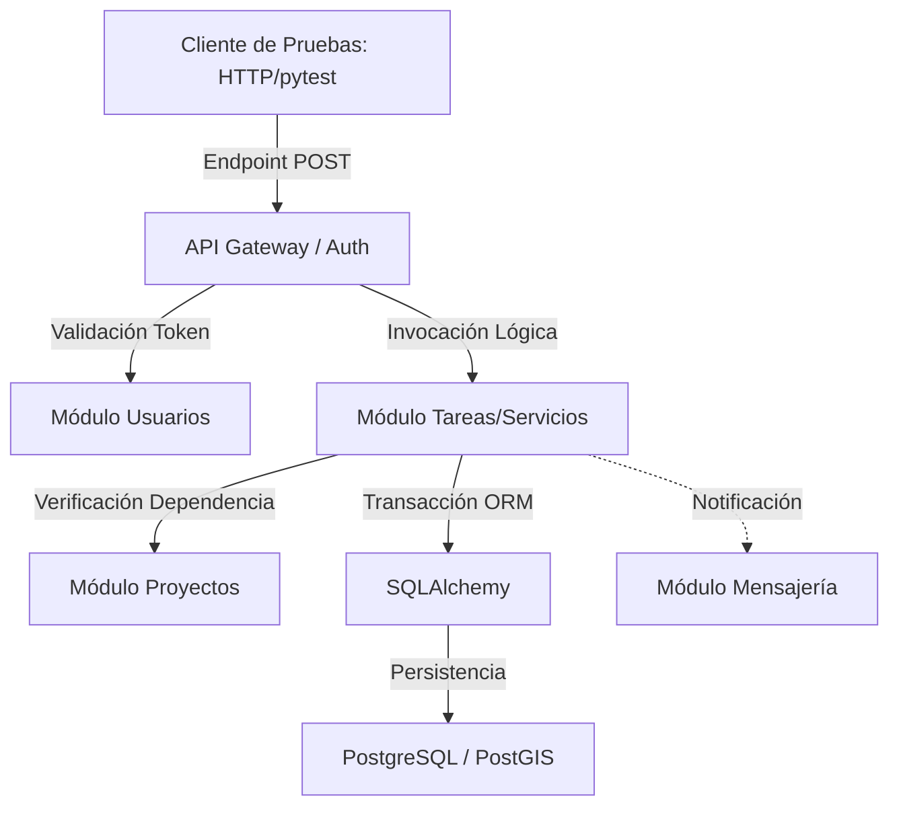

# Plan de Pruebas de Integración

**Proyecto:** HOT OSM Tasking Manager  
**Equipo:** Escarabajo Rinoceronte  
**Fase:** Sprint 2 - Hito 2  
**Versión:** 2.1 (Consolidada)  
**Fecha:** Junio 2026  

---

## 1. Objetivo y Alcance

### 1.1 Objetivo
Validar la comunicación e interoperabilidad funcional y técnica entre los componentes del sistema HOT OSM Tasking Manager, verificando que los contratos de integración (Base de Datos, APIs, Servicios de Dominio y Servicios Externos) operen de forma conjunta y preserven la integridad del flujo de negocio.

### 1.2 Estrategia de Modularización del Backend
La implementación del backend está dividida por **Dominios de Negocio** (*Bounded Contexts*) en lugar de capas técnicas puras. Para las pruebas de integración, esto significa que se validarán transacciones completas (*Verticales*) y dependencias entre módulos (*Horizontales*):

| Módulo Funcional | Responsabilidad de Integración Principal |
| :--- | :--- |
| **Usuarios y Auth** | Identidad, perfiles, sesión OAuth y niveles de mapper. |
| **Proyectos** | Configuración de metadatos, AOI (Área de Interés) y control de autoría. |
| **Tareas y Mapeo** | Flujo de estados cartográficos, locks temporales y partición espacial. |

La asociación de una prueba a un módulo se define por su **Punto de Entrada** y **Propiedad del Estado**. Una prueba de integración rara vez evalúa exclusivamente un módulo; por definición, valida cómo un flujo de negocio específico afecta múltiples áreas del sistema.

### 1.3 Alcance
**Incluido en este plan:**
- Integración Vertical: Comunicación entre API Gateway, Middlewares, Servicios de Dominio, Modelos ORM (SQLAlchemy) y la Base de Datos (PostgreSQL/PostGIS).
- Integración Horizontal: La comunicación entre los Módulos Funcionales descritos.
- Integración Externa: Comunicación del backend con el Servicio OpenStreetMap (OAuth2).
- Sistema de notificaciones interno por eventos.

**Excluido de este plan:**
- Lógica interna pura aislada de dependencias (Pruebas Unitarias).
- Pruebas completas de interfaz gráfica E2E (Frontend/Tauri).
- Servicios descontinuados (RENIEC/SUNAT, legacy).
- Despliegue en entornos de producción.

---

## 2. Enfoque y Estrategia de Integración

Se aplicará una combinación de un enfoque **Modular Basado en Flujos de Negocio** apoyado por una estrategia de ensamblaje técnico **Bottom-Up**.

1.  **Cimientos Técnicos:** Primero se garantiza la persistencia e infraestructura (PostgreSQL/PostGIS + Alembic).
2.  **Lógica de API y Servicios:** Se verifican los controladores FastAPI interactuando con los servicios y la BD.
3.  **Dependencias Externas:** Se evalúa la integración con OSM y sistemas asíncronos.
4.  **Integración Transversal (Big-Bang Parcial por Módulo):** Se orquesta la ejecución del flujo completo en un entorno efímero.

**Stubs y Mocks Definidos:**
- **Servicios Externos:** Las respuestas OAuth2 de OSM serán simuladas mediante intercepciones de red (e.g. `WireMock` o `pytest-httpx`/`responses`) para evitar llamadas fallidas por cuotas o latencia.
- **Base de Datos:** Se utilizará un contenedor de PostgreSQL real y persistente efímera por cada sesión de tests, en lugar de simular la BD (no se mockea el ORM).

---

## 3. Diagrama de Integración

El siguiente flujo representa la ruta transversal típica que evaluarán las pruebas para un flujo de negocio (por ejemplo, Bloqueo de Tarea):

---

## 4. Criterios de Entrada

Para iniciar las pruebas de integración en cada sprint/módulo, deben cumplirse:
- [ ] Pruebas unitarias de los componentes participantes aprobadas (Objetivo general > 80% cobertura).
- [ ] Contenedores de prueba definidos en `docker-compose.yml` ejecutando sin errores (API y DB).
- [ ] Migraciones de esquema (`alembic upgrade head`) aplicadas correctamente en la BD de pruebas.
- [ ] Definición completa de los contratos de la API o los DTOs intermedios a validar.

---

## 5. Matriz de Interfaces a Integrar (Capa Core)

| ID | Origen | Destino | Operación | Endpoint / Evento Principal |
|---|---|---|---|---|
| INT-IF-01 | FastAPI | PostgreSQL (PostGIS) | Operaciones GIS y CRUD sobre estado de tareas | Capa ORM / `db.py` |
| INT-IF-02 | FastAPI | OSM Auth (OAuth2) | Sincronización de token y perfil OSM | `GET /api/v2/system/authentication/login/` |
| INT-IF-03 | FastAPI | Internal Bus | Generación de notificaciones post-mapeo | Eventos `notifications.py` |

*(Nota: Las matrices específicas de APIs funcionales se documentan en el Diseño de Pruebas de cada módulo).*

---

## 6. Entorno y Recursos Requeridos

*(Este componente se documenta detalladamente en la Especificación de Infraestructura y Entorno: `01-infraestructura-entorno.md`).*

**Resumen Operativo:**
- **Base de Datos:** Instancia aislada de PostgreSQL 14 con extensión PostGIS 3.
- **Orquestación:** Docker Compose para estandarizar el despliegue local de backend y BD.
- **Framework de Pruebas:** Pytest con `anyio` (para asincronía) y `httpx` (para invocación de APIs).

---

## 7. Cronograma General de Pruebas de Integración

| Fase | Tarea | Componentes Involucrados |
|---|---|---|
| **Fase 1** | Validación Base (Bottom-Up) | Modelos ORM, Migraciones, Repositorios, Conexión BD. |
| **Fase 2** | Integración de Servicios Externos | OSM OAuth2, Mocks de Red, Respuestas Externas. |
| **Fase 3** | Ejecución de Flujos Modulares | Módulo Usuarios, Proyectos y Tareas (Controladores + Servicios + BD). |
| **Fase 4** | E2E Técnico y Reportes | Ejecución automatizada en CI/CD, Cálculo de Cobertura Final. |

---

## 8. Riesgos y Mitigaciones

| ID | Riesgo | Probabilidad / Impacto | Mitigación |
|---|---|---|---|
| R-INT-01 | Fallo de conexión o cuota API OSM | Alta / Alto | Utilizar librerías de Mocking de red (por ejemplo, `httpx-mock`) para interceptar la respuesta de login. |
| R-INT-02 | Contaminación de Datos entre Pruebas | Alta / Alto | Utilizar transacciones efímeras (`force_rollback=True`) por cada función de test para mantener un estado limpio. |
| R-INT-03 | Lentitud extrema de integración GIS | Media / Medio | Excluir datos cartográficos mundiales; usar polígonos minimalistas (Cajas delimitadoras pequeñas) en los tests de `SplitService`. |

---

## 9. Criterios de Salida

Se considerará aprobado el plan de integración de un módulo o hito cuando:
- El 100% de las pruebas diseñadas para los módulos de Usuarios, Proyectos y Tareas se encuentren programadas y ejecutándose en un orquestador local.
- Se haya alcanzado un **Pass Rate** > 95%.
- Se reporte la cobertura real (excluyendo tests duplicados unitarios) superando los umbrales definidos por módulo (80-85%).
- Los resultados y volcados de consola estén anexados en el respectivo Reporte de Ejecución.
