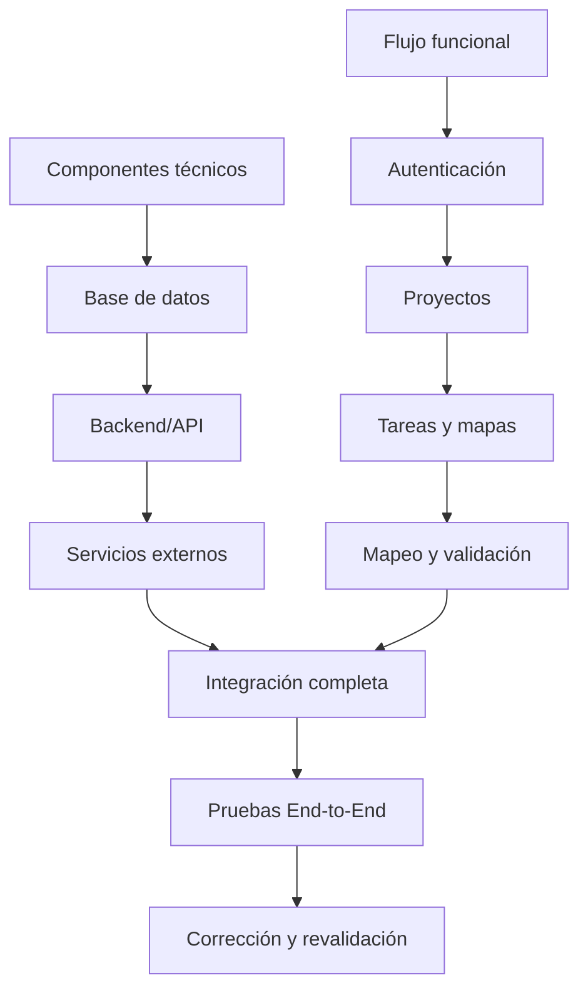

# Plan de Pruebas de Integración

**Proyecto:** HOT OSM Tasking Manager  
**Equipo:** Escarabajo Rinoceronte  
**Fase:** Sprint 2 — Hito 2  
**Versión:** 2.0  
**Fecha:** Junio 2026  

---

## 1. Objetivo y Alcance

### 1.1 Objetivo

Validar la comunicación e interoperabilidad entre los componentes del sistema HOT OSM Tasking Manager, verificando que los contratos de interfaz (endpoints, DTOs, formatos de request/response) se cumplan correctamente cuando los módulos operan de forma conjunta.

### 1.2 Alcance

**Incluido en este plan:**

| Punto de integración | Componente origen | Componente destino | Protocolo |
|---|---|---|---|
| INT-IF-01 | Frontend (React/Axios) | Backend API (FastAPI) | HTTP REST / JSON |
| INT-IF-02 | Backend API (FastAPI) | Base de datos (PostgreSQL/PostGIS) | SQL / ORM (SQLAlchemy) |
| INT-IF-03 | Backend API (FastAPI) | Servicio OpenStreetMap (OAuth2) | HTTPS / OAuth2 |
| INT-IF-04 | Backend API (FastAPI) | Sistema de notificaciones interno | Eventos internos / BD |

**Excluido de este plan:**
- Lógica interna de cada módulo por separado (cubierta en pruebas unitarias).
- Servicios RENIEC/SUNAT, Django legacy y Tauri (fuera de arquitectura activa).
- Despliegue en producción.

---

## 2. Estrategia de Integración

Se aplica una estrategia **Bottom-Up con franja Sandwich**, con el siguiente orden:

```
Nivel 1 (base): PostgreSQL/PostGIS + Alembic (persistencia)
      ↓
Nivel 2:        Backend FastAPI + Servicios de negocio (API REST)
      ↓
Nivel 3:        Frontend React + Axios (consumo de API)
      ↓
Nivel 4 (top):  Flujos E2E completos (autenticar → mapear → validar)
```

**Justificación:** Se integra desde la capa más estable (BD) hacia arriba. En cada nivel, los componentes del nivel inferior ya fueron validados, lo que permite aislar defectos en el nivel que se está integrando.

**Stubs y Drivers:**

| Etapa | Qué se simula | Herramienta |
|---|---|---|
| Nivel 2 (sin frontend listo) | Peticiones HTTP al API | Postman / pytest + httpx |
| Nivel 3 (con API externa no disponible) | Respuesta OAuth2 de OSM | WireMock / pytest monkeypatch |
| Nivel 4 | N/A — todos los componentes reales | Docker Compose completo |

---

## 3. Diagrama de integración funcional

El diagrama muestra las dos líneas de integración y el punto donde convergen para las pruebas completas.



---

## 4. Criterios de Entrada

Antes de iniciar las pruebas de integración, se deben cumplir:

- [ ] Las pruebas unitarias del backend superan el **85% de cobertura** en los módulos de autenticación, proyectos y tareas.
- [ ] Las pruebas unitarias del frontend superan el **85% de cobertura**.
- [ ] El entorno Docker Compose levanta correctamente con `docker compose up` sin errores.
- [ ] Las migraciones Alembic se aplican hasta `head` sin conflictos.
- [ ] Los endpoints documentados en el README del backend responden en el entorno local.

---

## 5. Matriz de Interfaces

| ID | Módulo Origen | Módulo Destino | Operación | Endpoint / Contrato | Dato enviado | Respuesta esperada |
|---|---|---|---|---|---|---|
| INT-IF-01a | Frontend | API | Login con OSM | `POST /api/v2/auth/callback/` | `{ code, state }` | `{ token, user }` — HTTP 200 |
| INT-IF-01b | Frontend | API | Listar proyectos | `GET /api/v2/projects/` | Query params (filtros) | Array de proyectos — HTTP 200 |
| INT-IF-01c | Frontend | API | Bloquear tarea | `POST /api/v2/projects/{id}/tasks/actions/lock-for-mapping/{taskId}/` | Token JWT | `{ taskId, status: LOCKED }` — HTTP 200 |
| INT-IF-01d | Frontend | API | Marcar tarea mapeada | `POST /api/v2/projects/{id}/tasks/actions/unlock-after-mapping/{taskId}/` | `{ status: MAPPED, comment }` | HTTP 200 |
| INT-IF-02a | API | BD | Persistir estado de tarea | SQL UPDATE tasks | Estado + user_id | Confirmación de transacción |
| INT-IF-02b | API | BD | Consultar historial | SQL SELECT task_history | task_id | Lista de eventos |
| INT-IF-03a | API | OSM OAuth2 | Validar token de usuario | `GET https://www.openstreetmap.org/api/0.6/user/details` | Bearer token | Datos del usuario OSM |
| INT-IF-04a | API | Notificaciones | Crear notificación al validar | Evento interno | user_id + message | Registro en tabla notifications |

---

## 6. Casos de Prueba de Integración

| ID | Punto de integración | Precondición | Acción | Resultado esperado | Tiempo est. |
|---|---|---|---|---|---|
| INT-01 | Frontend → API → BD | Usuario autenticado nivel BEGINNER | `GET /api/v2/projects/` con filtro `mappingTypes=ROADS` | Lista proyectos filtrados según nivel | 15 min |
| INT-02 | Frontend → API → BD | Usuario MANAGER de organización | Crear proyecto vía formulario | Proyecto en BD con status DRAFT; HTTP 201 | 20 min |
| INT-03 | Frontend → API → BD | Proyecto publicado, tareas READY | `POST lock-for-mapping/{taskId}` | Tarea LOCKED_FOR_MAPPING en BD; candado en UI | 15 min |
| INT-04 | Frontend → API → BD | Tarea LOCKED por usuario actual | `POST unlock-after-mapping` status MAPPED | Tarea MAPPED en BD; historial registra evento | 15 min |
| INT-05 | Frontend → API → BD | Tarea MAPPED; usuario VALIDATOR | `POST lock-for-validation/{taskId}` | Tarea LOCKED_FOR_VALIDATION; solo validador opera | 15 min |
| INT-06 | Frontend → API → BD | Tarea en validación | `POST unlock-after-validation` status INVALIDATED | Tarea regresa a READY; comentario se preserva | 20 min |
| INT-07 | API → Notificaciones → BD | Tarea marcada VALIDATED | Notificación automática al mapper | Registro en tabla notifications correcto | 10 min |
| INT-08 | API → OSM OAuth2 | Token OAuth2 expirado | Acción autenticada | HTTP 401; frontend redirige a login | 10 min |
| INT-E2E-01 | Todos los componentes | Usuario nuevo | Flujo: login → explorar → bloquear → mapear → validar | Cada transición persiste; permisos se aplican | 45 min |

---

## 7. Entorno y Recursos

| Recurso | Configuración |
|---|---|
| Orquestación | Docker Compose (`docker-compose.yml`) + red `tm-net` |
| Backend | FastAPI, Python 3.x, pytest + httpx |
| Frontend | React, Axios, Vitest |
| Base de datos | PostgreSQL/PostGIS — instancia exclusiva de pruebas |
| Migraciones | Alembic hasta revisión `head` |
| Entrada HTTP | Traefik: frontend en `/` y API en `/api/` |
| Simulación servicios externos | WireMock o pytest `monkeypatch` para OAuth2 OSM |
| Automatización CI | GitHub Actions (`.github/workflows/`) |
| Evidencias | Logs Docker, responses JSON, capturas de pantalla, resultados CI |

---

## 8. Cronograma

| Fase | Fechas | Actividad | Tiempo estimado |
|---|---|---|---|
| 1 — Infraestructura | 12–15 Jun 2026 | Docker Compose; Alembic; validar conectividad BD | 6 h |
| 2 — API y Servicios | 16–18 Jun 2026 | Endpoints con Postman/pytest; validar contratos INT-IF-02 | 8 h |
| 3 — Frontend↔API | 19–21 Jun 2026 | INT-01 a INT-04; flujo autenticar → bloquear → mapear | 6 h |
| 4 — Servicios externos | 22–24 Jun 2026 | INT-08 (OAuth2 expirado); simular fallos con monkeypatch | 4 h |
| 5 — E2E | 25–27 Jun 2026 | INT-E2E-01; flujo completo de extremo a extremo | 6 h |
| 6 — Corrección e informe | 28–30 Jun 2026 | Corregir defectos; reejecución; redactar informe final | 8 h |

**Tiempo total estimado:** ~38 horas de trabajo efectivo.

---

## 9. Registro de Riesgos de Integración

| ID | Riesgo | Probabilidad | Impacto | Mitigación |
|---|---|---|---|---|
| R-INT-01 | Incompatibilidad de contrato frontend↔API (campos renombrados o tipos incorrectos) | Alta | Alto | Revisar especificación OpenAPI antes de integrar |
| R-INT-02 | Servicio OAuth2 de OSM no disponible durante pruebas | Media | Alto | Usar WireMock para simular respuestas OAuth2 en CI |
| R-INT-03 | Migraciones Alembic con conflictos en rama develop | Media | Alto | Ejecutar `alembic upgrade head` en BD aislada antes de cada sesión |
| R-INT-04 | Diferencias de comportamiento entre entorno local y CI | Media | Medio | Definir variables de entorno idénticas en `.env.test` y en GitHub Actions |
| R-INT-05 | Datos residuales entre casos de prueba | Alta | Medio | Ejecutar rollback/seed de BD antes de cada caso INT |

---

## 10. Criterios de Salida

La fase de integración se considera **aprobada** cuando:

- Se ejecuta el **100%** de los casos de prueba (INT-01 a INT-E2E-01).
- Al menos el **90%** de los casos obtienen resultado satisfactorio.
- **No existen defectos críticos abiertos** en: autenticación, bloqueo de tareas y persistencia de estados.
- Los resultados de CI/CD muestran checks en verde para los workflows de integración.
