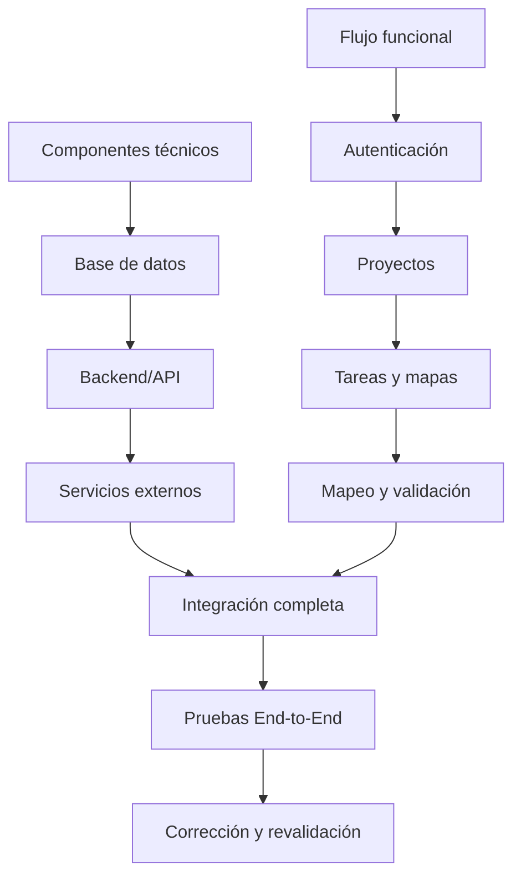

# Plan de Pruebas de Integración

**Proyecto:** HOT OSM Tasking Manager  
**Fase:** Sprint 2 - Integración  
**Tipo de estrategia:** Integración incremental híbrida  

## 1. Objetivo y alcance

Validar el flujo de información entre los ámbitos funcionales seleccionados: autenticación y perfil, exploración de proyectos, ejecución de mapeo, validación, administración de proyectos, gobernanza de organizaciones y equipos, y comunicación y notificaciones.

Quedan fuera de alcance Django, Tauri y los servicios RENIEC/SUNAT, debido a que no forman parte de la arquitectura revisada.

## 2. Estrategia de integración

Se aplicará una estrategia **incremental híbrida**, porque la integración avanzará en dos líneas paralelas antes de unir el sistema completo:

- **Línea técnica:** base de datos, Backend/API y servicios externos. Permite comprobar primero la persistencia, los contratos HTTP y las dependencias externas.
- **Línea funcional:** autenticación, proyectos, tareas y mapas, mapeo y validación. Permite verificar que cada flujo utilice correctamente los componentes ya integrados.

Ambas líneas se unirán en las pruebas End-to-End. Este enfoque es adecuado para el repositorio porque sus operaciones funcionales dependen de FastAPI y PostgreSQL/PostGIS, mientras que algunos flujos también requieren servicios externos. La ejecución por incrementos facilita identificar si un defecto pertenece a la infraestructura, a la API o al flujo funcional.

## 3. Diagrama de integración funcional

El diagrama muestra las dos líneas de integración y el punto donde convergen para las pruebas completas.

## 4. Entorno y recursos

| Recurso | Configuración |
|---|---|
| Orquestación | Docker Compose y red `tm-net` |
| Backend | FastAPI, Python y pytest |
| Frontend | React, Axios y pruebas del proyecto |
| Base de datos | PostgreSQL/PostGIS exclusiva de pruebas |
| Migraciones | Alembic hasta la revisión `head` |
| Entrada HTTP | Traefik; frontend en `/` y API en `/api/` |
| Automatización | GitHub Actions para pruebas unitarias e integración |
| Evidencias | Logs, respuestas JSON, capturas UI y resultados CI |

## 5. Casos prioritarios

| ID | Ámbitos integrados | Resultado esperado |
|---|---|---|
| INT-01 | Autenticación y exploración | El usuario autenticado visualiza proyectos según su nivel y permisos. |
| INT-02 | Gobernanza y administración | Los miembros autorizados administran proyectos de su organización o equipo. |
| INT-03 | Administración + exploración | Un proyecto publicado aparece con sus datos y filtros correctos. |
| INT-04 | Exploración y mapeo | La tarea seleccionada se bloquea y se asigna al usuario correspondiente. |
| INT-05 | Mapeo y validación | Una tarea mapeada pasa a revisión y solo admite transiciones válidas. |
| INT-06 | Validación y mapeo | Una tarea invalidada vuelve al flujo de corrección conservando comentarios. |
| INT-07 | Proyectos/tareas y comunicación | Los cambios relevantes generan la notificación o actividad esperada. |
| INT-E2E-01 | Todos los ámbitos | Autenticar, explorar, mapear, validar y notificar mantiene permisos, datos y estados consistentes. |

## 6. Cronograma

| Fase | Fechas | Actividad |
|---|---|---|
| 1 | 12-15/06/2026 | PostGIS, Alembic y persistencia |
| 2 | 16-18/06/2026 | Servicios de negocio y API |
| 3 | 19-21/06/2026 | React, Axios, autenticación y API |
| 4 | 22-24/06/2026 | Servicios externos y tolerancia a fallos |
| 5 | 25-27/06/2026 | Flujos E2E críticos |
| 6 | 28-30/06/2026 | Corrección, reejecución e informe |

## 7. Lineamientos y criterios de salida

- Ejecutar las pruebas sobre una base aislada; nunca sobre producción.
- Usar mocks para servicios externos en CI y pruebas reales controladas en staging.
- Registrar defectos en GitHub Issues con pasos, payload, respuesta, severidad y evidencia.
- Integrar cambios mediante Pull Request y exigir aprobación de los checks.
- Restablecer los datos de prueba para evitar dependencia entre casos.

La fase será aprobada cuando se ejecute el 100 % de los casos prioritarios, se alcance al menos un 95 % de resultados satisfactorios y no existan defectos críticos abiertos en autenticación, creación de proyectos, bloqueo de tareas o persistencia.
