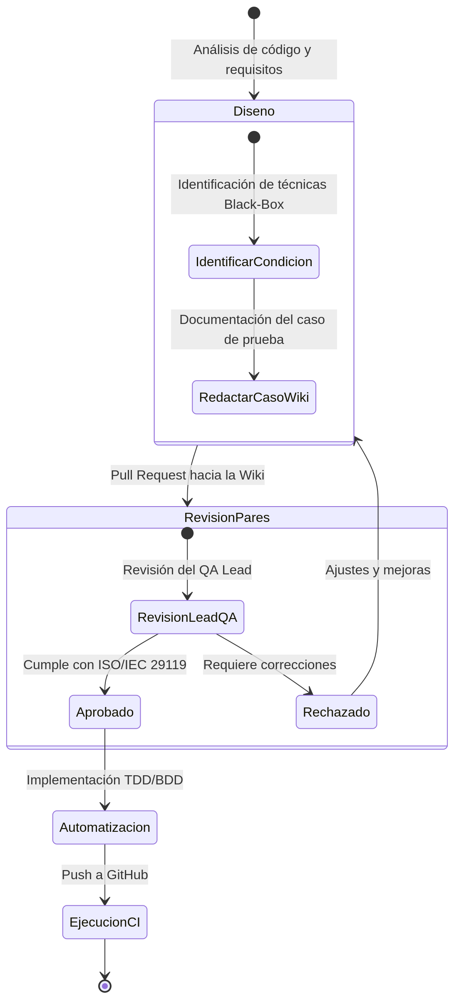

# Plan Maestro de Pruebas: Estrategia Organizacional

**Proyecto:** HOT OSM Tasking Manager  
**Estándar de Referencia:** ISO/IEC/IEEE 29119-2 (Procesos de Pruebas) y 29119-3  

## 1. Estrategia General de Pruebas
El proyecto adopta un enfoque de pruebas estructurado de **"Abajo hacia Arriba" (Bottom-Up)** combinado con una filosofía **Shift-Left Testing**. Esto implica que la calidad se inyecta desde la fase de desarrollo mediante metodologías como TDD (Test-Driven Development) y BDD (Behavior-Driven Development), minimizando el descubrimiento de defectos en las fases tardías de UI/E2E.

### 1.1. Ciclo de Vida Organizacional de las Pruebas
Todas las pruebas, independientemente de su nivel (Unitaria, Integración, Sistema), seguirán el siguiente flujo estándar estipulado por el equipo QA.

 

*(Propósito del diagrama: Establecer la regla inquebrantable de que ninguna prueba se codifica sin antes haber sido diseñada y aprobada en la Wiki de QA).*

## 2. Organización del Equipo y Responsabilidades
El equipo opera en un esquema progresivo. La fase inicial se ejecuta con el **Core QA Team (3 miembros)**, escalando a 6 miembros para las fases superiores.

*   **Integrante 1 (QA Lead / Reviewer):** Responsable de la auditoría y control documental. Aprueba los Pull Requests hacia la Wiki. Consolida los planes de fase y garantiza que las fórmulas de trazabilidad cuadren. Ejecuta el diseño de pruebas en los módulos de Seguridad y Usuarios.
*   **Integrantes 2 y 3 (QA Automation Engineers):** Responsables del análisis estático del código de Tasking Manager, mapeo de pruebas automatizadas preexistentes y diseño de especificaciones para nuevas pruebas unitarias (Core, Modelos y DTOs).
*   **Integrantes 4, 5 y 6 (QA Analysts):** (Onboarding programado para la Fase 3). Se encargarán del diseño de escenarios E2E y pruebas exploratorias sobre la interfaz de usuario en React.

## 3. Control Documental y Criterios de Revisión
Para mantener la integridad del gobierno documental, se aplican los siguientes criterios estandarizados:
*   **Revisión por Pares (Peer Review):** Todo cambio en `tests-docs/` debe ser propuesto vía Pull Request (PR) y requiere aprobación obligatoria del Integrante 1.
*   **Versionado:** Los planes maestros y de fase se versionan usando SemVer (ej. 1.0.0). Cambios menores (ortografía, actualización de métricas) incrementan el parche (1.0.1); cambios de fase incrementan la versión menor (1.1.0).

## 4. Trazabilidad y Métricas Core
La estrategia de medición se basa estrictamente en la **Parte 4 del estándar ISO/IEC/IEEE 29119**.

*   **Métrica de Cobertura de Diseño:** Se medirá la relación entre casos diseñados y ejecutados mediante la fórmula: $Cobertura = (N / T) * 100\%$ (donde *T* es el total de elementos identificados y *N* los ejecutados).
*   **Matriz de Trazabilidad Unificada:** El Integrante 1 mantendrá una matriz viva en la Wiki que relacionará: `Requisito/Épica` ➔ `Módulo de Código` ➔ `Caso en Wiki` ➔ `Script Automatizado en GitHub`.

## 5. Estrategia de Evolución del Plan
Este plan es un artefacto vivo. Se ha programado una sesión de reevaluación (Test Strategy Review) al finalizar el ciclo de Pruebas de Integración (Fase 2) para incorporar los procesos metodológicos de los 3 nuevos integrantes y adaptar la estrategia hacia las pruebas de Sistema (Fase 3).
