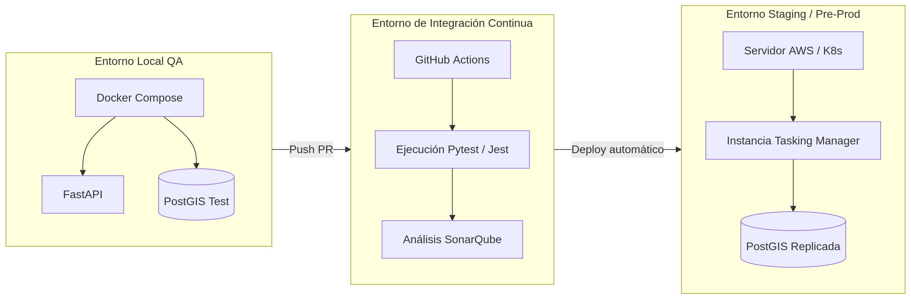

# Plan Maestro de Pruebas: Recursos y Entornos

**Proyecto:** HOT OSM Tasking Manager  
**Estándar de Referencia:** ISO/IEC/IEEE 29119-3 (Especificación del Entorno de Pruebas)  

## 1. Arquitectura de los Entornos de Pruebas
Para garantizar el aislamiento y la repetibilidad de los resultados, el aseguramiento de calidad del Tasking Manager exige el uso de entornos encapsulados mediante contenedores, dada la complejidad de sus dependencias espaciales.

 

*(Propósito del diagrama: Aclarar la separación de responsabilidades operativas. Las pruebas unitarias ocurren entre Local y CI; las pruebas de Sistema ocurrirán en Staging).*

## 2. Requerimientos de Infraestructura y Herramientas QA
El stack tecnológico de pruebas ha sido estandarizado para todo el equipo:

### 2.1. Frameworks de Ejecución
*   **Backend (Python/FastAPI):** `pytest` como framework principal de aserciones. Uso intensivo de `unittest.mock` para aislar microservicios.
*   **Frontend (React):** `Jest` y `React Testing Library` para pruebas de componentes aislados.
*   **End-to-End (E2E):** `Cypress` (a implementar a partir de la Fase 3) para automatizar flujos de mapeo y validación en la UI.

### 2.2. Dependencias Técnicas y Entorno Local
*   **Motor de Base de Datos Temporal:** Cada ejecución de pruebas unitarias/integración del backend *debe* levantar una base de datos efímera de PostgreSQL con la extensión **PostGIS**. Está estrictamente prohibido apuntar pruebas de escritura a bases de datos de desarrollo o producción.
*   **Mocks de Servicios Externos:** Se requiere la configuración de servidores mock (ej. `WireMock` o librerías internas como `responses` en Python) para interceptar y simular respuestas de la API pública de **OpenStreetMap (OSM)** y **Ohsome**.

## 3. Integración Continua (CI/CD)
El proyecto confía en **GitHub Actions** como orquestador de pruebas.
*   Todo *Pull Request* hacia la rama `develop` o `main` disparará automáticamente el *Test Pipeline*.
*   **Bloqueo de Merge:** Si el reporte de cobertura automatizado (generado por `coverage.py`) cae por debajo del umbral del 80%, el PR será bloqueado automáticamente en GitHub.

## 4. Limitaciones Técnicas y Restricciones
*   **Límites de Tasa (Rate Limiting) de OSM:** Tasking Manager consume datos reales de OSM. Durante las pruebas E2E y de Integración, el equipo QA debe tener cuidado de no ser baneado por exceder el *rate limit* de la API pública de OSM. El uso de *Mocks* es obligatorio en Fases 1 y 2.
*   **Datos Espaciales (Test Data):** La generación manual de polígonos GeoJSON (multipolygon) para pruebas es compleja. El equipo deberá mantener un banco de datos estáticos en `tests/fixtures/` con geometrías pre-validadas.
