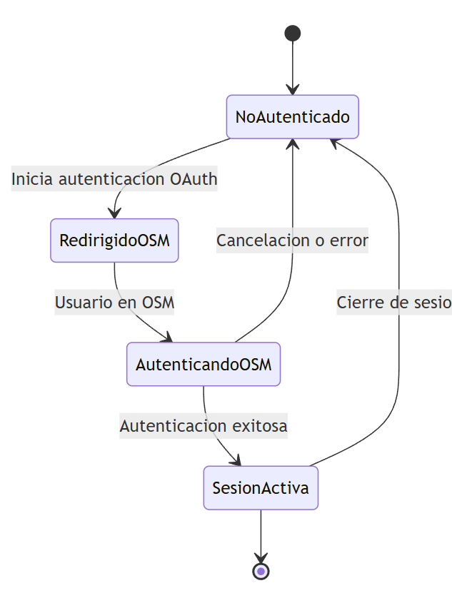
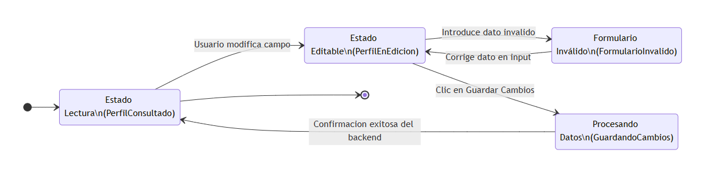

# Diseño de Pruebas Funcionales: MOD-01 - Autenticación y Perfil
**Versión del Documento:** 1.0
**Tipo de Análisis:** Diseño de Pruebas de Sistema (Caja Negra)

---

## 1. Contexto del Módulo
Este módulo gestiona el ciclo de vida de la identidad, sesión y experiencia del usuario en la plataforma. Es responsable de controlar el acceso seguro mediante OAuth 2.0 con OpenStreetMap, calcular y actualizar el nivel técnico del mapper (BEGINNER, INTERMEDIATE, ADVANCED) según sus métricas, restringir contribuciones mediante la aceptación obligatoria de licencias, y permitir la personalización de ajustes del perfil desde la interfaz.

*Para consultar el detalle exhaustivo de los actores, restricciones y reglas de negocio, referirse al [Catálogo de Requerimientos Funcionales](../funcionales/01-requerimientos-funcionales.md).*

---

## 2. Estrategia de Diseño de Pruebas

### 2.1. Enfoque general
Las pruebas se centrarán de manera estricta en la validación visual y de comportamiento a nivel de Interfaz de Usuario (UI). La estrategia se enfocará en verificar la correcta sincronización de datos con el proveedor externo (OSM), el bloqueo preventivo de funciones de mapeo cuando existan licencias pendientes de aprobación, y la correcta respuesta visual ante cambios en el formulario de configuración del perfil del usuario.

El alcance de estas pruebas cubre las interacciones de los siguientes actores clave del sistema:
* **ACT-01 Usuario Anónimo:** Evaluando su restricción de acceso a menús privados y su transición hacia la pasarela de autenticación.
* **ACT-02 Mapper:** Validando su experiencia visual en el Dashboard, la edición de sus preferencias y el impacto de su nivel calculado en la interfaz.
* **ACT-06 Sistema:** Verificando cómo los procesos automatizados en segundo plano (consultas de APIs externas como Ohsome) impactan y actualizan los datos visuales del perfil del Mapper en tiempo real.

| Actor de Impacto | Rol en este Módulo | Contexto de Prueba |
| :--- | :--- | :--- |
| **ACT-01** Usuario Anónimo | Solicitante de acceso | Intento de Login / Navegación pública inicial (RF-1001). |
| **ACT-02** Mapper | Usuario core autenticado | Aceptación de licencias (RF-1003) y actualización de datos (RF-1004). |
| **ACT-06** Sistema | Proveedor de datos asíncrono | Cálculo automático y visualización del nivel técnico (RF-1002). |

### 2.2. Técnicas de Caja Negra Utilizadas

* **Transición de Estados:** Utilizada para modelar y evaluar el flujo del login delegado (RF-1001) y la actualización de perfil (RF-1004). Permite verificar cómo cambia la interfaz entre diferentes estados (ej. Usuario Anónimo, Pantalla Externa de OSM, Sesión Activa, o Alertas de Validación en el formulario) basándose puramente en las interacciones y clics del usuario.
* **Partición de Equivalencia (PE)** y **Análisis de Valores Límite (AVL):** Aplicadas de manera conjunta para el cálculo del nivel de Mapper (RF-1002). Permiten agrupar los rangos numéricos de las ediciones en clases representativas y evaluar con total precisión en la pantalla los "bordes" o fronteras exactas donde la etiqueta visual del nivel debe cambiar de forma automática.
* **Tablas de Decisión:** Utilizada para la funcionalidad de aceptación de licencias (RF-1003). Permite validar de forma rigurosa las combinaciones lógicas de entrada (estado de la autenticación y configuración de restricciones del proyecto) para asegurar que el sistema ejecute correctamente la acción de habilitar o mantener bloqueado el botón de contribución en el mapa.

---

## 3. Especificaciones de Escenarios y Casos de Prueba

### 3.1. Escenario: ESC-1001 - Autenticación Delegada de Usuario vía OAuth 2.0 con OSM

**A. Definición del Escenario**
| Atributo | Detalle |
| :--- | :--- |
| **Descripción** | Validar el ciclo de vida del inicio y cierre de sesión del usuario en la interfaz del Tasking Manager, siguiendo las transiciones de estado del protocolo OAuth 2.0 con OpenStreetMap. |
| **RF Asociados** | RF-1001 |
| **Precondiciones** | El usuario debe contar con una cuenta activa y credenciales válidas en la plataforma oficial openstreetmap.org. El sistema debe encontrarse en la Landing Page pública. |
| **Técnicas aplicadas**| Transición de Estados |
| **Resultado Esperado** | La interfaz debe guiar al usuario a través del flujo externo de autorización y, tras el éxito o la cancelación del proceso, actualizar el estado de la pantalla local de forma segura y coherente. |

**B. Aplicación de Técnicas (Análisis)**
Para este escenario, se modela el comportamiento del sistema mediante los componentes de la técnica de **Transición de Estados** extraídos del diagrama oficial del módulo:

* **Estados del Sistema Identificados:**
    * `NoAutenticado`: Estado inicial público donde el usuario navega como invitado en la interfaz.
    * `RedirigidoOSM`: El sistema deriva el control visual a la URL externa de OpenStreetMap.
    * `AutenticandoOSM`: Estado intermedio de callback donde el Tasking Manager procesa la respuesta del token en segundo plano.
    * `SesionActiva`: Estado final exitoso donde el usuario accede a su perfil y dashboard con sus datos visibles en pantalla.
* **Transiciones / Eventos Evaluados:**
    * `Inicia autenticacion OAuth`
    * `Usuario en OSM`
    * `Autenticacion exitosa`
    * `Cancelacion o error`
    * `Cierre de sesion`

 

---

**C. Casos de Prueba Derivados**

| ID Caso | Pasos de Ejecución | Datos de Entrada (Clases aplicadas) | Resultado Esperado |
| :--- | :--- | :--- | :--- |
| **CP-1001-01** | 1. Ingresar a la URL principal del Tasking Manager (`NoAutenticado`). 2. Hacer clic en el botón "Log In" (`Inicia autenticacion OAuth`). 3. En la interfaz externa de OSM (`RedirigidoOSM`), ingresar credenciales y autorizar (`Usuario en OSM`). 4. Esperar el procesamiento de la respuesta (`AutenticandoOSM`). | **Credenciales OSM:** Válidas. **Acción en OSM:** Autorizar acceso. | El sistema completa la transición a `Autenticacion exitosa`, cargando la interfaz local en el estado `SesionActiva` con el Dashboard de mapeo disponible. |
| **CP-1001-02** | 1. Ingresar a la URL principal del Tasking Manager (`NoAutenticado`). 2. Hacer clic en el botón "Log In" (`Inicia autenticacion OAuth`). 3. En la interfaz externa de OSM (`RedirigidoOSM`), hacer clic en el botón "Denegar" o "Cancelar". | **Credenciales OSM:** N/A. **Acción en OSM:** Denegar o Cancelar. | Al pasar al estado `AutenticandoOSM`, el sistema detecta la denegación y ejecuta la transición `Cancelacion o error`, devolviendo de inmediato la interfaz del usuario al estado inicial de `NoAutenticado`. |
| **CP-1001-03** | 1. Estando dentro de la plataforma con la sesión iniciada (`SesionActiva`). 2. Desplegar el menú de perfil en la esquina superior derecha. 3. Hacer clic en la opción "Log Out / Cerrar Sesión" (`Cierre de sesion`). | **Estado Inicial:** `SesionActiva`. **Acción de Salida:** Clic en Logout. | La aplicación destruye la sesión de forma local y redirige la interfaz del usuario de regreso al estado inicial de `NoAutenticado` (Landing Page pública). |

---

### 3.2. Escenario: ESC-1002 - Clasificación Automatizada y Visualización del Nivel del Mapper

**A. Definición del Escenario**
| Atributo | Detalle |
| :--- | :--- |
| **Descripción** | Validar que el sistema (ACT-06) calcule correctamente el nivel técnico de experiencia del usuario basándose en sus ediciones consumidas por API, y que la interfaz de usuario muestre la etiqueta correspondiente de manera exacta. |
| **RF Asociados** | RF-1002 |
| **Precondiciones** | El usuario (ACT-02) debe haber iniciado sesión de forma exitosa mediante OAuth (RF-1001) y encontrarse visualizando la sección de su perfil o el menú de métricas del sistema. |
| **Técnicas aplicadas**| Partición de Equivalencia (PE) y Análisis de Valores Límite (AVL) |
| **Resultado Esperado** | La interfaz gráfica debe actualizar de forma automática la medalla o etiqueta de nivel (`BEGINNER`, `INTERMEDIATE`, `ADVANCED`) en el segundo exacto en que las métricas del usuario toquen las fronteras numéricas establecidas. |

**B. Aplicación de Técnicas (Análisis)**

#### B.1. Partición de Equivalencia (PE)
Se agrupa el universo de datos del contador numérico de ediciones en base a las categorías lógicas del sistema:

| Clase Válida | Clases No Válidas | Rango de Ediciones |
| :--- | :--- | :---: |
| **PE-V01** (Beginner) | - | de 0 a 250 |
| **PE-V02** (Intermediate) | - | de 251 a 1000 |
| **PE-V03** (Advanced) | - | mas 1001 |
| - | **PE-NV01** (Valores Corruptos) | < 0 |

#### B.2. Análisis de Valores Límite (AVL)
Se identifican los valores de prueba críticos situados en los extremos numéricos exactos de las particiones:

| Límite Inferior Válido | Límite Inferior No Válido | Límite Superior Válido | Límite Superior No Válido | Rango de Clase Asociado |
| :---: | :---: | :---: | :---: | :---: |
| **0** | **-1** | **250** | **251** | Rango Beginner |
| **251** | **250** | **1000** | **1001** | Rango Intermediate |
| **1001** | **1000** | **no especificado** | - | Rango Advanced |

---

**C. Casos de Prueba Derivados**

| ID Caso | Pasos de Ejecución | Datos de Entrada (Clases aplicadas) | Resultado Esperado |
| :--- | :--- | :--- | :--- |
| **CP-1002-01** | 1. Acceder al Tasking Manager con un perfil que posea el valor base de la escala de mappers. | **Total Changesets:** 0  *(Límite Inferior Válido)* | La interfaz gráfica de usuario carga el perfil mostrando explícitamente la etiqueta con el texto **BEGINNER**. |
| **CP-1002-02** | 1. Acceder al Tasking Manager con un perfil que posea exactamente el tope de la clase principiante. | **Total Changesets:** 250  *(Límite Superior Válido)* | La interfaz gráfica de usuario carga el perfil mostrando explícitamente la etiqueta con el texto **BEGINNER**. |
| **CP-1002-03** | 1. Acceder al Tasking Manager con un perfil que posea el valor inmediatamente superior a la frontera Beginner. | **Total Changesets:** 251  *(Límite Superior No Válido)* | El sistema calcula la transición y la interfaz del usuario cambia de forma automática la medalla a la categoría **INTERMEDIATE**. |
| **CP-1002-04** | 1. Acceder al Tasking Manager con un perfil que se encuentre en el límite estricto de la clase intermedia. | **Total Changesets:** 1000  *(Límite Superior Válido)* | La interfaz gráfica de usuario mantiene la consistencia visual mostrando la etiqueta fija de **INTERMEDIATE**. |
| **CP-1002-05** | 1. Acceder al Tasking Manager con un perfil que rompa el límite intermedio por una sola edición. | **Total Changesets:** 1001  *(Límite Superior No Válido)* | El sistema evalúa el cambio de rango de forma inmediata y la interfaz de usuario renderiza la etiqueta de máximo nivel: **ADVANCED**. |

---

### 3.3. Escenario: ESC-1003 - Restricción de Contribución por Aceptación de Licencias de Proyecto

**A. Definición del Escenario**
| Atributo | Detalle |
| :--- | :--- |
| **Descripción** | Validar que la interfaz restrinja el acceso a las funciones de mapeo de un proyecto cuando este exija términos legales específicos, impidiendo la contribución hasta que el usuario confirme su aceptación. |
| **RF Asociados** | RF-1003 (Dependiente de RF-1001) |
| **Precondiciones** | El usuario (ACT-02) intenta interactuar con la vista de asignación de tareas cartográficas de un proyecto específico. |
| **Técnicas aplicadas**| Tablas de Decisión |
| **Resultado Esperado** | La interfaz de usuario debe bloquear dinámicamente los botones de interacción cartográfica y forzar la aparición de un componente modal/banner legal, el cual se liberará únicamente al registrar la confirmación del usuario. |

**B. Aplicación de Técnicas (Análisis)**
Para este escenario, se modela el comportamiento lógico de la interfaz mediante los componentes de la técnica de **Tablas de Decisión**, mapeando las variables de entrada y las respuestas visuales del sistema:

* **Condiciones de Entrada (Controles de la UI):**
    * `CE-1`: ¿El usuario cuenta con una sesión autenticada activa? (RF-1001)
    * `CE-2`: ¿El proyecto seleccionado exige la firma/aceptación de una licencia?
    * `CE-3`: ¿El usuario hace clic en "Aceptar términos" en la ventana modal/banner?
* **Condiciones de Salida (Resultados en la UI):**
    * `CS-1`: Redirigir de forma inmediata a la Landing Page pública y forzar el Login.
    * `CS-2`: Desplegar ventana modal/banner obligatorio de términos legales en pantalla.
    * `CS-3`: Mantener inhabilitado el botón de contribución ("Mapear Tarea") en gris.
    * `CS-4`: Habilitar por completo el botón de contribución ("Mapear Tarea") en color activo.

#### B.1. Tablas de Decisión
Se cruzan las condiciones utilizando la simplificación por equivalencias (guiones) para optimizar la cobertura de pruebas de la interfaz:

| Tipo de Control | Variables de la Interfaz de Usuario | A | B | C | D |
| :--- | :--- | :---: | :---: | :---: | :---: |
| **Condiciones de Entrada** | `CE-1`: Sesión de usuario activa | **F** | **V** | **V** | **V** |
| | `CE-2`: Proyecto exige licencia | **-** | **F** | **V** | **V** |
| | `CE-3`: Usuario acepta términos en pantalla | **-** | **-** | **F** | **V** |
| **Condiciones de Salida** | `CS-1`: Redirigir de forma forzada a Landing/Login | **V** | **F** | **F** | **F** |
| | `CS-2`: Desplegar modal/banner legal | **F** | **F** | **V** | **F** |
| | `CS-3`: Botón "Mapear Tarea" inhabilitado (Gris) | **F** | **F** | **V** | **F** |
| | `CS-4`: Botón "Mapear Tarea" habilitado (Activo) | **F** | **V** | **F** | **V** |

---

**C. Casos de Prueba Derivados**

| ID Caso | Pasos de Ejecución | Datos de Entrada (Reglas Aplicadas) | Resultado Esperado |
| :--- | :--- | :--- | :--- |
| **CP-1003-01** | 1. Intentar ingresar directamente a la URL de contribución de un proyecto restrictivo sin autenticación previa. | **Estado Sesión:** No Autenticado. *(Regla de Columna A)* | El sistema bloquea la carga de la interfaz del proyecto, redirige de inmediato al usuario a la Landing Page pública (`CS-1 = V`) y solicita el login vía OSM. |
| **CP-1003-02** | 1. Iniciar sesión con una cuenta de Mapper (`ACT-02`). 2. Navegar e ingresar a un proyecto público estándar que **no** tiene ninguna licencia configurada. | **Estado Sesión:** Activa. **Configuración:** Proyecto sin licencia. *(Regla de Columna B)* | La interfaz no despliega alertas visuales, carga la cuadrícula del mapa de forma limpia y el botón "Mapear Tarea" se muestra directamente activo y habilitado (`CS-4 = V`). |
| **CP-1003-03** | 1. Iniciar sesión con una cuenta de Mapper (`ACT-02`). 2. Navegar e ingresar a un proyecto configurado con licencias legales obligatorias. 3. Intentar seleccionar un cuadrante o interactuar con el mapa ignorando los textos. | **Estado Sesión:** Activa. **Configuración:** Proyecto con licencia. **Acción:** Sin aceptar términos. *(Regla de Columna C)* | La interfaz congela las interacciones desplegando de forma obligatoria la ventana modal de términos legales (`CS-2 = V`). El botón principal "Mapear Tarea" permanece bloqueado en color gris (`CS-3 = V`). |
| **CP-1003-04** | 1. Estando ante la ventana modal obligatoria de términos legales de un proyecto (Contexto CP-1003-03). 2. Hacer clic en el botón o casilla "Acepto los términos y licencias" de la pantalla. | **Estado Sesión:** Activa. **Configuración:** Proyecto con licencia. **Acción:** Clic en Aceptar. *(Regla de Columna D)* | El componente modal legal se oculta automáticamente en la interfaz. El botón principal "Mapear Tarea" cambia de estado visual de gris a su color activo (azul/verde) quedando totalmente habilitado (`CS-4 = V`). |

---

### 3.4. Escenario: ESC-1004 - Modificación de Preferencias y Actualización de Perfil

**A. Definición del Escenario**
| Atributo | Detalle |
| :--- | :--- |
| **Descripción** | Validar que la interfaz del perfil de usuario permita modificar las preferencias personales (idioma, correo, editor preferido), controlling visualmente los estados del formulario desde la edición hasta el guardado exitoso o el rechazo por datos inválidos. |
| **RF Asociados** | RF-1004 |
| **Precondiciones** | El usuario (ACT-02) debe tener una sesión activa (`SesionActiva`), haber ingresado a la sección "Ajustes de Perfil" y el formulario debe cargarse con sus datos actuales en modo lectura. |
| **Técnicas aplicadas**| Transición de Estados |
| **Resultado Esperado** | La interfaz gráfica debe guiar al usuario bloqueando o habilitando el botón de guardado según el estado del formulario, mostrando alertas instantáneas ante errores de formato y confirmando visualmente cuando los cambios se almacenen con éxito. |

**B. Aplicación de Técnicas (Análisis)**
Para este escenario, se modela el comportamiento del sistema mediante los componentes de la técnica de **Transición de Estados** extraídos del diagrama oficial del módulo:

* **Estados del Sistema Identificados:**
    * `PerfilConsultado`: Estado inicial donde el formulario se muestra en modo lectura con la información guardada. El botón "Guardar Cambios" permanece oculto o inhabilitado.
    * `PerfilEnEdicion`: Estado en el cual el usuario altera al menos un input válido. El botón de guardado transiciona a un estado activo en la pantalla.
    * `FormularioInvalido`: Estado de alerta visual activado al introducir un dato erróneo (ej. correo sin formato `@`). El botón de guardado se congela y se renderiza texto rojo de advertencia.
    * `GuardandoCambios`: Estado transitorio de procesamiento donde la interfaz muestra un indicador de carga (Spinner) y congela temporalmente los campos.
* **Transiciones / Eventos Evaluados:**
    * `Usuario modifica campo`
    * `Introduce dato invalido`
    * `Corrige dato en input`
    * `Clic en Guardar Cambios`
    * `Confirmacion exitosa del backend`

---

**C. Casos de Prueba Derivados**

| ID Caso | Pasos de Ejecución | Datos de Entrada (Clases aplicadas) | Resultado Esperado |
| :--- | :--- | :--- | :--- |
| **CP-1004-01** | 1. Ingresar a la sección "Ajustes de Perfil" (`PerfilConsultado`). 2. Cambiar el "Editor por defecto" de ID Editor a JOSM (`Usuario modifica campo`). 3. Hacer clic en el botón activo "Guardar Cambios" (`Clic en Guardar Cambios`). 4. Esperar el procesamiento asíncrono de la pantalla (`GuardandoCambios`). | **Editor seleccionado:** JOSM. **Acción:** Enviar cambios de preferencias. | El sistema procesa la actualización (`Confirmacion exitosa del backend`), la interfaz despliega un mensaje Toast emergente de éxito y el formulario regresa al estado base de `PerfilConsultado`. |
| **CP-1004-02** | 1. Ingresar a la sección "Ajustes de Perfil" (`PerfilConsultado`). 2. Borrar el correo electrónico actual y escribir el texto "usuario_mapeo" sin dominio (`Introduce dato invalido`). | **Correo ingresado:** usuario_mapeo *(Sintaxis incorrecta)* | La interfaz cambia al estado `FormularioInvalido`: el botón "Guardar Cambios" se deshabilita automáticamente y aparece un mensaje de error en texto rojo indicando el fallo de formato. |
| **CP-1004-03** | 1. Estando en la pantalla de perfil con el error visual de correo electrónico activo (`FormularioInvalido`). 2. Completar la dirección agregando "@gmail.com" al input (`Corrige dato en input`). | **Correo corregido:** usuario_mapeo@gmail.com | La aplicación detecta el cambio en tiempo real, borra la alerta roja de la pantalla y transiciona al estado `PerfilEnEdicion`, reactivando visualmente el botón "Guardar Cambios". |