# Documento de Especificación de Requerimientos Funcionales (DERF)
**Proyecto:** HOTOSM Tasking Manager
**Versión del Documento:** 1.0
**Tipo de Análisis:** Ingeniería Inversa de Requisitos / Análisis de Caja Negra

---

## 1. Descripción general del sistema

El presente documento formaliza los requerimientos funcionales del **HOTOSM Tasking Manager (TM)**, la herramienta principal de coordinación para el mapeo colaborativo del Equipo Humanitario de OpenStreetMap (HOT).

*   **Objeto de análisis:** La instancia oficial de producción ([tasks.hotosm.org](https://tasks.hotosm.org)).
*   **Alcance:** El análisis abarca la funcionalidad estrictamente observable desde la interfaz gráfica de usuario (UI)
*   **Objetivo:** Establecer una línea base documentada, con alta trazabilidad que sirva como insumo oficial para el diseño, ejecución y automatización de pruebas de software (Caja Negra, Pruebas de Integración y Pruebas Unitarias).

---

## 2. Actores del sistema

El sistema implementa un modelo de Control de Acceso Basado en Roles (RBAC) superpuesto con un sistema de "Niveles de Experiencia" calculados dinámicamente.

| ID | Nombre del Actor | Descripción Funcional |
| :--- | :--- | :--- |
| **ACT-0001** | **Usuario Anónimo** | Visitante sin autenticar. Sus capacidades se limitan a la exploración de proyectos públicos, visualización de estadísticas globales y acceso a documentación. |
| **ACT-0002** | **Mapper** | Usuario autenticado vía OpenStreetMap. Posee un nivel de experiencia calculado automáticamente (`BEGINNER`, `INTERMEDIATE`, `ADVANCED`). Puede bloquear, mapear y comentar tareas. |
| **ACT-0003** | **Validator** | Usuario con permisos elevados (por su nivel de experiencia o por membresía en un equipo de validación) autorizado para auditar, aprobar o rechazar el mapeo realizado por otros usuarios. |
| **ACT-0004** | **Project Manager (PM)** | Administrador a nivel de Organización o Equipo. Tiene privilegios para crear proyectos, definir Áreas de Interés (AOI), asignar permisos, transferir propiedad y administrar membresías. |
| **ACT-0005** | **SysAdmin** | Administrador global de la plataforma. Posee acceso irrestricto para gestionar campañas, licencias globales, roles de otros usuarios y configuraciones del sistema. |
| **ACT-0006** | **Sistema** | Procesos automatizados en segundo plano (Cron Jobs / Background Tasks) encargados de liberar tareas expiradas, actualizar estadísticas contra APIs externas (Ohsome) y disparar notificaciones. |

---

## 3. Módulos del sistema

La arquitectura funcional del Tasking Manager se ha segmentado lógicamente en los siguientes módulos para facilitar la cobertura de pruebas.

| ID | Nombre del Módulo | Descripción |
| :--- | :--- | :--- |
| **MOD-0001** | **Autenticación y Perfil** | Gestión del ciclo de vida de la sesión (OAuth 2.0 con OSM), cálculo de métricas de usuario, niveles de mapeo y aceptación de licencias. |
| **MOD-0002** | **Exploración de Proyectos** | Motor de búsqueda, filtros avanzados (por estado, dificultad, campañas), ordenamiento y renderizado en mapa (BBOX). |
| **MOD-0003** | **Ejecución de Mapeo (Tasking)** | Lógica core de bloqueo/desbloqueo de tareas, división de grillas (Split) e integración con editores geográficos externos (iD, JOSM, Rapid). |
| **MOD-0004** | **Proceso de Validación** | Flujo de control de calidad. Incluye bloqueo múltiple, prevención de auto-validación y transiciones de estado (`VALIDATED`, `INVALIDATED`). |
| **MOD-0005** | **Administración de Proyectos** | Creación de proyectos (AOI, Tareas por grilla o arbitrarias), clonación, configuración de metadatos y privacidad. |
| **MOD-0006** | **Gobernanza (Equipos y Orgs)** | Gestión jerárquica de permisos. Creación de Organizaciones, Equipos, flujos de invitación/solicitud de unión y asignación de proyectos. |
| **MOD-0007** | **Comunicación y Alertas** | Subsistema de notificaciones (in-app y email), chat general de proyectos, menciones (`@usuario`) y comentarios por tarea. |

---

## 4. Catálogo de Requerimientos Funcionales

A continuación, se detallan los requerimientos funcionales extraídos y deducidos, estructurados para su directa conversión en Casos de Prueba.

### MOD-0001: Autenticación y Perfil
| ID | Nombre | Descripción Funcional | Actor | Módulo | Prioridad | Dependencias |
| :--- | :--- | :--- | :--- | :--- | :--- | :--- |
| **RF-1001** | **Login delegado (OAuth)** | El sistema debe autenticar al usuario redirigiéndolo al proveedor OAuth de OSM y crear una sesión local basada en el token devuelto. | ACT-0001 | MOD-0001 | Alta | - |
| **RF-1002** | **Cálculo de nivel de Mapper** | Tras la autenticación, el sistema debe consultar la API de OSM/Ohsome para contabilizar *changesets* y calcular el nivel del usuario (`BEGINNER`, `INTERMEDIATE`, `ADVANCED`). | ACT-0006 | MOD-0001 | Alta | RF-1001 |
| **RF-1003** | **Aceptación de Licencias** | Si un proyecto tiene una licencia asignada, el sistema debe bloquear la contribución hasta que el usuario confirme la aceptación de los términos. | ACT-0002 | MOD-0001 | Alta | RF-1001, RF-3001 |
| **RF-1004** | **Actualización de Perfil** | El usuario debe poder modificar su correo, género, y preferencias de notificaciones desde la interfaz de ajustes de perfil. | ACT-0002 | MOD-0001 | Media | RF-1001 |

### MOD-0002: Exploración de Proyectos
| ID | Nombre | Descripción Funcional | Actor | Módulo | Prioridad | Dependencias |
| :--- | :--- | :--- | :--- | :--- | :--- | :--- |
| **RF-2001** | **Filtros de Búsqueda** | El sistema debe permitir filtrar proyectos por nivel de dificultad, estado (`DRAFT`, `PUBLISHED`, `ARCHIVED`), campaña y tipo de mapeo. | ACT-0001 | MOD-0002 | Alta | - |
| **RF-2002** | **Búsqueda por BBOX** | El sistema debe renderizar en la vista de mapa solo los proyectos cuyos polígonos intersecten con las coordenadas de la vista actual (Bounding Box). | ACT-0001 | MOD-0002 | Media | - |
| **RF-2003** | **Restricción de Proyectos Privados** | Los proyectos marcados como privados no deben ser listados en la exploración general a menos que el usuario pertenezca a un equipo autorizado o sea Admin. | ACT-0002 | MOD-0002 | Alta | RF-1001 |

### MOD-0003: Ejecución de Mapeo (Tasking)
| ID | Nombre | Descripción Funcional | Actor | Módulo | Prioridad | Dependencias |
| :--- | :--- | :--- | :--- | :--- | :--- | :--- |
| **RF-3001** | **Bloqueo singular de tarea** | El sistema debe permitir a un Mapper bloquear una tarea en estado `READY` cambiándola a `LOCKED_FOR_MAPPING`. Solo se permite una tarea en mapeo a la vez por usuario. | ACT-0002 | MOD-0003 | Crítica | RF-1001 |
| **RF-3002** | **Integración de Editor Web** | Al seleccionar iD o Rapid, el sistema debe inyectar la URL base con parámetros geográficos (Zoom, X, Y) y comentarios predeterminados (`changesetComment`). | ACT-0002 | MOD-0003 | Alta | RF-3001 |
| **RF-3003** | **Integración de Editor Local (JOSM)** | Al seleccionar JOSM, el sistema debe comprobar disponibilidad local (HTTP GET `127.0.0.1:8111`). Si no responde, debe mostrar un modal de error (`JOSMError`). | ACT-0002 | MOD-0003 | Alta | RF-3001 |
| **RF-3004** | **Envío de estado (Submit)** | El sistema debe permitir desbloquear la tarea asignando un estado final: `MAPPED` (completada), `BADIMAGERY` (no mapeable) o regresar a `READY`. | ACT-0002 | MOD-0003 | Crítica | RF-3001 |
| **RF-3005** | **División de tarea (Split)** | Un Mapper debe poder dividir una tarea bloqueada en 4 sub-tareas más pequeñas, sujeto al límite máximo de zoom configurado. | ACT-0002 | MOD-0003 | Media | RF-3001 |
| **RF-3006** | **Liberación por tiempo (Auto-unlock)** | El sistema debe revertir automáticamente tareas bloqueadas a estado `READY` si el tiempo de bloqueo excede la configuración (`autoUnlockSeconds`). | ACT-0006 | MOD-0003 | Alta | RF-3001 |

### MOD-0004: Proceso de Validación
| ID | Nombre | Descripción Funcional | Actor | Módulo | Prioridad | Dependencias |
| :--- | :--- | :--- | :--- | :--- | :--- | :--- |
| **RF-4001** | **Bloqueo de tareas para validación** | El sistema debe permitir a un Validator bloquear una o múltiples tareas en estado `MAPPED` (pasando a `LOCKED_FOR_VALIDATION`). | ACT-0003 | MOD-0004 | Alta | RF-3004 |
| **RF-4002** | **Prevención de Auto-Validación** | El sistema debe rechazar la validación si el usuario intentando validar es el mismo que registró el estado `MAPPED` de la tarea. | ACT-0003 | MOD-0004 | Alta | RF-4001 |
| **RF-4003** | **Evaluación de calidad** | El sistema debe permitir clasificar la tarea revisada como `VALIDATED` (aprobada) o `INVALIDATED` (rechazada, vuelve a requerir mapeo). | ACT-0003 | MOD-0004 | Crítica | RF-4001 |
| **RF-4004** | **Deshacer acción (Undo)** | El usuario debe poder revertir su propia última acción en una tarea, regresando el estado previo, registrando un comentario en el historial. | ACT-0002 | MOD-0004 | Media | RF-3004, RF-4003 |

### MOD-0005: Administración de Proyectos
### 5.1 Creación de Área de Interés mediante GeoJSON válido

**CP-MOD5-001**

| ID              | Descripción                                                                                                                      | Tipo   | Estado  | Defectos                    |
| :-------------- | :------------------------------------------------------------------------------------------------------------------------------- | :----- | :------ | :-------------------------- |
| **CP-MOD5-001** | Verificar que el sistema permita definir el Área de Interés de un nuevo proyecto mediante la carga de un archivo GeoJSON válido. | Manual | Exitoso | No se encontraron defectos. |

| Resultado esperado                                                                                                                              | Resultado obtenido                                                                                                                                                                                  |
| :---------------------------------------------------------------------------------------------------------------------------------------------- | :-------------------------------------------------------------------------------------------------------------------------------------------------------------------------------------------------- |
| El sistema debe aceptar el archivo GeoJSON válido, representar el AOI en el mapa y permitir avanzar al siguiente paso de creación del proyecto. | El sistema aceptó el AOI cargado y permitió avanzar al **Paso 2: Establecer tamaños de tareas**, mostrando el área definida sobre el mapa e indicando la cantidad de tareas generadas inicialmente. |

#### Evidencia CP-MOD5-001 — Pantalla inicial de definición de AOI

  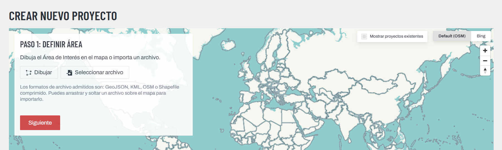

Se observa la pantalla inicial del flujo de creación de proyecto, donde el sistema permite definir el Área de Interés mediante dibujo manual o carga de archivo geográfico.

#### Evidencia CP-MOD5-001 — AOI aceptado y avance al Paso 2

  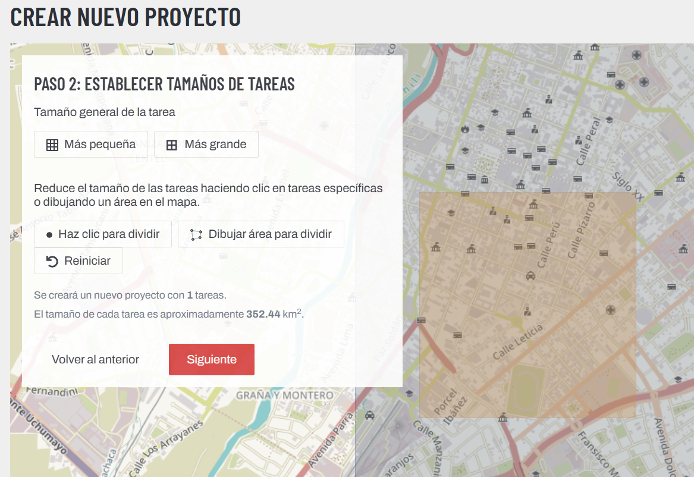

Se observa que el sistema aceptó correctamente el AOI definido y permitió avanzar al Paso 2: Establecer tamaños de tareas.yecto y permitió continuar con la configuración del tamaño de tareas. Esto evidencia que la entrada válida fue procesada correctamente desde la interfaz del usuario.

### 5.2 Generación de grilla de tareas dentro del AOI

**CP-MOD5-002**

| ID              | Descripción                                                                                                                                                         | Tipo   | Estado  | Defectos                    |
| :-------------- | :------------------------------------------------------------------------------------------------------------------------------------------------------------------ | :----- | :------ | :-------------------------- |
| **CP-MOD5-002** | Verificar que el sistema genere una cuadrícula de tareas dentro del Área de Interés definida previamente y permita continuar con el flujo de creación del proyecto. | Manual | Exitoso | No se encontraron defectos. |

| Resultado esperado                                                                                                                                                                                   | Resultado obtenido                                                                                                                              |
| :--------------------------------------------------------------------------------------------------------------------------------------------------------------------------------------------------- | :---------------------------------------------------------------------------------------------------------------------------------------------- |
| El sistema debe generar una grilla o cuadrícula de tareas dentro del AOI definido, mostrar visualmente las tareas generadas y permitir avanzar al siguiente paso del flujo de creación del proyecto. | El sistema generó la cuadrícula de tareas sobre el AOI previamente definido y permitió avanzar al **Paso 3: Recortar la cuadrícula de tareas**. |

#### Evidencia CP-MOD5-002 — Grilla inicial generada

  

Se observa que, después de definir el Área de Interés, el sistema generó una cuadrícula inicial de tareas dentro del AOI. Además, la interfaz muestra la cantidad de tareas que serán creadas y permite ajustar el tamaño general de cada tarea.

#### Evidencia CP-MOD5-002 — Avance al paso de recorte de cuadrícula

  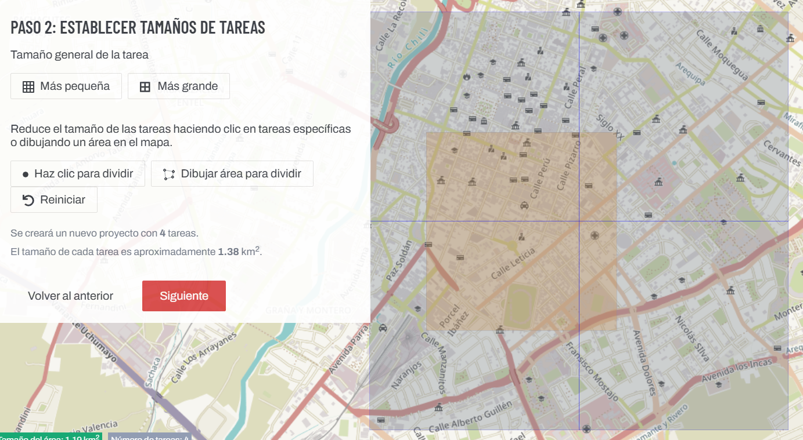

Se evidencia que el sistema permitió continuar hacia el **Paso 3: Recortar la cuadrícula de tareas**, confirmando que la generación inicial de la grilla fue procesada correctamente desde la interfaz del usuario.

### 5.3 Recorte de cuadrícula de tareas dentro del AOI

**CP-MOD5-003**

| ID              | Descripción                                                                                                                                    | Tipo   | Estado  | Defectos                    |
| :-------------- | :--------------------------------------------------------------------------------------------------------------------------------------------- | :----- | :------ | :-------------------------- |
| **CP-MOD5-003** | Verificar que el sistema permita recortar la cuadrícula de tareas generada previamente y continuar con el flujo de creación del proyecto. | Manual | Exitoso | No se encontraron defectos. |

| Resultado esperado                                                                                                                                       | Resultado obtenido                                                                                                                                                  |
| :------------------------------------------------------------------------------------------------------------------------------------------------------- | :------------------------------------------------------------------------------------------------------------------------------------------------------------------ |
| El sistema debe permitir recortar la cuadrícula de tareas al Área de Interés definida, conservar las tareas válidas dentro del AOI y permitir avanzar al paso de revisión del proyecto. | El sistema procesó correctamente el recorte de la cuadrícula y permitió avanzar al **Paso 4: Revisar**, indicando que el proyecto se creará con **4 tareas**. |

#### Evidencia CP-MOD5-003 — Pantalla inicial de recorte de cuadrícula

  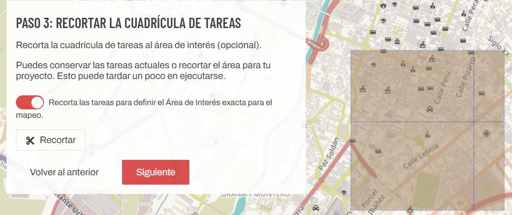

Se observa la pantalla correspondiente al **Paso 3: Recortar la cuadrícula de tareas**, donde el sistema permite conservar las tareas actuales o recortar la cuadrícula para ajustarla al Área de Interés definida.

#### Evidencia CP-MOD5-003 — Avance al paso de revisión del proyecto

  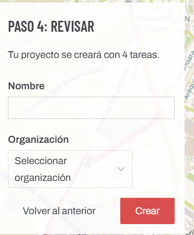

Se evidencia que el sistema procesó correctamente el recorte de la cuadrícula y permitió avanzar al **Paso 4: Revisar**, mostrando que el proyecto será creado con 4 tareas.

### 5.4 Creación del proyecto con datos mínimos válidos

**CP-MOD5-004**

| ID              | Descripción                                                                                                                  | Tipo   | Estado  | Defectos                    |
| :-------------- | :--------------------------------------------------------------------------------------------------------------------------- | :----- | :------ | :-------------------------- |
| **CP-MOD5-004** | Verificar que el sistema permita crear un nuevo proyecto después de completar los datos mínimos requeridos en el paso de revisión. | Manual | Exitoso | No se encontraron defectos. |

| Resultado esperado                                                                                                                                     | Resultado obtenido                                                                                                                                                         |
| :----------------------------------------------------------------------------------------------------------------------------------------------------- | :------------------------------------------------------------------------------------------------------------------------------------------------------------------------- |
| El sistema debe permitir crear el proyecto cuando el AOI, la grilla, el nombre del proyecto y la organización son válidos. Luego debe mostrar una confirmación o redirigir a la pantalla de administración del proyecto creado. | El sistema creó correctamente el proyecto y redirigió a la pantalla **Editar Proyecto**, donde se visualiza el nombre registrado: **Proyecto Arequipa**. |

#### Evidencia CP-MOD5-004 — Datos mínimos completados

  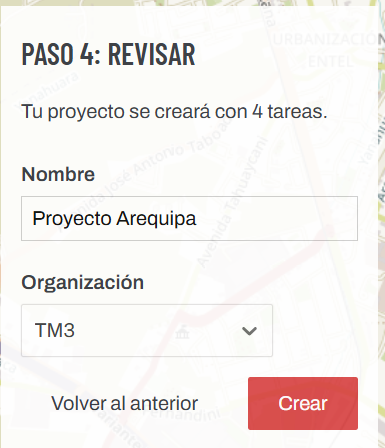

Se observa que el usuario completó los datos requeridos para continuar con la creación del proyecto.

#### Evidencia CP-MOD5-004 — Proyecto creado correctamente

  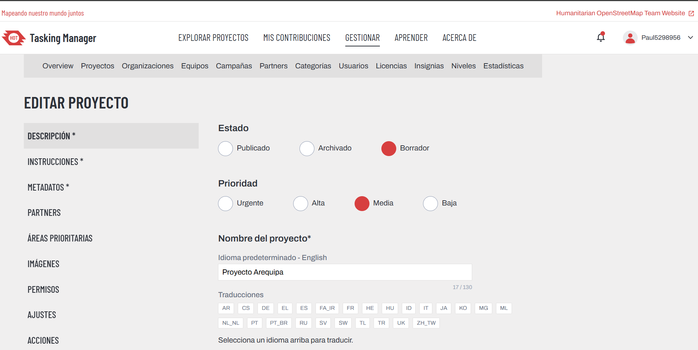

Se evidencia que el sistema creó correctamente el proyecto y redirigió a la pantalla de edición, donde se muestra el proyecto recién creado con el nombre **Proyecto Arequipa**.

### 5.5 Validación de campos obligatorios al guardar proyecto

**CP-MOD5-005**

| ID              | Descripción                                                                                                                              | Tipo   | Estado  | Defectos                    |
| :-------------- | :--------------------------------------------------------------------------------------------------------------------------------------- | :----- | :------ | :-------------------------- |
| **CP-MOD5-005** | Verificar que el sistema impida guardar un proyecto cuando existen campos obligatorios incompletos en la configuración del proyecto. | Manual | Exitoso | No se encontraron defectos. |

| Resultado esperado                                                                                                                                      | Resultado obtenido                                                                                                                                                                                                                                                                                  |
| :------------------------------------------------------------------------------------------------------------------------------------------------------ | :-------------------------------------------------------------------------------------------------------------------------------------------------------------------------------------------------------------------------------------------------------------------------------------------------- |
| El sistema debe rechazar el guardado del proyecto si faltan campos obligatorios como descripción, instrucciones o tipo de mapeo, mostrando un mensaje de validación comprensible para el usuario. | El sistema impidió guardar el proyecto y mostró un mensaje de validación indicando que falta información en el idioma predeterminado del proyecto, específicamente **Descripción corta**, **Descripción**, **Instrucciones detalladas** y el campo obligatorio **Tipos de mapeo**. |

#### Evidencia CP-MOD5-005 — Proyecto con campos obligatorios incompletos

  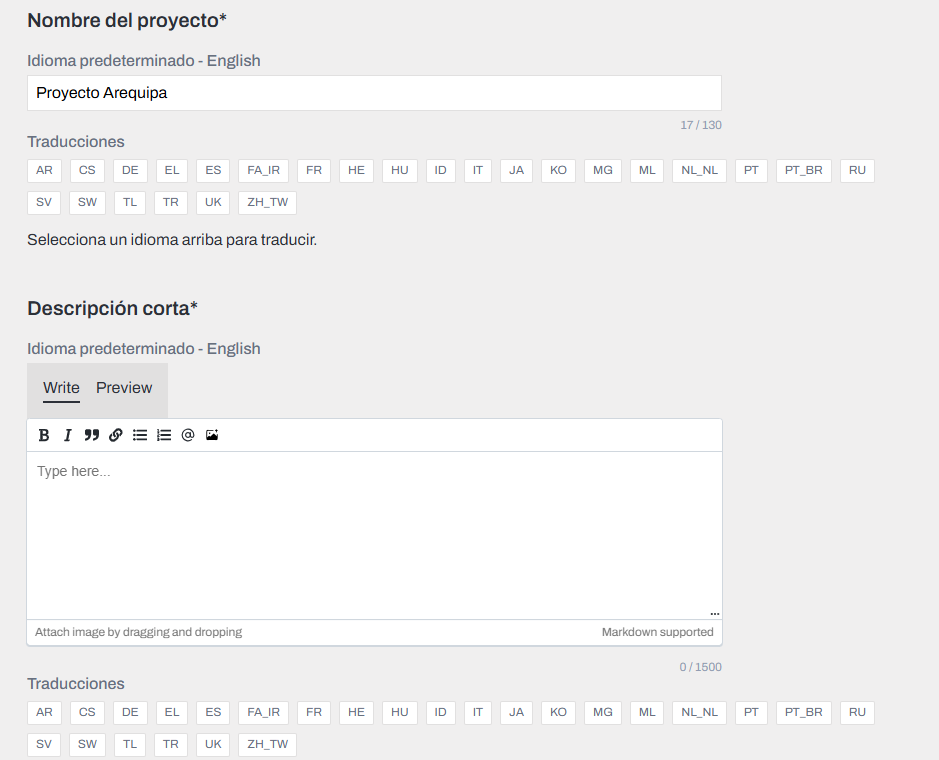

Se observa la pantalla de edición del proyecto con secciones obligatorias pendientes de completar, como descripción, instrucciones y metadatos.

#### Evidencia CP-MOD5-005 — Validación de campos obligatorios

  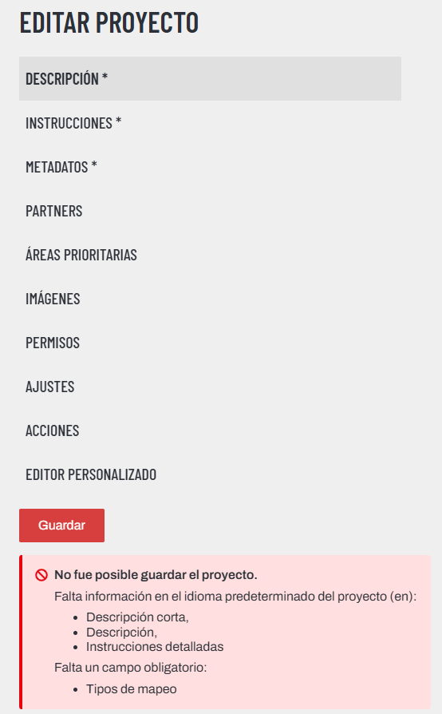

Se evidencia que el sistema bloqueó el guardado del proyecto y mostró un mensaje de validación detallando los campos obligatorios faltantes. Esto confirma que el sistema controla entradas incompletas antes de guardar la configuración del proyecto.

### 5.6 Guardado de proyecto con campos obligatorios completos

**CP-MOD5-006**

| ID              | Descripción                                                                                                                          | Tipo   | Estado  | Defectos                    |
| :-------------- | :----------------------------------------------------------------------------------------------------------------------------------- | :----- | :------ | :-------------------------- |
| **CP-MOD5-006** | Verificar que el sistema permita guardar un proyecto cuando los campos obligatorios de descripción, instrucciones y metadatos han sido completados correctamente. | Manual | Exitoso | No se encontraron defectos. |

| Resultado esperado                                                                                                                                          | Resultado obtenido                                                                                                                                                 |
| :---------------------------------------------------------------------------------------------------------------------------------------------------------- | :----------------------------------------------------------------------------------------------------------------------------------------------------------------- |
| El sistema debe permitir guardar el proyecto cuando los campos obligatorios se encuentran completos y válidos, mostrando una confirmación de actualización exitosa. | El sistema guardó correctamente la configuración del proyecto y mostró el mensaje **“Proyecto actualizado correctamente.”**. |

#### Evidencia CP-MOD5-006 — Campos obligatorios completados

<table>
  <tr>
    <td align="center">
      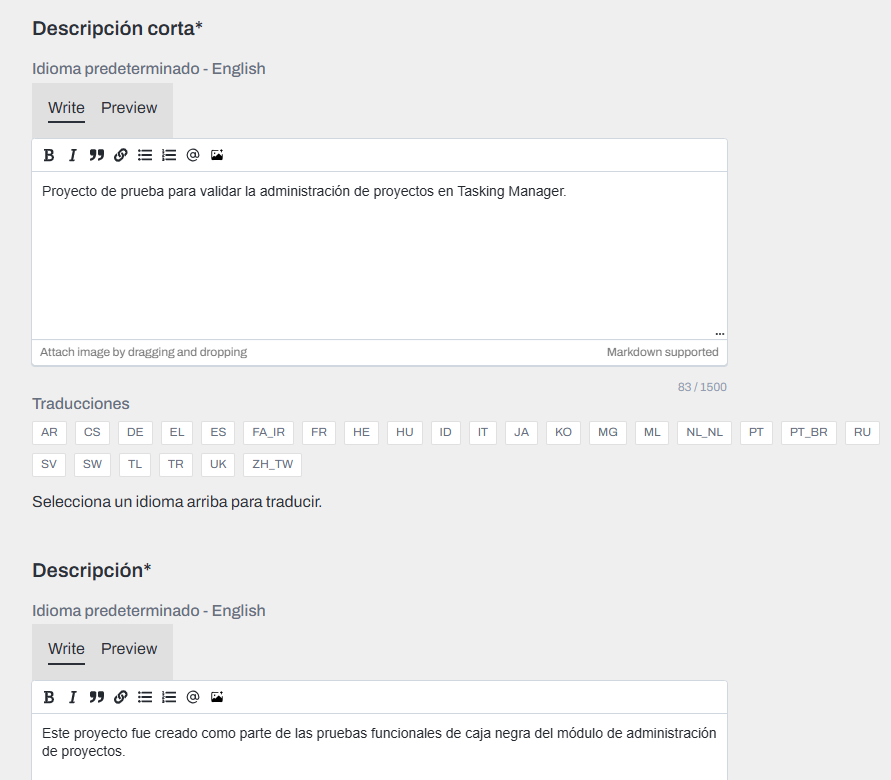
       
      <strong>Descripción completada</strong>
    </td>
    <td align="center">
      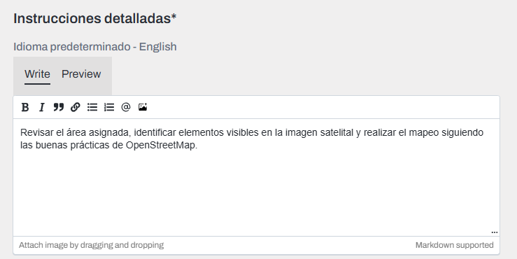
       
      <strong>Instrucciones completadas</strong>
    </td>
    <td align="center">
      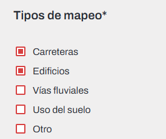
       
      <strong>Metadatos completados</strong>
    </td>
  </tr>
</table>

Se observa que el usuario completó las secciones obligatorias del proyecto: descripción, instrucciones y metadatos, incluyendo el tipo de mapeo requerido por el sistema.
#### Evidencia CP-MOD5-006 — Proyecto guardado exitosamente

  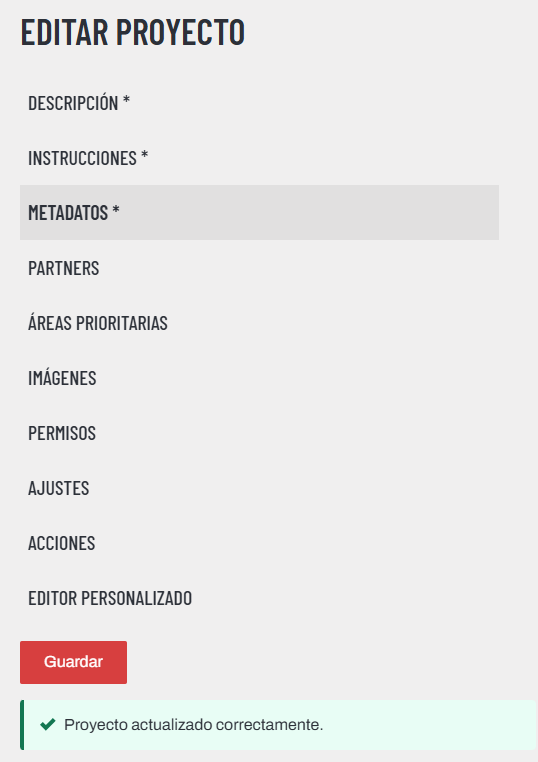

Se evidencia que el sistema aceptó la información ingresada y mostró el mensaje **“Proyecto actualizado correctamente.”**, confirmando que el proyecto fue guardado sin defectos.

### 5.7 Publicación del proyecto desde estado Borrador

**CP-MOD5-007**

| ID              | Descripción                                                                                                                  | Tipo   | Estado  | Defectos                    |
| :-------------- | :--------------------------------------------------------------------------------------------------------------------------- | :----- | :------ | :-------------------------- |
| **CP-MOD5-007** | Verificar que el sistema permita cambiar el estado de un proyecto desde **Borrador** hacia **Publicado** cuando la configuración obligatoria se encuentra completa. | Manual | Exitoso | No se encontraron defectos. |

| Resultado esperado                                                                                                                                              | Resultado obtenido                                                                                                                                                     |
| :-------------------------------------------------------------------------------------------------------------------------------------------------------------- | :--------------------------------------------------------------------------------------------------------------------------------------------------------------------- |
| El sistema debe permitir cambiar el estado del proyecto de **Borrador** a **Publicado**, guardar la modificación y mostrar una confirmación de actualización exitosa. | El sistema permitió seleccionar el estado **Publicado**, guardó correctamente el cambio y mostró la confirmación de actualización del proyecto. |

#### Evidencia CP-MOD5-007 — Estado inicial Borrador

  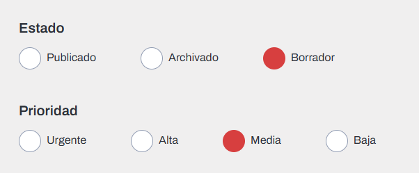

Se observa que el proyecto se encuentra inicialmente en estado **Borrador**, antes de realizar la transición de estado.

#### Evidencia CP-MOD5-007 — Estado Publicado seleccionado

  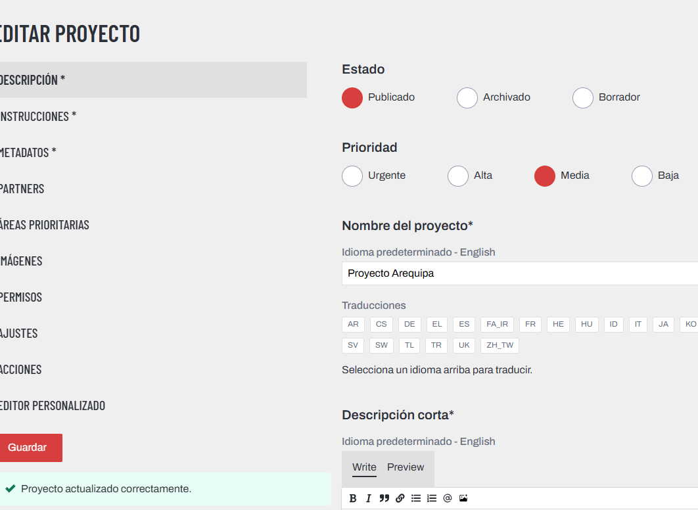

Se observa que el usuario seleccionó el estado **Publicado** como nuevo estado del proyecto.

#### Evidencia CP-MOD5-007 — Proyecto publicado correctamente

  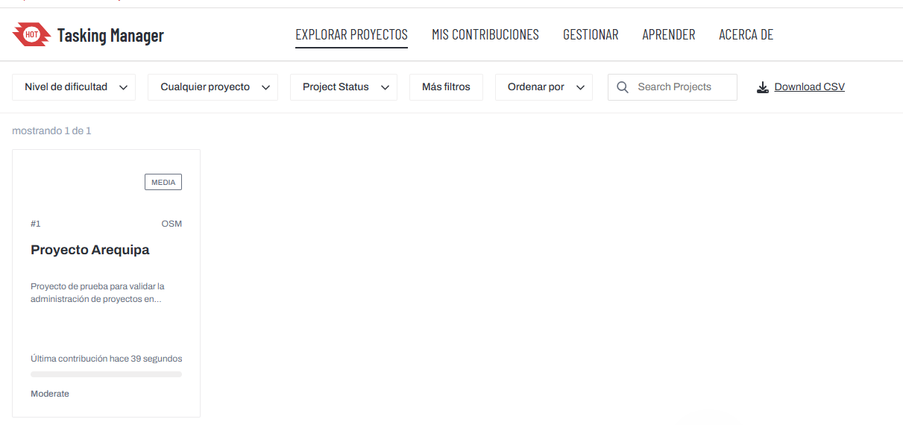

Se evidencia que el sistema guardó correctamente el cambio de estado y confirmó la actualización del proyecto. Esto demuestra que la transición **Borrador → Publicado** fue realizada correctamente desde la interfaz.

### 5.8 Configuración de privacidad y permisos del proyecto

**CP-MOD5-008**

| ID              | Descripción                                                                                                                        | Tipo   | Estado  | Defectos                    |
| :-------------- | :--------------------------------------------------------------------------------------------------------------------------------- | :----- | :------ | :-------------------------- |
| **CP-MOD5-008** | Verificar que el sistema permita configurar los permisos de mapeo y validación de un proyecto mediante niveles mínimos de usuario. | Manual | Exitoso | No se encontraron defectos. |

| Resultado esperado                                                                                                                                                      | Resultado obtenido                                                                                                                                                                                                              |
| :---------------------------------------------------------------------------------------------------------------------------------------------------------------------- | :------------------------------------------------------------------------------------------------------------------------------------------------------------------------------------------------------------------------------ |
| El sistema debe permitir modificar los permisos del proyecto, estableciendo niveles mínimos requeridos para mapear y validar, y guardar la configuración correctamente. | El sistema permitió modificar los permisos del proyecto, estableciendo el nivel **INTERMEDIATE** para mapeo y validación. La configuración fue guardada correctamente y permaneció visible en la sección de equipos y permisos. |

#### Evidencia CP-MOD5-008 — Pantalla inicial de permisos

  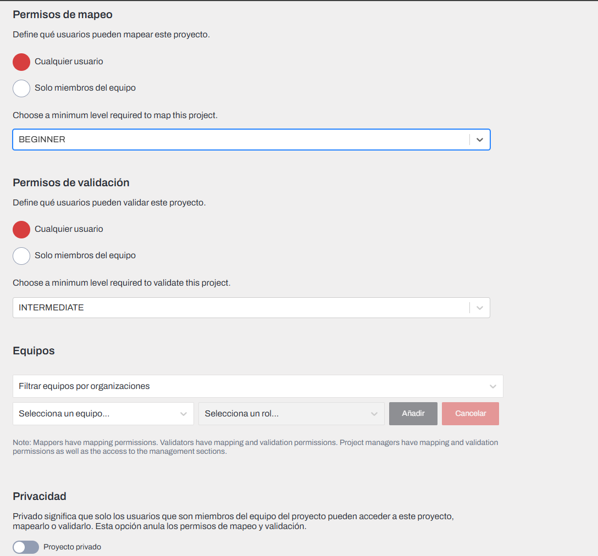

Se observa la sección de permisos del proyecto, donde el sistema permite definir qué usuarios pueden mapear y validar, así como los niveles mínimos requeridos para cada acción.

#### Evidencia CP-MOD5-008 — Nivel mínimo de mapeo modificado

  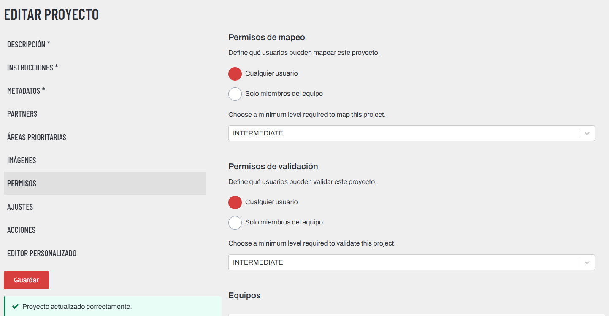

Se observa que el usuario modificó la configuración de permisos, estableciendo un nivel mínimo requerido para acceder a las acciones del proyecto.

#### Evidencia CP-MOD5-008 — Permisos guardados correctamente

  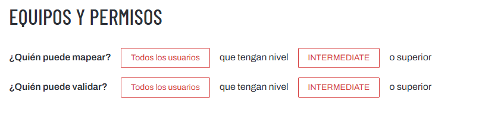

Se evidencia que el sistema guardó correctamente la configuración de permisos, mostrando que todos los usuarios con nivel **INTERMEDIATE** o superior pueden mapear y validar el proyecto.

### 5.9 Activación de privacidad del proyecto

**CP-MOD5-009**

| ID              | Descripción                                                                                                                 | Tipo   | Estado  | Defectos                    |
| :-------------- | :-------------------------------------------------------------------------------------------------------------------------- | :----- | :------ | :-------------------------- |
| **CP-MOD5-009** | Verificar que el sistema permita activar la opción de proyecto privado dentro de la configuración de permisos del proyecto. | Manual | Exitoso | No se encontraron defectos. |

| Resultado esperado                                                                                                                                         | Resultado obtenido                                                                                                                                                     |
| :--------------------------------------------------------------------------------------------------------------------------------------------------------- | :--------------------------------------------------------------------------------------------------------------------------------------------------------------------- |
| El sistema debe permitir activar la privacidad del proyecto, guardar la configuración y mantener activa la opción **Proyecto privado** después de guardar. | El sistema permitió activar la opción **Proyecto privado**, guardó correctamente el cambio y mantuvo la configuración aplicada en la sección de permisos del proyecto. |

#### Evidencia CP-MOD5-009 — Privacidad inicial del proyecto

  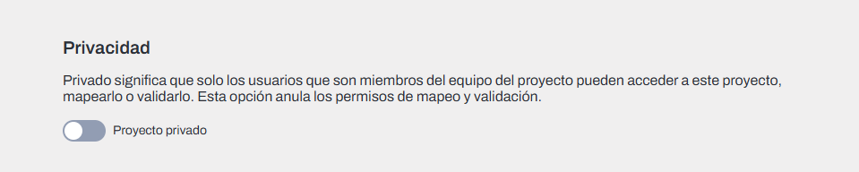

Se observa la sección de privacidad del proyecto antes de realizar la modificación, donde la opción **Proyecto privado** se encuentra inicialmente desactivada.

#### Evidencia CP-MOD5-009 — Proyecto privado activado

  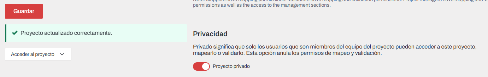

Se observa que el usuario activó la opción **Proyecto privado**, modificando la configuración de acceso al proyecto.

#### Evidencia CP-MOD5-009 — Privacidad guardada correctamente

  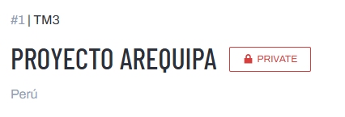

Se evidencia que el sistema guardó correctamente la configuración de privacidad del proyecto. Esto confirma que la opción de proyecto privado puede ser modificada desde la interfaz y persistida correctamente.

### 5.10 Clonación de proyecto existente

**CP-MOD5-010**

| ID              | Descripción                                                                                                                               | Tipo   | Estado  | Defectos                    |
| :-------------- | :---------------------------------------------------------------------------------------------------------------------------------------- | :----- | :------ | :-------------------------- |
| **CP-MOD5-010** | Verificar que el sistema permita clonar un proyecto existente y generar un nuevo proyecto basado en la información del proyecto original. | Manual | Exitoso | No se encontraron defectos. |

| Resultado esperado                                                                                                                                                                 | Resultado obtenido                                                                                                                                                                                             |
| :--------------------------------------------------------------------------------------------------------------------------------------------------------------------------------- | :------------------------------------------------------------------------------------------------------------------------------------------------------------------------------------------------------------- |
| El sistema debe permitir iniciar el flujo de clonación desde un proyecto existente, conservar la información base del proyecto original y generar un nuevo proyecto independiente. | El sistema inició correctamente el flujo de clonación del proyecto **#1 Proyecto Arequipa** y generó un nuevo proyecto clonado identificado como **#3 Proyecto Arequipa**, visible en el listado de proyectos. |

#### Evidencia CP-MOD5-010 — Opción de clonar proyecto

  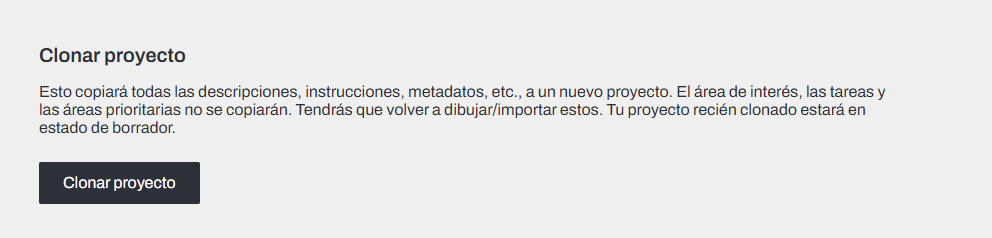

Se observa la opción que permite iniciar la clonación de un proyecto existente desde las acciones disponibles para el proyecto.

#### Evidencia CP-MOD5-010 — Flujo de clonación iniciado

  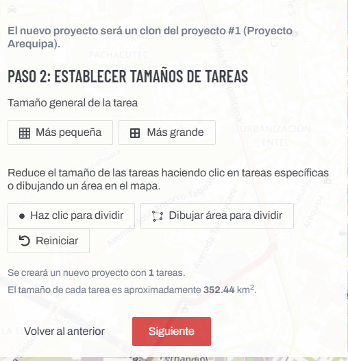

Se evidencia que el sistema inició el flujo de clonación e indicó que el nuevo proyecto será un clon del proyecto **#1 Proyecto Arequipa**.

#### Evidencia CP-MOD5-010 — Revisión del proyecto clonado

  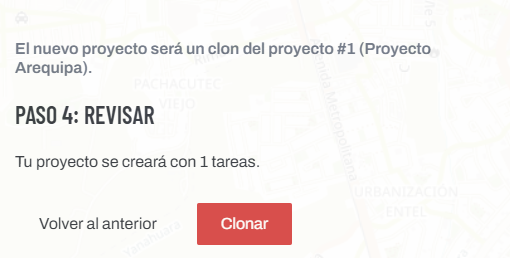

Se observa el paso de revisión del proyecto clonado antes de finalizar su creación.

#### Evidencia CP-MOD5-010 — Proyecto clonado creado correctamente

  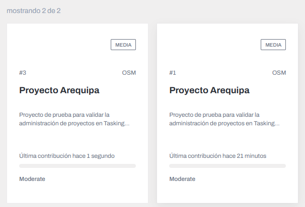

Se evidencia que el sistema creó correctamente un nuevo proyecto clonado. En el listado se muestran dos proyectos: el proyecto original **#1 Proyecto Arequipa** y el proyecto clonado **#3 Proyecto Arequipa**, confirmando que la clonación fue ejecutada correctamente.

### 5.11 Transferencia de propiedad del proyecto

**CP-MOD5-011**

| ID              | Descripción                                                                                                                                              | Tipo   | Estado  | Defectos                    |
| :-------------- | :------------------------------------------------------------------------------------------------------------------------------------------------------- | :----- | :------ | :-------------------------- |
| **CP-MOD5-011** | Verificar que el sistema permita transferir la propiedad de un proyecto a otro usuario administrador de Tasking Manager perteneciente a la organización. | Manual | Exitoso | No se encontraron defectos. |

| Resultado esperado                                                                                                                                                                           | Resultado obtenido                                                                                                                                                         |
| :------------------------------------------------------------------------------------------------------------------------------------------------------------------------------------------- | :------------------------------------------------------------------------------------------------------------------------------------------------------------------------- |
| El sistema debe permitir seleccionar un nuevo propietario válido del proyecto y transferir la propiedad cuando el usuario seleccionado tiene permisos suficientes dentro de Tasking Manager. | El sistema permitió seleccionar otro administrador de Tasking Manager perteneciente a la organización y realizar correctamente la transferencia de propiedad del proyecto. |

#### Evidencia CP-MOD5-011 — Formulario de transferencia de propiedad

  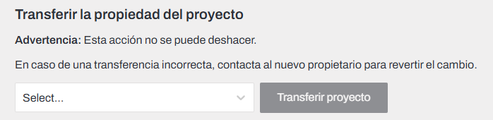

Se observa la sección de transferencia de propiedad del proyecto. El sistema muestra una advertencia indicando que esta acción no se puede deshacer, lo cual informa al usuario sobre el impacto de la operación antes de ejecutarla.

#### Evidencia CP-MOD5-011 — Selección de nuevo propietario

  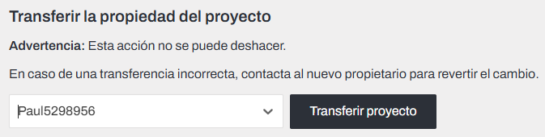

Se observa que el usuario seleccionó como nuevo propietario a otro administrador de Tasking Manager perteneciente a la organización, cumpliendo la condición requerida para realizar la transferencia.

#### Evidencia CP-MOD5-011 — Propiedad transferida correctamente

  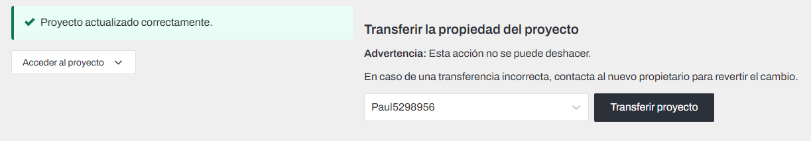

Se evidencia que el sistema ejecutó correctamente la transferencia de propiedad del proyecto. Esto confirma que la funcionalidad permite cambiar el propietario del proyecto hacia otro usuario con permisos suficientes dentro de la organización.

### 5.12 Eliminación controlada de proyecto

**CP-MOD5-012**

| ID              | Descripción                                                                                                                                               | Tipo   | Estado  | Defectos                    |
| :-------------- | :-------------------------------------------------------------------------------------------------------------------------------------------------------- | :----- | :------ | :-------------------------- |
| **CP-MOD5-012** | Verificar que el sistema permita eliminar un proyecto desde la sección de acciones y redirija correctamente al usuario después de completar la operación. | Manual | Exitoso | No se encontraron defectos. |

| Resultado esperado                                                                                                                                                                                                     | Resultado obtenido                                                                                                                                                             |
| :--------------------------------------------------------------------------------------------------------------------------------------------------------------------------------------------------------------------- | :----------------------------------------------------------------------------------------------------------------------------------------------------------------------------- |
| El sistema debe permitir eliminar un proyecto mediante una acción controlada, mostrar una confirmación o advertencia antes de ejecutar la operación y redirigir al usuario a una vista adecuada después de eliminarlo. | El sistema eliminó correctamente el proyecto seleccionado y redirigió al usuario a la vista de gestión de proyectos, confirmando que la operación fue ejecutada correctamente. |

#### Evidencia CP-MOD5-012 — Opción de eliminar proyecto

  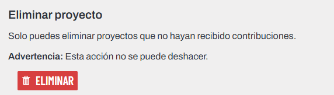

Se observa la opción disponible para eliminar el proyecto desde la sección de acciones. Esta funcionalidad permite al usuario autorizado iniciar una operación sensible sobre el proyecto.

#### Evidencia CP-MOD5-012 — Confirmación de eliminación

  

Se observa la confirmación o advertencia previa a la eliminación del proyecto, lo cual permite evitar una eliminación accidental.

#### Evidencia CP-MOD5-012 — Proyecto eliminado y redirección a gestión de proyectos

  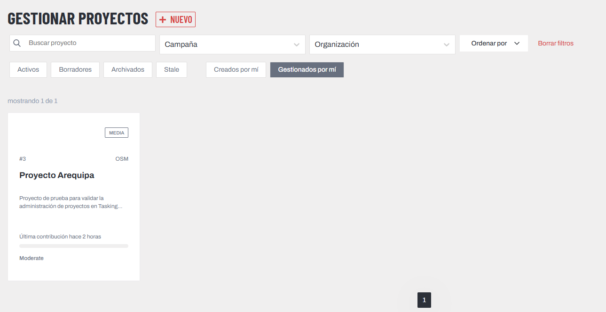

Se evidencia que el sistema eliminó correctamente el proyecto y redirigió al usuario a la vista de gestión de proyectos. Esto confirma que la eliminación fue procesada de forma controlada desde la interfaz.

### 5.13 Configuración de fuente de imágenes del proyecto

**CP-MOD5-013**

| ID              | Descripción                                                                                                                     | Tipo   | Estado  | Defectos                    |
| :-------------- | :------------------------------------------------------------------------------------------------------------------------------ | :----- | :------ | :-------------------------- |
| **CP-MOD5-013** | Verificar que el sistema permita seleccionar una fuente de imágenes válida para el proyecto y guardar correctamente la configuración. | Manual | Exitoso | No se encontraron defectos. |

| Resultado esperado                                                                                                                                        | Resultado obtenido                                                                                                                                               |
| :-------------------------------------------------------------------------------------------------------------------------------------------------------- | :--------------------------------------------------------------------------------------------------------------------------------------------------------------- |
| El sistema debe permitir seleccionar una fuente de imágenes válida para el proyecto, guardar la configuración y mantener visible la opción seleccionada. | El sistema permitió seleccionar la fuente de imágenes **Bing**, guardó correctamente la configuración y mostró el mensaje de actualización exitosa del proyecto. |

#### Evidencia CP-MOD5-013 — Pantalla inicial de imágenes

  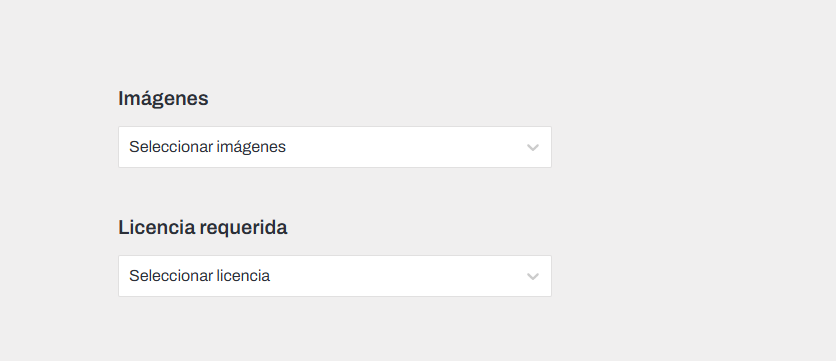

Se observa la sección **Imágenes** del proyecto, donde el sistema presenta distintas fuentes de imágenes disponibles para configurar el mapeo del proyecto, tales como Bing, Mapbox Satellite, ESRI World Imagery y Maxar Standard.

#### Evidencia CP-MOD5-013 — Fuente Bing seleccionada y guardada correctamente

  

Se evidencia que el usuario seleccionó la fuente de imágenes **Bing** y que el sistema guardó correctamente la configuración, confirmando que la fuente de mapeo fue actualizada sin defectos.

### MOD-0006: Gobernanza (Organizaciones y Equipos)
| ID | Nombre | Descripción Funcional | Actor | Módulo | Prioridad | Dependencias |
| :--- | :--- | :--- | :--- | :--- | :--- | :--- |
| **RF-6001** | **Gestión de Equipos** | Un Admin o PM debe poder crear equipos, asignarles visibilidad (`PUBLIC`/`PRIVATE`) y método de ingreso (`ANY`, `BY_REQUEST`, `BY_INVITE`). | ACT-0004 | MOD-0006 | Alta | - |
| **RF-6002** | **Solicitud de Membresía** | Si el equipo es `BY_REQUEST`, un Mapper puede solicitar unirse, generando una notificación a los administradores del equipo. | ACT-0002 | MOD-0006 | Media | RF-6001 |
| **RF-6003** | **Aprobación de Membresía** | Un Manager del equipo debe poder aceptar solicitudes de unión, cambiando el estado del usuario dentro del equipo a Activo (`MEMBER`). | ACT-0004 | MOD-0006 | Media | RF-6002 |

### MOD-0007: Comunicación y Notificaciones
| ID | Nombre | Descripción Funcional | Actor | Módulo | Prioridad | Dependencias |
| :--- | :--- | :--- | :--- | :--- | :--- | :--- |
| **RF-7001** | **Comentarios por Tarea** | El sistema debe permitir adjuntar comentarios de texto plano o Markdown asociados al historial de una tarea específica. | ACT-0002 | MOD-0007 | Alta | - |
| **RF-7002** | **Notificaciones in-app** | El sistema debe notificar al usuario cuando su tarea sea `INVALIDATED`, cuando sea mencionado (`@username`) o cuando suba de nivel de mapeo. | ACT-0006 | MOD-0007 | Alta | RF-4003 |
| **RF-7003** | **Envío de Emails** | Si el usuario tiene correos habilitados, el sistema debe despachar alertas SMTP para notificaciones críticas e hitos de finalización de proyectos. | ACT-0006 | MOD-0007 | Media | RF-1004 |
