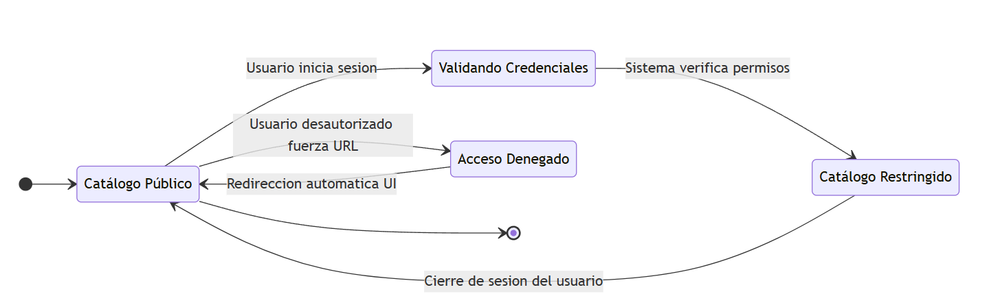

# Diseño de Pruebas Funcionales: MOD-02 - Exploración de Proyectos
**Versión del Documento:** 1.0
**Tipo de Análisis:** Diseño de Pruebas de Sistema (Caja Negra)

---

## 1. Contexto del Módulo
Este módulo es responsable de la persistencia visual, indexación y recuperación de los proyectos de mapeo en la plataforma. Permite a los usuarios buscar proyectos mediante un motor de texto predictivo, segmentar el universo cartográfico aplicando filtros avanzados (según el estado del proyecto, la dificultad técnica del mapper y las campañas globales asociadas), ordenar los resultados por relevancia o urgencia, y renderizar geográficamente los límites espaciales (Bounding Box - BBOX) sobre un mapa interactivo.

---

## 2. Estrategia de Diseño de Pruebas

### 2.1. Enfoque general
Las pruebas se concentrarán en garantizar la integridad de la interfaz de usuario (UI) al combinar múltiples criterios de búsqueda y al interactuar con el mapa. La estrategia verificará que la lista de tarjetas de proyectos se actualice de forma síncrona/asíncrona con los controles de filtrado y que el mapa encuadre correctamente el BBOX del proyecto seleccionado sin generar errores de renderizado.

El alcance cubre las interacciones de los siguientes actores:
* **ACT-01 Usuario Anónimo:** Navegación libre, aplicación de filtros y visualización del mapa público.
* **ACT-02 Mapper:** Búsqueda orientada a proyectos que coincidan estrictamente con su nivel de experiencia calculado.

| Actor de Impacto | Rol en este Módulo | Contexto de Prueba |
| :--- | :--- | :--- |
| **ACT-01** / **ACT-02** | Explorador de Proyectos | Uso del motor de búsqueda, filtros avanzados y ordenamiento. |
| **ACT-01** / **ACT-02** | Visualizador Cartográfico | Interacción con el mapa y renderizado del Bounding Box (BBOX). |

### 2.2. Técnicas de Caja Negra Utilizadas
* **Tablas de Decisión:** Aplicada al motor de búsqueda con filtros avanzados (RF-2001). Permite validar de forma matemática cómo responde la pantalla cuando se combinan o contradicen los filtros de Estado, Dificultad y Campaña.
* **Partición de Equivalencia (PE) y Análisis de Valores Límite (AVL):** Utilizadas para la barra de búsqueda por texto y las coordenadas del mapa (BBOX) (RF-2002). Limita las pruebas de caracteres en la barra de búsqueda y las fronteras geoespaciales numéricas del mapa.
* **Transición de Estados:** Aplicada a la vista del mapa interactivo (RF-2003). Modela cómo cambia la interfaz del mapa (Modo Lista, Vista de Cuadrícula, Zoom al BBOX y Carga Asíncrona de Capas) según los clics del usuario.

---

## 3. Especificaciones de Escenarios y Casos de Prueba

### 3.1. Escenario: ESC-2001 - Motor de Búsqueda y Combinación de Filtros Avanzados

**A. Definición del Escenario**
| Atributo | Detalle |
| :--- | :--- |
| **Descripción** | Validar que la interfaz actualice correctamente la lista de proyectos mostrados al activar, combinar o limpiar los filtros avanzados de Estado (Activo/Archivado), Dificultad (Beginner/Intermediate/Advanced) y Campaña. |
| **RF Asociados** | RF-2001 |
| **Precondiciones** | El usuario se encuentra en la pantalla principal de exploración ("Explore Projects"). La base de datos contiene proyectos diversificados con diferentes etiquetas. |
| **Técnicas aplicadas**| Tablas de Decisión |
| **Resultado Esperado** | La UI debe renderizar exclusivamente las tarjetas de proyectos que cumplan con la intersección lógica de todos los filtros seleccionados, mostrando un mensaje claro de "No se encontraron resultados" si la combinación está vacía. |

**B. Aplicación de Técnicas (Análisis)**
Para este escenario, se modela el comportamiento lógico de la pantalla utilizando la técnica de **Tablas de Decisión**, identificando los criterios de filtrado interactivos:

* **Condiciones de Entrada (Controles de la UI):**
    * `CE-1`: Se selecciona un filtro de Estado válido (ej. "Activo").
    * `CE-2`: Se selecciona un filtro de Dificultad acorde al Mapper (ej. "Beginner").
    * `CE-3`: Se selecciona un filtro de Campaña específico (ej. "Response COVID-19").
* **Condiciones de Salida (Resultados en la UI):**
    * `CS-1`: Renderizar lista filtrada con coincidencia exacta (Intersección lógica).
    * `CS-2`: Desplegar mensaje de alerta "No se encontraron proyectos que coincidan con los filtros".
    * `CS-3`: Mostrar el catálogo completo de proyectos (Estado por defecto / Sin filtros).

#### B.1. Matriz de Tabla de Decisión Racionalizada
Se cruzan las condiciones de los selectores aplicando guiones (**-**) para representar estados indiferentes y optimizar las pruebas en la interfaz:

| Tipo de Control | Variables de la Interfaz de Usuario | A | B | C | D |
| :--- | :--- | :---: | :---: | :---: | :---: |
| **Condiciones de Entrada** | `CE-1`: Filtro de Estado seleccionado | **F** | **V** | **V** | **V** |
| | `CE-2`: Filtro de Dificultad seleccionado | **F** | **F** | **V** | **V** |
| | `CE-3`: Filtro de Campaña seleccionado | **F** | **-** | **F** | **V** |
| **Condiciones de Salida** | `CS-1`: Renderizar lista filtrada exacta | **F** | **V** | **V** | **V** |
| | `CS-2`: Desplegar mensaje "Sin resultados" | **F** | **F** | **F** | **F** |
| | `CS-3`: Mostrar catálogo completo (Defecto)| **V** | **F** | **F** | **F** |

*Nota sobre el análisis:* Si la base de datos devuelve vacío para una combinación (por ejemplo, en la columna D no hay proyectos "Activos + Beginner + COVID-19"), la salida `CS-1` pasaría a Falso y se activaría de inmediato `CS-2`.

---

**C. Casos de Prueba Derivados**

| ID Caso | Pasos de Ejecución | Datos de Entrada (Reglas Aplicadas) | Resultado Esperado |
| :--- | :--- | :--- | :--- |
| **CP-2001-01** | 1. Ingresar a la sección "Explorar Proyectos". 2. Verificar el estado inicial de la pantalla sin interactuar con los desplegables. | **Filtros:** Ninguno activo. *(Regla de Columna A)* | La interfaz carga por defecto el catálogo completo de proyectos disponibles en el sistema (`CS-3 = V`). |
| **CP-2001-02** | 1. Hacer clic en el selector de Estado y marcar "Activo". 2. Mantener el resto de filtros vacíos. | **Estado:** Activo. **Dificultad:** Sin filtro. *(Regla de Columna B)* | La pantalla se actualiza asíncronamente mostrando únicamente las tarjetas de proyectos cuyo estado sea "Activo" (`CS-1 = V`). |
| **CP-2001-03** | 1. Manteniendo el filtro "Activo", abrir el selector de Dificultad y marcar "Beginner". | **Estado:** Activo. **Dificultad:** Beginner. *(Regla de Columna C)* | La lista reduce sus elementos, mostrando solo los proyectos que son "Activos" y que simultáneamente aceptan mappers "Beginner" (`CS-1 = V`). |
| **CP-2001-04** | 1. Mantener activos los filtros anteriores. 2. Abrir el selector de Campañas y marcar una campaña existente (ej. "Malaria"). | **Estado:** Activo. **Dificultad:** Beginner. **Campaña:** Malaria. *(Regla de Columna D)* | La interfaz procesa la intersección final. Muestra en pantalla solo los proyectos que cumplan estrictamente con los tres criterios en simultáneo (`CS-1 = V`). |

---

### 3.2. Escenario: ESC-2002 - Validación de Barra de Búsqueda por Texto y Límites del BBOX

**A. Definición del Escenario**
| Atributo | Detalle |
| :--- | :--- |
| **Descripción** | Validar la precisión del motor de búsqueda al ingresar cadenas de caracteres de texto en el input flotante, y la correcta recepción de coordenadas numéricas límites del Bounding Box (BBOX) que encuadran geográficamente un proyecto en el mapa. |
| **RF Asociados** | RF-2002 |
| **Precondiciones** | El usuario se encuentra en la pantalla de exploración. El mapa interactivo base (OpenStreetMap) está completamente cargado y listo para recibir coordenadas perimetrales de renderizado. |
| **Técnicas aplicadas**| Partición de Equivalencia (PE) y Análisis de Valores Límite (AVL) |
| **Resultado Esperado** | El input de texto debe filtrar los proyectos en tiempo real aceptando un número prudente de caracteres, mientras que el motor cartográfico debe interpretar con exactitud los límites decimales del BBOX sin desbordar el renderizado en la pantalla. |

**B. Aplicación de Técnicas (Análisis)**

#### B.1. Matriz de Partición de Equivalencia (PE)
Se agrupa el universo de datos para la barra de búsqueda (longitud de caracteres del string) y las coordenadas geográficas de latitud válidas para el encuadre del BBOX:

| Clase Válida | Clases No Válidas | Rango Evaluado |
| :--- | :--- | :---: |
| **PE-V01** (Texto estándar) | - | De 1 a 50 caracteres |
| - | **PE-NV01** (Texto Vacío) | 0 caracteres |
| - | **PE-NV02** (Texto Excesivo) | mas de 51 caracteres |
| **PE-V02** (Latitud Válida BBOX) | - | De -90.00 a +90.00 |
| - | **PE-NV03** (Latitud Fuera de Rango)| < -90.00 o > +90.00 |

#### B.2. Matriz de Análisis de Valores Límite (AVL)
Se identifican los valores de prueba críticos situados en las fronteras exactas de longitud de caracteres de búsqueda y bordes geográficos de latitud para el BBOX:

| Límite Inferior Válido | Límite Inferior No Válido | Límite Superior Válido | Límite Superior No Válido | Rango de Clase Asociado |
| :---: | :---: | :---: | :---: | :---: |
| **1** | **0** | **50** | **51** | Longitud del Input de Búsqueda |
| **-90.0000** | **-90.0001** | **90.0000** | **90.0001** | Coordenadas de Latitud (BBOX) |

---

**C. Casos de Prueba Derivados**

| ID Caso | Pasos de Ejecución | Datos de Entrada (Clases aplicadas) | Resultado Esperado |
| :--- | :--- | :--- | :--- |
| **CP-2002-01** | 1. Hacer clic en el input de búsqueda. 2. Presionar la barra espaciadora o dejar el campo vacío y presionar Enter. | **Texto de búsqueda:** (Vacío) *(Límite Inferior No Válido)* | El sistema ignora la acción de filtrado por texto, no realiza peticiones asíncronas innecesarias y mantiene el catálogo base intacto. |
| **CP-2002-02** | 1. Digitar un solo carácter válido (ej: "P") en la barra de búsqueda de proyectos. | **Texto de búsqueda:** "P" *(Límite Inferior Válido)* | La interfaz responde de inmediato al primer carácter, desplegando las tarjetas de proyectos cuyos nombres inicien o contengan la letra "P". |
| **CP-2002-03** | 1. Introducir una cadena de texto que contenga exactamente 50 caracteres alfabéticos en el input. | **Texto de búsqueda:** String de 50 caracteres. *(Límite Superior Válido)* | La interfaz de usuario procesa el texto completo sin truncar la caja de edición y actualiza la lista con los proyectos coincidentes. |
| **CP-2002-04** | 1. Intentar escribir o pegar una cadena de texto que posea 51 caracteres en la barra de búsqueda. | **Texto de búsqueda:** String de 51 caracteres. *(Límite Superior No Válido)* | La interfaz restringe el exceso de datos mediante un bloqueo de entrada físico (`maxlength="50"`) impidiendo que el carácter número 51 sea renderizado en pantalla. |
| **CP-2002-05** | 1. Seleccionar un proyecto cuyas coordenadas perimetrales del BBOX toquen el extremo del polo sur geográfico. | **Latitud del BBOX:** -90.0000 *(Límite Inferior Válido)* | El mapa interactivo se reubica de forma correcta, encuadrando y dibujando el polígono del proyecto en el límite exacto de la visualización cartográfica. |
| **CP-2002-06** | 1. Simular mediante la URL o la carga de mapa un proyecto con un BBOX corrupto que sobrepase el límite norte. | **Latitud del BBOX:** 90.0001 *(Límite Superior No Válido)* | La interfaz atrapa la excepción de desborde geográfico, el mapa evita romperse (pantalla en blanco) y renderiza una alerta visual de "Error al cargar la delimitación espacial". |

---

### 3.3. Escenario: ESC-2003 - Restricción de Visibilidad y Acceso a Proyectos Privados

**A. Definición del Escenario**
| Atributo | Detalle |
| :--- | :--- |
| **Descripción** | Validar que el catálogo de exploración oculte o muestre de forma dinámica los proyectos marcados como privados en la interfaz, permitiendo el acceso únicamente a usuarios logueados que pertenezcan al equipo autorizado o posean rol de Administrador. |
| **RF Asociados** | RF-2003 (Dependiente de RF-1001) |
| **Precondiciones** | El usuario se encuentra en la pantalla de exploración de proyectos (`Explore Projects`). Existen proyectos en la base de datos configurados con visibilidad "Privada". |
| **Técnicas aplicadas**| Transición de Estados |
| **Resultado Esperado** | La interfaz de usuario debe restringir la visualización de las tarjetas privadas a usuarios anónimos (ACT-01), mutando el catálogo de forma inmediata al iniciar sesión si el usuario posee las credenciales autorizadas. |

**B. Aplicación de Técnicas (Análisis)**
Para este escenario, se modela el comportamiento del sistema mediante los componentes de la técnica de **Transición de Estados** extraídos del diagrama oficial del módulo:

* **Estados del Sistema Identificados:**
    * `CatalogoPublico`: Estado inicial de la pantalla para cualquier internauta. Solo se renderizan los proyectos con visibilidad abierta.
    * `ValidandoCredenciales`: Estado transitorio de la interfaz tras el inicio de sesión (`RF-1001`), donde el sistema verifica los permisos del usuario contra el proyecto privado.
    * `CatalogoRestringido`: Estado de la UI donde se incorporan y muestran de manera exclusiva las tarjetas de los proyectos privados autorizados para el usuario.
    * `AccesoDenegado`: Estado de error visual (alerta en la interfaz o redirección) si un usuario intenta forzar el ingreso a la URL de un proyecto privado sin permisos.
* **Transiciones / Eventos Evaluados:**
    * `Usuario inicia sesion`
    * `Sistema verifica permisos`
    * `Usuario desautorizado fuerza URL`
    * `Cierre de sesion del usuario`
    * `Redireccion automatica UI`

---

**C. Casos de Prueba Derivados**

| ID Caso | Pasos de Ejecución | Datos de Entrada (Clases aplicadas) | Resultado Esperado |
| :--- | :--- | :--- | :--- |
| **CP-2003-01** | 1. Ingresar a la sección "Explorar Proyectos" abriendo una pestaña en modo incógnito (`CatalogoPublico`). 2. Digitar el nombre de un proyecto de carácter estrictamente cerrado en la barra de búsqueda. | **Rol de Usuario:** Anónimo (`ACT-01`). **Texto búsqueda:** "Proyecto Privado Equipo A". | El sistema procesa la búsqueda local sin colgarse y la interfaz muestra de forma limpia el mensaje "0 proyectos encontrados", manteniendo oculta la tarjeta. |
| **CP-2003-02** | 1. Estando en el explorador base, hacer clic en el botón principal "Log In" de la barra superior (`Usuario inicia sesion`). 2. Completar el inicio de sesión vía OAuth (`ValidandoCredenciales`). 3. Ingresar al catálogo usando una cuenta que forme parte activa del equipo del proyecto (`Sistema verifica permisos`). | **Rol de Usuario:** Mapper Autorizado (`ACT-02`). **Credenciales:** Token de sesión válido. | La interfaz transiciona al estado `CatalogoRestringido`: la pantalla se refresca asíncronamente inyectando la tarjeta del proyecto privado con un indicador visual de acceso exclusivo. |
| **CP-2003-03** | 1. Estando en la vista del catálogo con las tarjetas restringidas visibles (`CatalogoRestringido`). 2. Desplegar el menú del perfil de usuario y hacer clic en la opción "Log Out" (`Cierre de sesion del usuario`). | **Acción UI:** Clic en Cerrar Sesión. | El navegador elimina el token de autenticación del almacenamiento, la interfaz parpadea borrando las tarjetas privadas y regresa de inmediato al estado `CatalogoPublico`. |
| **CP-2003-04** | 1. Copiar de forma externa la ruta directa de mapeo de un proyecto privado (ej: `/projects/10/map`). 2. Pegarla directamente en la barra de direcciones de una ventana sin autenticar (`Usuario desautorizado fuerza URL`). | **Ruta forzada:** URL interna protegida. | La aplicación interrumpe la carga normal y cambia al estado `AccesoDenegado`: renderiza en pantalla una alerta roja de error "403 No Autorizado" y tras 3 segundos (`Redireccion automatica UI`) redirige al usuario de vuelta al `CatalogoPublico`. |
