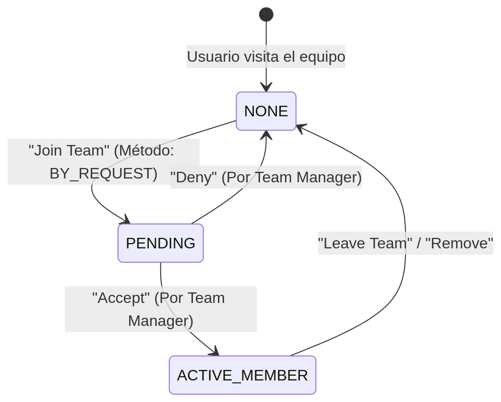

# Diseño de Pruebas Funcionales: MOD-06 - Gobernanza (Organizaciones y Equipos)
**Versión del Documento:** 1.0
**Tipo de Análisis:** Diseño de Pruebas de Sistema (Caja Negra)

---

## 1. Contexto del Módulo

Este módulo gestiona la estructura jerárquica de agrupaciones de usuarios y la delegación de permisos dentro de la plataforma. Su responsabilidad principal es la creación y administración de Organizaciones y Equipos, controlando sus políticas de visibilidad (`PUBLIC`, `PRIVATE`), métodos de ingreso (`ANY`, `BY_REQUEST`, `BY_INVITE`) y orquestando el ciclo de vida de las solicitudes de membresía para segmentar de forma segura el acceso a los proyectos.

*Para consultar el detalle exhaustivo de los actores, restricciones y reglas de negocio, referirse al [Catálogo de Requerimientos Funcionales](./01-requerimientos-funcionales.md).*

---

## 2. Estrategia de Diseño de Pruebas

### 2.1. Enfoque general

El enfoque de pruebas para este módulo será de extremo a extremo (End-to-End), orientado fuertemente a la validación del Control de Acceso Basado en Roles (RBAC) y la correcta segregación de privilegios. 

La estrategia evaluará dos perspectivas complementarias: la del actor administrativo (**`Project Manager` ACT-0004** o **`SysAdmin` ACT-0005**) encargado de configurar las políticas de gobernanza, y la del actor base (**`MAPPER` ACT-0002**) que interactúa con estas estructuras para solicitar membresías. Se priorizará la verificación del comportamiento de la interfaz al exponer u ocultar información según la visibilidad del equipo, así como la correcta gestión transaccional de las solicitudes de ingreso desde que se emiten hasta que son resueltas por un administrador.

### 2.2. Técnicas de Caja Negra Utilizadas

Para garantizar una cobertura exhaustiva de las políticas de acceso y los flujos de membresía, se aplicarán las siguientes metodologías de diseño:

*   **Partición de Equivalencia (Equivalence Partitioning):** Técnica fundamental para este módulo, utilizada para reducir el infinito número de interacciones de usuarios a clases representativas basadas en sus roles (por ejemplo, Admin, Org Manager, Team Manager, Mapper, Anónimo). También se aplicará para agrupar los atributos de configuración de los equipos (Visibilidad Pública vs. Privada).
*   **Tablas de Decisión (Decision Table Testing):** Se utilizará para modelar la lógica de negocio detrás de la acción de "Unirse a un Equipo". La interfaz debe reaccionar de manera diferente combinando múltiples entradas: el método de ingreso del equipo (`ANY`, `BY_REQUEST`, `BY_INVITE`), el rol del usuario y su estado de membresía actual.
*   **Transición de Estados (State Transition Testing):** Aplicada específicamente para auditar el flujo de trabajo (workflow) de las solicitudes de membresía de los usuarios. Validará que los cambios de estado del actor dentro de un equipo (de `None` a `Pending`, y de `Pending` a `Active` o `Rejected`) sigan estrictamente las transiciones permitidas por la plataforma mediante la intervención de un administrador autorizado.

## 3. Especificaciones de Escenarios y Casos de Prueba

Para asegurar una cobertura funcional completa del módulo sin generar redundancia en los casos de prueba, se proponen **3 Especificaciones de Escenarios de Prueba (ESC)**.

**Justificación de la cantidad y agrupación:**
El módulo 6 se encarga de la gestión de acceso jerárquico. La administración de equipos y organizaciones puede dividirse lógicamente en tres flujos transaccionales con diferentes niveles de intervención de actores y reglas de negocio:

1.  **Creación de Estructuras (ESC-6001):** Evalúa los permisos fundamentales. Un usuario debe tener un rol elevado (`ADMIN`, `ORG MANAGER`) para instanciar equipos. (Ya desarrollado).
2.  **Solicitudes y Ciclo de Vida de Membresía (ESC-6002):** Cubre el flujo de interacción entre usuarios base (solicitantes) y administradores (aprobadores), dependiendo altamente de las configuraciones de visibilidad y métodos de ingreso del equipo. Es ideal para analizar mediante Transición de Estados.
3.  **Privilegios y Permisos Heredados en Proyectos (ESC-6003):** Verifica que las membresías otorgadas en los flujos anteriores efectivamente habiliten o restrinjan el acceso de un usuario a Mapear o Validar en un proyecto específico. Requiere evaluar múltiples reglas de negocio (Tabla de Decisión).

| ID Escenario | Descripción Breve | RF Cubiertos | Alcance Funcional | Técnica Principal |
| :--- | :--- | :--- | :--- | :--- |
| **ESC-6001** | Creación y Configuración Inicial de Equipos | RF-6001 | Validación de RBAC en la creación y configuración de variables principales (Visibilidad, Método de Ingreso). | Partición de Equivalencia |
| **ESC-6002** | Solicitud y Aprobación de Membresías | RF-6002, RF-6003 | Flujo completo de un usuario solicitando unirse a un equipo y el proceso de aprobación/rechazo por parte del Manager. | Transición de Estados |
| **ESC-6003** | Resolución de Permisos en Proyectos | RF-6003 | Impacto de la membresía: Validación de que pertenecer a un equipo (o la suma de roles) otorga los permisos correctos sobre un proyecto. | Tabla de Decisión |

---

### 3.1. Escenario: [ESC-6001] - Creación y Configuración Inicial de Equipos

**A. Definición del Escenario**

| Atributo | Detalle |
| :--- | :--- |
| **Descripción** | Validar que el sistema permite la creación y configuración inicial de un Equipo (asignando su Organización padre, nivel de visibilidad y método de ingreso) exclusivamente a usuarios con privilegios administrativos, restringiendo el acceso y la habilitación de los controles de interfaz a usuarios sin autorización. |
| **RF Asociados** | RF-6001 |
| **Precondiciones** | Organización matriz previamente creada en el sistema. |
| **Técnicas aplicadas**| Partición de Equivalencia (PE). |
| **Resultado Esperado** | El sistema procesa la creación del equipo, lo asocia a la organización correspondiente y redirige al usuario a la vista de gestión del equipo (`/manage/teams/{id}`). Las solicitudes sin privilegios o con datos incompletos son bloqueadas a nivel de interfaz o rechazadas por la API. |

**B. Aplicación de Técnicas (Análisis)**

**B.1. Partición de Equivalencia (PE)**
La creación de equipos está gobernada por estrictas reglas de Control de Acceso (RBAC) y validación de formularios. Se aplica la Partición de Equivalencia para agrupar los tipos de usuarios que interactúan con el sistema y los estados del formulario de creación, reduciendo la cantidad de pruebas necesarias y cubriendo todas las fronteras de validación.

| Cod. | Campo / Condición Analizada | Clase Válida | Clases No Válidas |
| :--- | :--- | :--- | :--- |
| **MOD06-PE-001** | Privilegios del Usuario (Control de Acceso) | 1. Administrador Global (`ADMIN`). 2. Gestor de la Organización (`ORG MANAGER`). | 1. Usuario estándar (`MAPPER`). 2. Usuario no autenticado (Anónimo). |
| **MOD06-PE-002** | Entrada: Nombre del Equipo | Cadena de texto alfanumérica (> 0 caracteres). | Cadena de texto vacía. |
| **MOD06-PE-003** | Configuración: Visibilidad (`visibility`) | `PUBLIC`, `PRIVATE`. | Valores nulos o alterados en la petición (por ejemplo, `HIDDEN`). |
| **MOD06-PE-004** | Configuración: Método de ingreso (`joinMethod`) | `ANY`, `BY_REQUEST`, `BY_INVITE`. | Valores nulos o no soportados. |

*   *Comportamiento esperado (MOD06-PE-001 - Clase Válida):* El botón de "Nuevo Equipo" es visible en la interfaz de gestión y la petición `POST` al endpoint retorna `HTTP 201 Created`.
*   *Comportamiento esperado (MOD06-PE-001 - Clases No Válidas):* La interfaz oculta el botón de creación. Si se fuerza la petición vía API, el sistema retorna `HTTP 403` indicando `CreateTeamNotPermitted`.
*   *Comportamiento esperado (MOD06-PE-002 - Clases No Válidas):* La interfaz mantiene deshabilitado el botón "Crear Equipo" hasta que el campo contenga un valor.

**C. Casos de Prueba Derivados**

| ID Caso | Pasos de Ejecución | Datos de Entrada / Contexto | Resultado Esperado | Técnicas / Etiquetas Aplicadas |
| :--- | :--- | :--- | :--- | :--- |
| **CP-6001-01** | 1. Autenticar y navegar a "Crear Equipo". 2. Completar formulario. 3. Enviar. | **Rol:** `ADMIN` **Nombre:** "Alpha Team" **Visibilidad:** `PUBLIC` **Ingreso:** `ANY` | Creación exitosa (`HTTP 201`). El sistema muestra notificación (Toast) de éxito y redirige a la vista del detalle del equipo. | PE-001 (Válido) PE-002 (Válido) PE-003 (Válido) |
| **CP-6001-02** | 1. Autenticar y navegar a "Crear Equipo". 2. Completar formulario. 3. Enviar. | **Rol:** `ORG MANAGER` **Nombre:** "Bravo Team" **Visibilidad:** `PRIVATE` **Ingreso:** `BY_REQUEST` | Creación exitosa (`HTTP 201`). El usuario queda automáticamente registrado como Manager del equipo creado. | PE-001 (Válido) PE-003 (Válido) PE-004 (Válido) |
| **CP-6001-03** | 1. Autenticar y navegar a "Crear Equipo". 2. Dejar el campo nombre vacío. 3. Intentar enviar. | **Rol:** `ADMIN` **Nombre:** `""` (Vacío) **Visibilidad:** `PUBLIC` | El botón de "Crear Equipo" (`Create Team`) permanece deshabilitado (Disabled). No se envía petición de red. | PE-002 (No Válida) |
| **CP-6001-04** | 1. Autenticar como usuario base. 2. Acceder al dashboard de equipos. 3. Buscar botón de creación. | **Rol:** `MAPPER` | La UI no muestra el botón "New". | PE-001 (No Válida) |
| **CP-6001-05** | 1. Cargar la URL de creación de equipos de forma directa. | **Rol:** Anónimo (Sin token) | El sistema redirige al usuario a la pantalla de inicio de sesión (`/login`) o retorna `HTTP 401`. | PE-001 (No Válida) |

### 3.2. Escenario: [ESC-6002] - Solicitud y Aprobación de Membresías de Equipo

**A. Definición del Escenario**

| Atributo | Detalle |
| :--- | :--- |
| **Descripción** | Validar el flujo de trabajo (workflow) completo mediante el cual un usuario base solicita unirse a un equipo configurado como `BY_REQUEST`, y el posterior proceso de resolución (aceptación o denegación) por parte de un administrador de dicho equipo, verificando la correcta asignación de roles. |
| **RF Asociados** | RF-6002, RF-6003 |
| **Precondiciones** | Equipo existente configurado con `joinMethod = BY_REQUEST`. Usuario solicitante autenticado. |
| **Técnicas aplicadas**| Transición de Estados (State Transition Testing). |
| **Resultado Esperado** | El sistema procesa secuencialmente la solicitud, generando notificaciones asíncronas y cambiando el estado de vinculación del usuario con el equipo hasta reflejar la membresía activa (`MEMBER`) tras la aprobación. Las transiciones no autorizadas o fuera de secuencia son denegadas. |

**B. Aplicación de Técnicas (Análisis)**

**B.1. Transición de Estados**
La membresía de un usuario en un equipo sigue un ciclo de vida definido. Se modelan los estados del usuario con respecto a la membresía del equipo y las acciones que provocan las transiciones.

 

**Tabla de Transición de Estados**

| Estado Inicial (Membresía) | Acción (Evento en Interfaz / API) | Actor | Estado Final Esperado | Transición | Observación |
| :--- | :--- | :--- | :--- | :---: | :--- |
| `NONE` | Clic en botón "Join Team" | `MAPPER` | `PENDING` | Válida | Solicitud en espera. Se genera notificación al Manager. |
| `PENDING` | Clic en "Accept" | `TEAM MANAGER` | `ACTIVE_MEMBER` | Válida | El usuario obtiene rol de `MEMBER` activo. |
| `PENDING` | Clic en "Deny" | `TEAM MANAGER` | `NONE` | Válida | Solicitud rechazada. El usuario no ingresa al equipo. |
| `ACTIVE_MEMBER` | Clic en "Leave Team" | `MEMBER` | `NONE` | Válida | Salida voluntaria del equipo. |
| `ACTIVE_MEMBER` | Clic en "Remove" | `TEAM MANAGER` | `NONE` | Válida | Expulsión forzada por el administrador. |
| `PENDING` | Clic en "Accept" | `MAPPER` (Solicitante) | - | Inválida | Un usuario no puede auto-aprobar su solicitud (Error 403). |
| `ACTIVE_MEMBER`| Clic en "Join Team" | `MEMBER` | - | Inválida | Un miembro activo no puede solicitar ingreso nuevamente (Error). |

**C. Casos de Prueba Derivados**

| ID Caso | Pasos de Ejecución | Datos de Entrada / Contexto | Resultado Esperado | Técnicas / Etiquetas Aplicadas |
| :--- | :--- | :--- | :--- | :--- |
| **CP-6002-01** | 1. Usuario A visita página de Equipo (`BY_REQUEST`). 2. Clic en "Join Team". | **Estado:** `NONE` **Actor:** `MAPPER` | El sistema muestra mensaje "Join request successful". El estado cambia a `PENDING`. Se envía notificación interna al Manager del equipo. | Transición de Estados (Válida) |
| **CP-6002-02** | 1. Manager revisa lista de solicitudes. 2. Selecciona Usuario A y hace clic en "Accept". | **Estado:** `PENDING` **Actor:** `TEAM MANAGER` | El sistema retorna "True/Success". El usuario A pasa a estado `ACTIVE_MEMBER` y se visualiza en la pestaña "Team Members". | Transición de Estados (Válida) |
| **CP-6002-03** | 1. Manager revisa lista de solicitudes. 2. Selecciona Usuario B y hace clic en "Deny". | **Estado:** `PENDING` **Actor:** `TEAM MANAGER` | El sistema elimina la solicitud. El estado del Usuario B vuelve a `NONE` (no se agrega a la lista de miembros). | Transición de Estados (Válida) |
| **CP-6002-04** | 1. Miembro Activo navega al detalle del equipo. 2. Clic en "Leave Team" y confirmación. | **Estado:** `ACTIVE_MEMBER` **Actor:** `MEMBER` | El sistema retorna "User removed from the team". El estado vuelve a `NONE`. | Transición de Estados (Válida) |
| **CP-6002-05** | 1. Usuario C solicita unirse (`PENDING`). 2. Usuario C manipula petición API intentando forzar "Accept". | **Estado:** `PENDING` **Actor:** `MAPPER` (Solicitante) | Transición denegada. El sistema retorna `HTTP 403: You don't have permissions to approve this join team request`. | Transición de Estados (Inválida) |

### 3.3. Escenario: [ESC-6003] - Resolución de Permisos y Privilegios en Proyectos

**A. Definición del Escenario**

| Atributo | Detalle |
| :--- | :--- |
| **Descripción** | Validar que el motor de autorización del sistema evalúa correctamente la combinación de las membresías de equipo del usuario, los roles asignados a dichos equipos dentro del proyecto, y el nivel de experiencia del usuario, para otorgar o denegar permisos de ejecución (Mapeo o Validación) sobre las tareas de un proyecto restringido. |
| **RF Asociados** | RF-6003 |
| **Precondiciones** | Proyecto en estado `PUBLISHED`. Permisos del proyecto configurados restrictivamente (ej. `mappingPermission = TEAMS_LEVEL`). Equipos asociados al proyecto con roles definidos (`MAPPER`, `VALIDATOR`). Usuario (ACT-0002) autenticado. |
| **Técnicas aplicadas**| Tablas de Decisión (Decision Table Testing). |
| **Resultado Esperado** | El sistema procesa la matriz de condiciones del usuario contra la configuración del proyecto y habilita los controles de "Mapear Tarea" o "Validar Tarea", o muestra el mensaje de error correspondiente a la validación que falló. |

**B. Aplicación de Técnicas (Análisis)**

**B.1. Tablas de Decisión**
Para determinar si un usuario puede accionar sobre una tarea, el sistema evalúa simultáneamente el método de restricción del proyecto, la membresía, el rol del equipo y el nivel del usuario. Se diseña una tabla para la restricción más estricta: `TEAMS_LEVEL` (Requiere pertenecer a un equipo autorizado Y poseer un nivel mínimo). Se utilizan guiones (`-`) para condiciones que resultan indiferentes tras una falla primaria.

| Condiciones de entrada | | | | | |
| :--- | :---: | :---: | :---: | :---: | :---: |
| Permiso del proyecto configurado como `TEAMS_LEVEL` | V | V | V | V | V |
| El usuario pertenece a un Equipo asignado al proyecto | V | V | V | F | V |
| El rol del equipo asignado permite la acción solicitada (ej. `MAPPER`) | V | F | V | - | F |
| El nivel del usuario (`BEGINNER`, `ADVANCED`) cumple el mínimo exigido | V | V | F | - | F |
| **Condiciones de salida** | | | | | |
| Permitir Acción (Habilitar botones de Mapeo/Validación) | V | F | F | F | F |
| Error: No pertenece a un equipo con el rol necesario (`UserIsNotMappingTeamMember`) | F | V | F | V | V |
| Error: Nivel insuficiente (`UserLevelToMap` / `UserLevelToValidate`) | F | F | V | F | F |
| **Etiqueta** | **A** | **B** | **C** | **D** | **E** |

*(Nota: La Etiqueta A representa el "Happy Path" de autorización combinada).*

**C. Casos de Prueba Derivados**

| ID Caso | Datos de entrada o escenario | Resultado Esperado | Técnicas / Etiquetas Aplicadas |
| :--- | :--- | :--- | :--- |
| **CP-6003-01** | Proyecto requiere `TEAMS_LEVEL` (`ADVANCED`). Usuario Nivel: `ADVANCED`. Equipo: Asignado al proyecto con rol `MAPPER`. Usuario: Miembro Activo. | El usuario visualiza y puede utilizar el botón "Map a Task" o seleccionar una tarea para mapeo. Autorización exitosa. | Tabla de Decisión (A) |
| **CP-6003-02** | Proyecto requiere `TEAMS_LEVEL` (`ADVANCED`). Usuario Nivel: `ADVANCED`. Equipo: Asignado al proyecto con rol `VALIDATOR`. Acción solicitada: Mapear. | Acción de mapeo denegada. El sistema muestra la advertencia: `User is not a mapping team member`. | Tabla de Decisión (B) |
| **CP-6003-03** | Proyecto requiere `TEAMS_LEVEL` (`ADVANCED`). Usuario Nivel: `BEGINNER`. Equipo: Asignado al proyecto con rol `MAPPER`. Usuario: Miembro Activo. | Acción denegada. El sistema muestra la advertencia indicando que no se posee el nivel requerido (`userLevelToMap`). | Tabla de Decisión (C) |
| **CP-6003-04** | Proyecto requiere `TEAMS_LEVEL` (`ADVANCED`). Usuario Nivel: `ADVANCED`. Usuario: No pertenece a ningún equipo. | Acción denegada por no ser miembro de un equipo autorizado, mostrando la advertencia: `User is not a mapping team member`. | Tabla de Decisión (D) |

---

## 4. Matriz de Trazabilidad del Módulo

Esta matriz consolida la relación bidireccional entre los Requerimientos Funcionales (RF) documentados y los artefactos de diseño generados para el módulo **MOD-06: Gobernanza (Organizaciones y Equipos)**.

Garantiza la cobertura total de las reglas de negocio y facilita el análisis de impacto ante futuros cambios en los flujos de membresía o el Control de Acceso (RBAC).

| Requerimiento Funcional (RF) | Especificación de Escenario (ESC) | Casos de Prueba (CP) Derivados | Técnicas de Diseño Aplicadas |
| :--- | :--- | :--- | :--- |
| **RF-6001** | **ESC-6001:** Creación y Configuración Inicial de Equipos | **CP-6001-01**, **CP-6001-02** | Partición de Equivalencia (Clases Válidas) |
| **RF-6001** | ESC-6001 | **CP-6001-03**, **CP-6001-04**, **CP-6001-05** | Partición de Equivalencia (Clases No Válidas) |
| **RF-6002, RF-6003** | **ESC-6002:** Solicitud y Aprobación de Membresías de Equipo | **CP-6002-01**, **CP-6002-02**, **CP-6002-03**, **CP-6002-04** | Transición de Estados (Válidas) |
| **RF-6002** | ESC-6002 | **CP-6002-05** | Transición de Estados (Inválidas) |
| **RF-6003** | **ESC-6003:** Resolución de Permisos y Privilegios en Proyectos | **CP-6003-01** | Tabla de Decisión (Happy Path / Combinación A) |
| **RF-6003** | ESC-6003 | **CP-6003-02**, **CP-6003-03**, **CP-6003-04** | Tabla de Decisión (Restricciones / Combinaciones B, C, D) |
