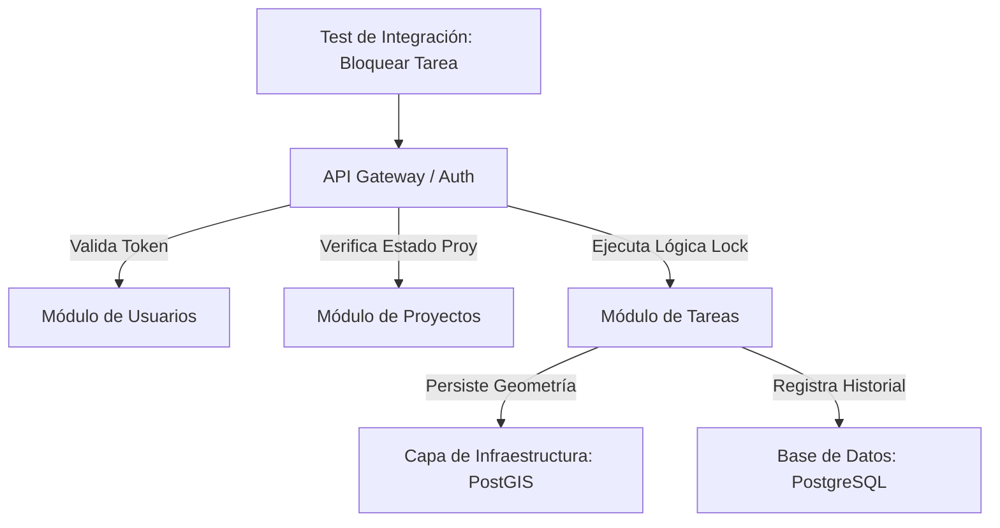

# Arquitectura Modular y Estrategia de Pruebas de Integración

Este documento detalla la relación entre la organización del backend de **Tasking Manager** y su estrategia de pruebas de integración, proporcionando un marco de referencia para comprender cómo se validan los procesos de negocio en un entorno modular.

---

## 1. División del Backend en Módulos Funcionales

La implementación del backend no está dividida por capas técnicas puras (como "Controladores" o "Repositorios"), sino por **Dominios de Negocio** (también conocidos como *Bounded Contexts* en el diseño orientado a dominios).

### Criterio de Clasificación
El criterio principal es la **Responsabilidad Funcional**. Cada módulo agrupa la lógica, los datos y las reglas que pertenecen a un área específica del negocio.

| Módulo Funcional | Representación en el Negocio | Utilidad de esta Clasificación |
| :--- | :--- | :--- |
| **Usuarios y Auth** | Identidad, perfiles y permisos. | Centraliza la seguridad y la gestión de mappers. |
| **Proyectos** | Configuración, AOI y autoría. | Permite gestionar el "contenedor" de las tareas. |
| **Tareas y Mapeo** | Flujo de estados, locks y geometría. | Protege la integridad del trabajo cartográfico. |
| **Organizaciones** | Dueños legales y suscripciones. | Estructura la jerarquía administrativa superior. |
| **Equipos** | Colaboración y permisos grupales. | Gestiona el acceso masivo a proyectos privados. |
| **Comunicación** | Mensajería, chat y notificaciones. | Desacopla la lógica de envío de alertas. |
| **Estadísticas** | Métricas, progreso y rankings. | Agrega datos masivos para la toma de decisiones. |

---

## 2. Diferencia entre Módulo Funcional y Caso de Prueba

Es crucial no confundir la **herramienta de construcción** con la **herramienta de validación**.

*   **Módulo Funcional:** Es un componente del sistema. Es **estático** (código fuente) y define **qué puede hacer** el sistema. Ejemplo: El servicio que sabe cómo dividir una tarea.
*   **Caso de Prueba de Integración:** Es un escenario de verificación. Es **dinámico** (ejecución) y define **cómo se comporta** el sistema cuando interactúan sus partes. Ejemplo: Simular que un usuario real intenta dividir una tarea y verificar que la base de datos se actualice y el historial se registre.

---

## 3. Asociación de Tests a Módulos: El Punto de Entrada

Decir que una prueba "pertenece" al **Módulo de Tareas y Mapeo** no significa que esté encerrada en una caja. Significa que ese módulo es el **Sujeto de Interés Primario**.

### Criterios de Asociación:
1.  **Punto de Entrada:** El test inicia invocando un endpoint o servicio de ese módulo (por ejemplo, `POST /tasks/lock`).
2.  **Propiedad del Estado:** El test se clasifica aquí si el cambio principal ocurre en las entidades de este módulo (por ejemplo, la tabla `tasks`).
3.  **Objetivo de Negocio:** La pregunta que el test intenta responder es sobre este dominio. (Ej. "¿Puede un usuario bloquear una tarea?").

---

## 4. El Alcance de la Integración

Un caso de prueba asociado a un módulo **rara vez valida exclusivamente ese módulo**. En una arquitectura moderna, los componentes están interconectados.

### Validación Transversal
Cuando ejecutas un test del módulo de **Tareas**, el flujo atraviesa múltiples capas y dominios:

Si el test solo validara el código interno del servicio usando datos falsos (*mocks*), sería una **prueba unitaria**. Al permitir que el flujo toque la base de datos real y consulte otros servicios, se convierte en **integración**, validando las "costuras" del sistema.

---

## 5. ¿Por qué sigue siendo "Integración" si está bajo un solo módulo?

La clasificación modular es una **organización lógica para el desarrollador**, pero la naturaleza del test es técnica. Sigue siendo integración porque valida dos dimensiones:

1.  **Integración Vertical:** La comunicación entre la API, los Servicios, los Modelos de SQLAlchemy y el motor de base de datos PostgreSQL/PostGIS.
2.  **Integración Horizontal:** Las dependencias necesarias entre dominios. Por ejemplo, el módulo de **Tareas** necesita del módulo de **Licencias** para saber si el usuario puede mapear. Sin esa integración, el test fallaría.

---

## 6. Alcance Real de un Caso de Prueba

El alcance es **funcional y completo**. Un único test tiene un objetivo simple pero una ejecución compleja.

| Atributo | Descripción |
| :--- | :--- |
| **Objetivo Único** | Verificar una acción de negocio (por ejemplo, "Mapear tarea"). |
| **Componentes Involucrados** | Middlewares, DTOs, Servicios, Lógica de Dominio, Triggers de BD, Extensiones Espaciales (PostGIS). |
| **Efecto Lateral** | El test valida que, además de la acción principal, ocurran los efectos esperados en otros lados (por ejemplo, enviar una notificación tras validar una tarea). |

### Ejemplo de Alcance
En el test `test_unlock_after_mapping`:
*   **Módulo asignado:** Tareas y Mapeo.
*   **Lo que realmente sucede:** Se valida la autenticación (Usuarios), se verifica que el proyecto acepte contribuciones (Proyectos), se calcula la duración del lock (Infraestructura/Tiempo), se actualiza el estado (Tareas) y se dispara una tarea en segundo plano para actualizar estadísticas (Estadísticas).

**Conclusión:** La organización por módulos permite una navegación estructurada del código, mientras que las pruebas de integración aseguran que, a pesar de esa división, el sistema funcione como un **todo unificado y coherente**.
