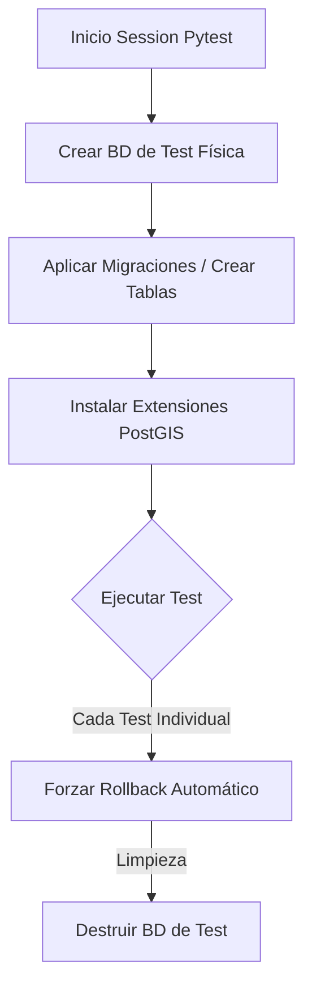

# Módulo de Infraestructura y Núcleo (Core)

El **Módulo de Infraestructura y Núcleo** constituye el cimiento técnico sobre el cual se construye el **Tasking Manager**. A diferencia de los módulos funcionales, que encapsulan reglas del dominio de negocio (mapeo, validación, gestión de equipos), este módulo se encarga de la **capacidad operativa** del sistema. Provee los mecanismos de configuración, persistencia, manejo de excepciones y orquestación del ciclo de vida que permiten que el resto de la aplicación sea agnóstica a los detalles de implementación de bajo nivel.

---

## 1. Propósito y Filosofía de Diseño

El propósito primordial de este módulo es la **abstracción de la infraestructura** y la **estandarización del entorno de ejecución**. 

### Diferencia entre Infraestructura y Dominio Funcional
*   **Módulos Funcionales (Verticales):** Implementan el "QUÉ" hace la aplicación (ej. "Dividir una tarea en cuatro"). Contienen lógica volátil y específica del negocio.
*   **Módulo de Infraestructura (Horizontal/Core):** Implementa el "CÓMO" sobrevive la aplicación (ej. "Cómo nos conectamos asíncronamente a PostgreSQL" o "Cómo leemos variables de entorno"). Es transversal, estable y soporta a todos los verticales.

---

## 2. Componentes Principales y Arquitectura

La infraestructura se organiza en tres pilares: **Configuración**, **Ciclo de Vida** y **Persistencia**.

### A. Gestión de Configuración Dinámica (`config.py`)
Utiliza **Pydantic Settings** para implementar el patrón *Twelve-Factor App*. 
*   **Mecanismo:** La clase `Settings` valida en tiempo de inicio que todas las variables necesarias (DB, OAuth, SMTP) existan y tengan el formato correcto.
*   **Justificación:** Previene errores en tiempo de ejecución. Si una configuración crítica es inválida, la aplicación no inicia ("Fail-fast").
*   **Inyección:** Se utiliza `lru_cache` para asegurar que la configuración sea un singleton eficiente en todo el sistema.

### B. Ciclo de Vida y Punto de Entrada (`main.py`)
FastAPI actúa como el orquestador principal.
*   **lifespan events:** Gestiona la conexión y desconexión del pool de base de datos.
*   **Middlewares:** Implementa la seguridad (CORS), autenticación y profiling de forma centralizada.
*   **Justificación:** Centralizar el ciclo de vida garantiza que no queden conexiones "huérfanas" a la base de datos y que cada petición pase por el mismo flujo de validación.

### C. Capa de Datos Asíncrona (`db.py`)
El sistema utiliza una arquitectura híbrida: **SQLAlchemy** para la definición de esquemas y modelos, y la librería **databases** para la ejecución asíncrona.
*   **Justificación:** SQLAlchemy es excelente para el mapeo objeto-relacional (ORM), pero su soporte asíncrono puro era limitado al inicio del proyecto. La librería `databases` permite ejecutar consultas de alto rendimiento aprovechando `asyncpg`, lo cual es vital para una aplicación GIS con alta concurrencia.

---

## 3. Orquestación del Entorno de Pruebas (`conftest.py`)

Este es el componente de infraestructura más crítico para la fiabilidad del código. Permite que las pruebas de integración sean **deterministas e aisladas**.

### El Patrón de "Base de Datos Efímera"
Para garantizar la reproducibilidad, el Core implementa el siguiente flujo en las pruebas:



### Justificación Técnica de Decisiones en Pruebas:
1.  **`force_rollback=True`:** Cada test se ejecuta dentro de una transacción que nunca se confirma (*commit*). 
    *   *Problema resuelto:* Evita que los datos creados por el Test A afecten el resultado del Test B (contaminación de estado).
2.  **Aislamiento de Base de Datos:** Se crea una base de datos con el sufijo `_test`.
    *   *Problema resuelto:* Previene la destrucción accidental de datos de desarrollo o producción durante la ejecución de los tests.
3.  **FastAPI `ASGITransport`:** Permite invocar la API sin levantar un servidor web real.
    *   *Problema resuelto:* Velocidad de ejecución y capacidad de interceptar peticiones internas para auditoría.

---

## 4. Gestión Global de Excepciones (`exceptions.py`)

El Core define un lenguaje común de errores para toda la arquitectura.

| Componente | Función Técnica | Razón de Existencia |
| :--- | :--- | :--- |
| **BaseException** | Clase madre que hereda de `HTTPException`. | Estandariza el formato JSON de respuesta de error para el Frontend. |
| **SubCodes** | Códigos de error específicos (ej. `USER_NOT_FOUND`). | Permite al cliente (web/mobile) realizar acciones específicas sin depender de mensajes de texto traducibles. |
| **Handler Global** | Captura excepciones no controladas en `main.py`. | Evita que errores internos del servidor (500) expongan trazas de código sensibles, devolviendo un error controlado. |

---

## 5. Resumen de Relaciones Arquitectónicas

```mermaid
nodeContext
  subgraph "Módulos Funcionales (Dominio)"
    Mapping[Mapping & Validation]
    Users[Users & Auth]
    Projects[Projects]
  end

  subgraph "Infraestructura & Núcleo (Core)"
    Config[config.py: Settings]
    Lifecycle[main.py: App Lifecycle]
    DB[db.py: Connection Pool]
    TestCore[conftest.py: Test Engine]
  end

  Mapping -.-> DB
  Users -.-> Config
  Lifecycle --> Mapping
  TestCore --> Lifecycle
  TestCore --> DB
```

Sin este módulo, los desarrolladores de lógica de negocio tendrían que gestionar manualmente las conexiones a la base de datos y la validación de configuraciones en cada función. El Módulo de Infraestructura y Núcleo elimina esa carga cognitiva, garantizando que el sistema sea **mantenible, testeable y escalable**.
