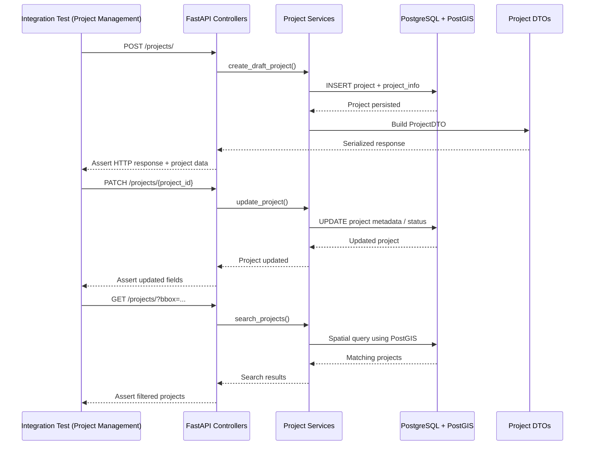

# Módulo de Gestión de Proyectos (Project Management)

## 1. Criterio de Selección

Para que un archivo de prueba sea considerado parte del módulo **Gestión de Proyectos**, debe cumplir al menos uno de los siguientes requisitos:

1. **Gestión del ciclo de vida del proyecto:** el test debe validar operaciones relacionadas con creación, consulta, edición, eliminación, publicación, transferencia o administración de proyectos.
2. **Administración de configuración del proyecto:** el test debe verificar información del proyecto como nombre, descripción, instrucciones, prioridad, privacidad, campañas, equipos, partners o estado del proyecto.
3. **Persistencia de entidades propias del proyecto:** el test debe interactuar con modelos directamente asociados a proyectos, como `Project`, `ProjectInfo`, `ProjectPartner`, `ProjectChat` o `PriorityArea`.
4. **Exposición de endpoints de proyectos:** el punto de entrada debe ser un endpoint ubicado en `backend/api/projects/`.
5. **Lógica de negocio propia de proyectos:** el test debe validar servicios como `ProjectService`, `ProjectAdminService`, `ProjectSearchService` o `ProjectPartnershipService`.

---

## 2. Archivos del módulo considerados para cobertura

Para medir la cobertura del módulo se consideraron únicamente los archivos propios de **Gestión de Proyectos**, organizados por capas.

### A. API / Controladores

| Archivo | Justificación de Inclusión |
| :--- | :--- |
| `backend/api/projects/__init__.py` | Inicializa el paquete de endpoints del módulo de proyectos. |
| `backend/api/projects/resources.py` | Expone los endpoints principales para crear, consultar, editar, eliminar y listar proyectos. |
| `backend/api/projects/actions.py` | Contiene acciones administrativas sobre proyectos, como transferencia, destacado, mensajes e intereses. |
| `backend/api/projects/activities.py` | Permite consultar actividades o línea de tiempo asociada a proyectos. |
| `backend/api/projects/campaigns.py` | Gestiona la relación entre proyectos y campañas. |
| `backend/api/projects/contributions.py` | Expone información de contribuciones relacionadas con proyectos. |
| `backend/api/projects/favorites.py` | Gestiona la funcionalidad de marcar o quitar proyectos favoritos. |
| `backend/api/projects/partnerships.py` | Expone endpoints para asociaciones entre proyectos y partners. |
| `backend/api/projects/statistics.py` | Expone estadísticas del proyecto. |
| `backend/api/projects/teams.py` | Gestiona la relación entre proyectos y equipos. |

### B. Servicios / Lógica de negocio

| Archivo | Justificación de Inclusión |
| :--- | :--- |
| `backend/services/project_service.py` | Servicio principal de operaciones generales del proyecto. |
| `backend/services/project_admin_service.py` | Servicio administrativo para creación, edición, permisos, transferencia y eliminación de proyectos. |
| `backend/services/project_search_service.py` | Servicio encargado de búsqueda, filtros, áreas, bbox y consulta avanzada de proyectos. |
| `backend/services/project_partnership_service.py` | Servicio específico para relaciones entre proyectos y partners. |

### C. Modelos PostGIS / Base de datos

| Archivo | Justificación de Inclusión |
| :--- | :--- |
| `backend/models/postgis/project.py` | Modelo principal del proyecto; contiene datos centrales, estados, geometría, AOI y relaciones. |
| `backend/models/postgis/project_info.py` | Modelo para información descriptiva o localizada del proyecto. |
| `backend/models/postgis/project_partner.py` | Modelo de relación entre proyecto y partner. |
| `backend/models/postgis/project_chat.py` | Modelo para mensajes o chat asociados al proyecto. |
| `backend/models/postgis/priority_area.py` | Modelo para áreas prioritarias dentro del proyecto. |

### D. DTOs / Esquemas

| Archivo | Justificación de Inclusión |
| :--- | :--- |
| `backend/models/dtos/project_dto.py` | DTO principal para entrada y salida de datos del proyecto. |
| `backend/models/dtos/project_partner_dto.py` | DTO relacionado con asociaciones entre proyectos y partners. |

---

## 3. Listado de suites de pruebas de integración actuales

El conjunto seleccionado para el módulo **Gestión de Proyectos** consta de pruebas ubicadas en `tests/api/integration/`.

### Archivos Incluidos

| Archivo de Prueba | Justificación de Inclusión |
| :--- | :--- |
| `api/projects/test_actions.py` | Valida acciones administrativas sobre proyectos, como transferencia, destacado, intereses, mensajes y cálculo de tiles intersectados. |
| `api/projects/test_activities.py` | Verifica la recuperación de actividades o eventos asociados al proyecto. |
| `api/projects/test_campaigns.py` | Cubre la asignación y eliminación de campañas relacionadas con proyectos. |
| `api/projects/test_contributions.py` | Evalúa la obtención de contribuciones de usuarios dentro de proyectos. |
| `api/projects/test_favourites.py` | Valida la funcionalidad de agregar y quitar proyectos favoritos. |
| `api/projects/test_resources.py` | Cubre endpoints principales del módulo: creación, consulta, edición, privacidad, draft, listado y eliminación de proyectos. |
| `api/projects/test_statistics.py` | Verifica endpoints de estadísticas del proyecto. |
| `models/test_project.py` | Valida comportamiento del modelo `Project`, persistencia, DTOs y actualización de datos. |
| `services/test_project_admin_service.py` | Cubre la lógica administrativa del proyecto: creación de draft, clonación, permisos y tareas asociadas. |
| `services/test_project_service.py` | Valida operaciones generales del servicio de proyectos y permisos de visualización/uso. |
| `services/test_project_search_service.py` | Prueba búsqueda de proyectos por área, intersección y bbox. |
| `services/test_featured_projects_services.py` | Evalúa lógica relacionada con proyectos destacados. |

### Archivos Excluidos

* `api/tasks/test_actions.py`: se excluye porque pertenece al flujo de tareas, mapeo y validación, no al ciclo de vida administrativo del proyecto.
* `api/tasks/test_resources.py`: aunque las tareas dependen de proyectos, este archivo valida recursos de tareas individuales.
* `services/grid/test_split_service.py`: se excluye porque pertenece a la lógica de grilla y división de tareas; se considera dependencia del proyecto, no núcleo del módulo.
* `services/license_service.py`: se excluye del alcance de cobertura del módulo porque pertenece al manejo de licencias, aunque sea usado durante la validación de imágenes.
* `api/users/*`: se excluye porque pertenece al módulo de usuarios, aunque los proyectos dependan de autores, managers o validadores.
* `api/organisations/*` y `api/teams/*`: se excluyen porque pertenecen a módulos externos de gobernanza, aunque existan relaciones con proyectos.

---

## 4. Análisis Funcional por Archivo

### A. Gestión principal de proyectos (`api/projects/test_resources.py`)

* **Objetivo:** validar los endpoints principales del módulo de proyectos.
* **Flujos Cubiertos:** creación de proyecto, obtención de proyecto, edición, eliminación, listado, proyectos privados, drafts y validaciones de acceso.
* **Componentes:** `Project`, `ProjectDTO`, `ProjectService`, `ProjectAdminService`, endpoints de `backend/api/projects/resources.py`.

### B. Acciones administrativas (`api/projects/test_actions.py`)

* **Objetivo:** asegurar que las acciones administrativas se ejecuten respetando permisos y reglas de negocio.
* **Flujos Cubiertos:** transferencia de propiedad, marcar proyecto como destacado, quitar destacado, envío de mensajes a contribuidores, asignación de intereses y cálculo de tiles intersectados.
* **Componentes:** `ProjectAdminService`, `ProjectService`, `Project`, `User`, permisos administrativos.

### C. Campañas, favoritos y estadísticas (`api/projects/test_campaigns.py`, `test_favourites.py`, `test_statistics.py`)

* **Objetivo:** validar funcionalidades complementarias del ciclo de vida del proyecto.
* **Flujos Cubiertos:** asociar campañas, eliminar campañas, marcar favoritos, quitar favoritos y consultar estadísticas.
* **Componentes:** `Project`, `Campaign`, `User`, endpoints de campañas, favoritos y estadísticas.

### D. Modelo y persistencia del proyecto (`models/test_project.py`)

* **Objetivo:** verificar que el modelo `Project` persista y transforme correctamente la información.
* **Flujos Cubiertos:** creación de entidad, actualización de campos, conversión a DTO, manejo de AOI y relaciones básicas.
* **Componentes:** `Project`, `ProjectInfo`, `PriorityArea`, PostgreSQL/PostGIS.

### E. Servicios administrativos y búsqueda (`services/test_project_admin_service.py`, `test_project_search_service.py`)

* **Objetivo:** probar la lógica de negocio del módulo sin depender únicamente de los endpoints HTTP.
* **Flujos Cubiertos:** creación de borradores, clonación de proyectos, permisos de administración, búsqueda por área, bbox e intersección.
* **Componentes:** `ProjectAdminService`, `ProjectSearchService`, `Project`, PostGIS.

### F. Servicio general de proyectos (`services/test_project_service.py`)

* **Objetivo:** validar reglas generales de acceso y consulta sobre proyectos.
* **Flujos Cubiertos:** obtención de DTO para mapper, manejo de proyectos draft, proyectos privados y permisos.
* **Componentes:** `ProjectService`, `Project`, `User`, DTOs del módulo.

---

## 5. Diagrama de Interacción de las Pruebas de Integración

Este diagrama muestra cómo las pruebas de integración del módulo ejercen varias capas del sistema:



---

## 6. Alcance de la cobertura

La cobertura se calculó sobre los archivos fuente propios del módulo, no sobre los archivos de prueba. Es decir, se ejecutaron pruebas de integración y luego se filtró el reporte para medir únicamente el código correspondiente a **API, servicios, modelos PostGIS y DTOs de Gestión de Proyectos**.

### Resultado general

| Métrica | Resultado |
| :--- | :--- |
| Módulo evaluado | Gestión de Proyectos |
| Tipo de pruebas | Integración |
| Pruebas ejecutadas | 179 |
| Pruebas exitosas | 179 |
| Pruebas fallidas | 0 |
| Archivos medidos | 21 |
| Líneas ejecutables analizadas | 3126 |
| Líneas no cubiertas | 840 |
| Cobertura total | 73% |
| Tiempo de ejecución | 73.84 s |

### Cobertura por archivo

| Archivo | Stmts | Miss | Cover |
| :--- | ---: | ---: | ---: |
| `backend/api/projects/__init__.py` | 0 | 0 | 100% |
| `backend/api/projects/actions.py` | 92 | 34 | 63% |
| `backend/api/projects/activities.py` | 35 | 12 | 66% |
| `backend/api/projects/campaigns.py` | 32 | 0 | 100% |
| `backend/api/projects/contributions.py` | 27 | 6 | 78% |
| `backend/api/projects/favorites.py` | 26 | 0 | 100% |
| `backend/api/projects/partnerships.py` | 55 | 32 | 42% |
| `backend/api/projects/resources.py` | 292 | 83 | 72% |
| `backend/api/projects/statistics.py` | 18 | 2 | 89% |
| `backend/api/projects/teams.py` | 57 | 38 | 33% |
| `backend/models/dtos/project_dto.py` | 406 | 50 | 88% |
| `backend/models/dtos/project_partner_dto.py` | 41 | 5 | 88% |
| `backend/models/postgis/priority_area.py` | 33 | 4 | 88% |
| `backend/models/postgis/project.py` | 733 | 161 | 78% |
| `backend/models/postgis/project_chat.py` | 48 | 25 | 48% |
| `backend/models/postgis/project_info.py` | 85 | 18 | 79% |
| `backend/models/postgis/project_partner.py` | 75 | 41 | 45% |
| `backend/services/project_admin_service.py` | 194 | 17 | 91% |
| `backend/services/project_partnership_service.py` | 85 | 62 | 27% |
| `backend/services/project_search_service.py` | 424 | 95 | 78% |
| `backend/services/project_service.py` | 368 | 155 | 58% |
| **TOTAL** | **3126** | **840** | **73%** |

---

## 7. Ejecución de pruebas de integración

Se ejecutaron las pruebas de integración del módulo mediante el siguiente comando:

```sh
docker compose exec -T tm-backend coverage run -m pytest tests/api/integration/api/projects/ tests/api/integration/models/test_project.py tests/api/integration/services/test_project_admin_service.py tests/api/integration/services/test_project_service.py tests/api/integration/services/test_project_search_service.py tests/api/integration/services/test_featured_projects_services.py -p no:warnings
```

### Resultado de la ejecución

```sh
============================= test session starts ==============================
platform linux -- Python 3.10.20, pytest-8.3.5, pluggy-1.5.0
rootdir: /usr/src/app
configfile: pyproject.toml
plugins: anyio-4.9.0
collected 179 items

tests/api/integration/api/projects/test_actions.py ..................... [ 11%]
..                                                                       [ 12%]
tests/api/integration/api/projects/test_activities.py ....               [ 15%]
tests/api/integration/api/projects/test_campaigns.py ...............     [ 23%]
tests/api/integration/api/projects/test_contributions.py ......          [ 26%]
tests/api/integration/api/projects/test_favourites.py ..........         [ 32%]
tests/api/integration/api/projects/test_resources.py ................... [ 43%]
..............................................................           [ 77%]
tests/api/integration/api/projects/test_statistics.py .....              [ 80%]
tests/api/integration/models/test_project.py .......                     [ 84%]
tests/api/integration/services/test_project_admin_service.py ........... [ 90%]
.......                                                                  [ 94%]
tests/api/integration/services/test_project_service.py ......            [ 97%]
tests/api/integration/services/test_project_search_service.py ...        [ 99%]
tests/api/integration/services/test_featured_projects_services.py .      [100%]

======================== 179 passed in 73.84s (0:01:13) ========================
```

---

## 8. Reporte de cobertura ejecutado

Para generar el reporte filtrado del módulo se ejecutó:

```sh
docker compose exec -T tm-backend coverage report -m --include="backend/api/projects/*.py,backend/services/project_service.py,backend/services/project_admin_service.py,backend/services/project_search_service.py,backend/services/project_partnership_service.py,backend/models/postgis/project.py,backend/models/postgis/project_info.py,backend/models/postgis/project_partner.py,backend/models/postgis/project_chat.py,backend/models/postgis/priority_area.py,backend/models/dtos/project_dto.py,backend/models/dtos/project_partner_dto.py"
```

### Resultado del reporte

```sh
Name                                              Stmts   Miss  Cover   Missing
-------------------------------------------------------------------------------
backend/api/projects/__init__.py                      0      0   100%
backend/api/projects/actions.py                      92     34    63%
backend/api/projects/activities.py                   35     12    66%
backend/api/projects/campaigns.py                    32      0   100%
backend/api/projects/contributions.py                27      6    78%
backend/api/projects/favorites.py                    26      0   100%
backend/api/projects/partnerships.py                 55     32    42%
backend/api/projects/resources.py                   292     83    72%
backend/api/projects/statistics.py                   18      2    89%
backend/api/projects/teams.py                        57     38    33%
backend/models/dtos/project_dto.py                  406     50    88%
backend/models/dtos/project_partner_dto.py           41      5    88%
backend/models/postgis/priority_area.py              33      4    88%
backend/models/postgis/project.py                   733    161    78%
backend/models/postgis/project_chat.py               48     25    48%
backend/models/postgis/project_info.py               85     18    79%
backend/models/postgis/project_partner.py            75     41    45%
backend/services/project_admin_service.py           194     17    91%
backend/services/project_partnership_service.py      85     62    27%
backend/services/project_search_service.py          424     95    78%
backend/services/project_service.py                 368    155    58%
-------------------------------------------------------------------------------
TOTAL                                              3126    840    73%
```

---

## 9. Análisis de resultados

El módulo presenta una cobertura total de **73%**, lo que indica una base importante de pruebas de integración. Las 179 pruebas ejecutadas pasaron correctamente, por lo que el comportamiento validado se encuentra estable en el entorno de pruebas.

Los archivos con mejor cobertura fueron:

| Archivo | Cobertura | Interpretación |
| :--- | ---: | :--- |
| `backend/api/projects/campaigns.py` | 100% | Los endpoints de campañas están completamente cubiertos. |
| `backend/api/projects/favorites.py` | 100% | La funcionalidad de favoritos está completamente cubierta. |
| `backend/services/project_admin_service.py` | 91% | La lógica administrativa principal tiene cobertura alta. |
| `backend/api/projects/statistics.py` | 89% | Las estadísticas del proyecto están bien cubiertas. |
| `backend/models/dtos/project_dto.py` | 88% | Los DTOs principales están bien ejercitados por las pruebas. |
| `backend/models/postgis/priority_area.py` | 88% | La persistencia de áreas prioritarias tiene buena cobertura. |

Los archivos con menor cobertura fueron:

| Archivo | Cobertura | Observación |
| :--- | ---: | :--- |
| `backend/services/project_partnership_service.py` | 27% | Falta reforzar pruebas de integración para relaciones proyecto-partner. |
| `backend/api/projects/teams.py` | 33% | Faltan pruebas específicas para endpoints que relacionan proyectos con equipos. |
| `backend/api/projects/partnerships.py` | 42% | Los endpoints de partnerships están poco cubiertos. |
| `backend/models/postgis/project_partner.py` | 45% | Faltan pruebas sobre persistencia y transformación de relaciones con partners. |
| `backend/models/postgis/project_chat.py` | 48% | Falta cubrir más escenarios de mensajes o chat de proyecto. |
| `backend/services/project_service.py` | 58% | El servicio general aún tiene ramas y métodos no ejercitados. |

---

## 10. Alcance y nivel de confianza

| Dimensión | Alcance | Nivel de Confianza | Observaciones |
| :--- | :--- | :--- | :--- |
| **Creación y administración de proyectos** | 90% | **Alto** | `project_admin_service.py` obtuvo 91%, lo que indica buena cobertura de la lógica administrativa. |
| **Endpoints principales de proyectos** | 72% | **Medio-Alto** | `resources.py` tiene cobertura aceptable, aunque todavía existen ramas no cubiertas. |
| **Campañas y favoritos** | 100% | **Muy Alto** | Ambos archivos alcanzaron cobertura completa. |
| **Búsqueda de proyectos** | 78% | **Alto** | `project_search_service.py` cubre gran parte de la consulta espacial y filtros. |
| **Modelo principal de proyecto** | 78% | **Alto** | `project.py` tiene una cobertura sólida considerando su tamaño y complejidad. |
| **DTOs del módulo** | 88% | **Alto** | Los esquemas de entrada y salida están bien ejercitados por los tests. |
| **Partnerships** | 27%-45% | **Bajo** | Es la zona más débil del módulo. Faltan pruebas para endpoints, servicio y modelo. |
| **Equipos asociados a proyectos** | 33% | **Bajo** | Falta reforzar pruebas para `backend/api/projects/teams.py`. |
| **Chat de proyecto** | 48% | **Bajo-Medio** | Falta cubrir más escenarios relacionados con comunicación dentro del proyecto. |

---

## 11. Conclusión del Estado Actual

Las pruebas de integración existentes proporcionan una base sólida para el módulo **Gestión de Proyectos**. La ejecución fue exitosa, con **179 pruebas pasadas de 179 ejecutadas**, lo que evidencia estabilidad en los flujos ya cubiertos.

La cobertura total obtenida fue de **73%** sobre 21 archivos propios del módulo. Este resultado demuestra que gran parte del flujo principal está validado, especialmente en creación y administración de proyectos, campañas, favoritos, estadísticas, búsqueda y DTOs.

Sin embargo, el módulo todavía presenta oportunidades de mejora. Las principales brechas se encuentran en `project_partnership_service.py`, `api/projects/teams.py`, `api/projects/partnerships.py`, `project_partner.py` y `project_chat.py`. Estas áreas deberían priorizarse si se busca aumentar la cobertura del módulo hacia una meta superior, como 80% u 85%.

**Conclusión final:**  
El módulo de Gestión de Proyectos cuenta con una cobertura de integración aceptable y una ejecución estable de pruebas, pero requiere reforzar los escenarios de partnerships, equipos asociados y comunicación de proyecto para alcanzar una cobertura más alta y equilibrada.
