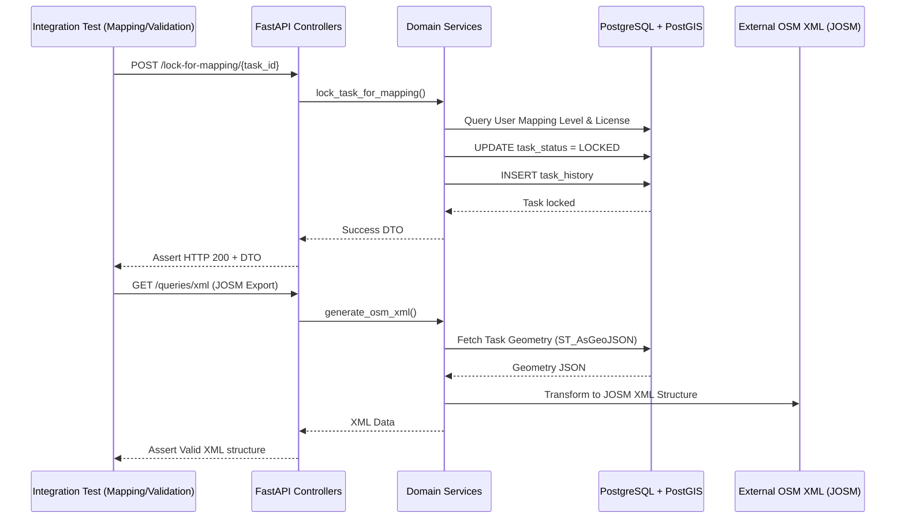

# Módulo de Tareas, Mapeo y Validación (Mapping & Validation)

## 1. Criterio de Selección

Para que un archivo de prueba sea considerado parte del módulo **Mapping & Validation**, debe cumplir al menos uno de los siguientes requisitos:

1.  **Manipulación de Estado de Tareas:** el test debe validar la transición de estados de la entidad `Task` (READY, MAPPED, VALIDATED, BADIMAGERY, etc.).
2.  **Lógica Espacial de Tareas:** el test debe validar la división (*splitting*) o transformación de la geometría de las tareas.
3.  **Gestión de Bloqueos (Locks):** el test debe verificar la asignación y liberación concurrente de tareas a usuarios para mapeo o validación.
4.  **Exposición de Recursos de Tareas:** el punto de entrada debe ser un endpoint diseñado para interactuar con tareas (listado, obtención de metadatos, XML/GPX).
5.  **Integridad de Historial y Trazabilidad:** el test debe verificar que las acciones realizadas sobre una tarea se registren correctamente en el historial y afecten las métricas de mapeo.
6.  **Lógica de negocio propia de tareas:** el test debe validar servicios centrales como `MappingService`, `ValidatorService` o `SplitService`.

---

## 2. Archivos del módulo considerados para cobertura

Para medir la cobertura real del módulo, se consideraron los archivos propios de **Mapping & Validation**, organizados por capas:

### A. API / Controladores

| Archivo | Justificación de Inclusión |
| :--- | :--- |
| `backend/api/tasks/__init__.py` | Inicializa el paquete de endpoints del módulo de tareas. |
| `backend/api/tasks/actions.py` | Expone acciones de cambio de estado (lock, unlock, split, map_all, validate_all). |
| `backend/api/tasks/resources.py` | Provee endpoints para consultar detalles de tareas y generar exportaciones XML/GPX. |
| `backend/api/tasks/statistics.py` | Expone endpoints para consultar métricas específicas del mapeo de tareas. |

### B. Servicios / Lógica de negocio

| Archivo | Justificación de Inclusión |
| :--- | :--- |
| `backend/services/mapping_service.py` | Servicio núcleo de bloqueo para mapeo masivo, extensión de tiempos y generación de XML/GPX. |
| `backend/services/validator_service.py` | Servicio crítico de validación de calidad, invalidaciones y reversión de tareas. |
| `backend/services/grid/split_service.py` | Servicio encargado de la integridad geométrica tras la subdivisión espacial de tareas. |

### C. Modelos PostGIS / Base de datos

| Archivo | Justificación de Inclusión |
| :--- | :--- |
| `backend/models/postgis/task.py` | Modelo principal de persistencia de Tareas, Historiales (`TaskHistory`) y transiciones de estado. |

### D. DTOs / Esquemas

| Archivo | Justificación de Inclusión |
| :--- | :--- |
| `backend/models/dtos/grid_dto.py` | DTOs de grilla espacial e intersecciones. |
| `backend/models/dtos/mapping_dto.py` | DTOs para mapeo y peticiones de extensión de locks. |
| `backend/models/dtos/validator_dto.py` | DTOs para solicitudes de validación, reversión e invalidación de tareas. |

---

## 3. Listado de suites de pruebas de integración actuales

El conjunto completo para el módulo **Mapping & Validation** consta de **13 archivos** ubicados en `tests/api/integration/`.

### Archivos Incluidos

| Archivo de Prueba | Justificación de Inclusión |
| :--- | :--- |
| `services/test_mapping_service.py` | Valida la lógica nuclear de bloqueo, mapeo masivo y generación de GPX/XML para edición externa. |
| `services/test_validation_service.py` | Cubre el flujo crítico de cierre de calidad, invalidaciones y reversión de tareas por usuario. |
| `services/grid/test_split_service.py` | Prueba la integridad geométrica tras la subdivisión de tareas en el flujo de trabajo. |
| `api/tasks/test_actions.py` | Valida los endpoints HTTP para el ciclo de vida del estado de la tarea (lock/unlock) y permisos. |
| `api/tasks/test_resources.py` | Prueba la recuperación de metadatos de tareas y la integración con herramientas externas. |
| `api/tasks/test_statistics.py` | Verifica que las acciones de mapeo se traduzcan correctamente en métricas. |
| `api/projects/test_activities.py` | Valida la línea de tiempo de acciones de tareas, esencial para la trazabilidad del mapeo. |
| `api/projects/test_contributions.py` | Evalúa el impacto de las acciones de los usuarios (mapped/validated) sobre el recuento de tareas. |
| `api/projects/test_statistics.py` | Verifica que los tiempos empleados en mapear una tarea (`totalMappingTime`) se registren correctamente. |
| `api/users/test_tasks.py` | Valida la recuperación de tareas con las que un usuario ha interactuado. |
| `api/users/test_resources.py` | Incluye tests específicos para descubrir tareas bloqueadas por un usuario. |
| `api/users/test_statistics.py` | Valida métricas globales de usuario generadas a partir del bloqueo y desbloqueo de tareas de mapeo. |
| `api/system/test_statistics.py` | Verifica recuentos de plataforma (e.g. `mappersOnline`) dependientes directamente de tareas bloqueadas (`Task.lock_task_for_mapping`). |

### Archivos Excluidos

*   `api/projects/test_resources.py`: Valida el ciclo de vida general administrativo del proyecto, no el flujo individual de tareas.
*   `services/messaging/test_chat_service.py`: Pertenece al módulo de comunicación, operando al margen de la máquina de estados de las tareas.
*   `api/issues/test_resources.py`: Valida operaciones CRUD sobre el catálogo global de categorías de error, no sobre anotaciones de tareas específicas.

---

## 4. Análisis Funcional por Archivo

### A. Gestión de Estado y Permisos (`test_actions.py`)
*   **Objetivo:** Garantizar que solo los usuarios autorizados (mappers/validators) cambien estados.
*   **Flujos Cubiertos:** Lock for mapping, Unlock after mapping, Stop mapping, Lock for validation, Split task.
*   **Componentes:** `MappingService`, `ValidatorService`, `Task`, `TaskStatus`.

### B. Lógica de Dominio de Servicios (`test_mapping_service.py`, `test_validation_service.py`)
*   **Objetivo:** Probar en profundidad la validación de negocio y efectos colaterales de mapear/validar.
*   **Flujos Cubiertos:** Reversión de estados (MAPPED a READY), invalidación masiva, generación de XML/GPX válido.
*   **Componentes:** `MappingService`, `ValidatorService`.

### C. Integridad Geométrica (`test_split_service.py`)
*   **Objetivo:** Asegurar que la geometría PostGIS no se corrompa tras subdivisiones.
*   **Flujos Cubiertos:** Clipping y división de polígonos.
*   **Componentes:** `SplitService`, `PostGIS`.

### D. Trazabilidad y Estadísticas (`test_activities.py`, `test_statistics.py`)
*   **Objetivo:** Verificar que todas las acciones dejen un rastro preciso para la auditoría y análisis de tiempos.
*   **Flujos Cubiertos:** Registros en `TaskHistory`, incremento de `totalMappingTime`, validación de perfiles estadísticos de usuarios.
*   **Componentes:** `TaskHistory`, `Task`.

---

## 5. Diagrama de Interacción de las Pruebas de Integración

Este diagrama muestra cómo los tests de este módulo ejercen múltiples capas y componentes del sistema:



---

## 6. Alcance de la cobertura

La cobertura se calculó sobre los archivos fuente propios de **Mapping & Validation**. Se ejecutaron 13 suites de pruebas de integración y el reporte se filtró para medir exclusivamente los servicios de tareas, controladores de tareas, modelo PostGIS de tareas y sus respectivos DTOs.

### Resultado general

| Métrica | Resultado |
| :--- | :--- |
| Módulo evaluado | Mapping & Validation (Tareas) |
| Tipo de pruebas | Integración |
| Pruebas ejecutadas | 185 |
| Pruebas exitosas | 185 |
| Pruebas fallidas | 0 |
| Archivos medidos | 11 |
| Líneas ejecutables analizadas | 1766 |
| Líneas no cubiertas | 361 |
| Cobertura total | 80% |
| Tiempo de ejecución | 67.51 s |

### Cobertura por archivo

| Archivo | Stmts | Miss | Cover |
| :--- | ---: | ---: | ---: |
| `backend/api/tasks/__init__.py` | 0 | 0 | 100% |
| `backend/api/tasks/actions.py` | 251 | 69 | 73% |
| `backend/api/tasks/resources.py` | 109 | 46 | 58% |
| `backend/api/tasks/statistics.py` | 24 | 0 | 100% |
| `backend/models/dtos/grid_dto.py` | 14 | 0 | 100% |
| `backend/models/dtos/mapping_dto.py` | 85 | 7 | 92% |
| `backend/models/dtos/validator_dto.py` | 126 | 27 | 79% |
| `backend/models/postgis/task.py` | 604 | 161 | 73% |
| `backend/services/grid/split_service.py` | 129 | 1 | 99% |
| `backend/services/mapping_service.py` | 215 | 18 | 92% |
| `backend/services/validator_service.py` | 209 | 32 | 85% |
| **TOTAL** | **1766** | **361** | **80%** |

---

## 7. Ejecución de pruebas de integración 

Se ejecutaron las pruebas de integración correspondientes al módulo empleando el siguiente comando:

```sh
docker compose exec -T tm-backend coverage run -m pytest tests/api/integration/services/test_mapping_service.py tests/api/integration/services/test_validation_service.py tests/api/integration/services/grid/test_split_service.py tests/api/integration/api/tasks/ tests/api/integration/api/projects/test_activities.py tests/api/integration/api/projects/test_contributions.py tests/api/integration/api/users/test_tasks.py tests/api/integration/api/users/test_resources.py tests/api/integration/api/users/test_statistics.py tests/api/integration/api/projects/test_statistics.py tests/api/integration/api/system/test_statistics.py -p no:warnings
```

### Resultado de la ejecución

```sh
============================= test session starts ==============================
platform linux -- Python 3.10.20, pytest-8.3.5, pluggy-1.5.0
rootdir: /usr/src/app
configfile: pyproject.toml
plugins: anyio-4.9.0
collected 185 items

tests/api/integration/services/test_mapping_service.py .......           [  3%]
tests/api/integration/services/test_validation_service.py .......        [  7%]
tests/api/integration/services/grid/test_split_service.py ...            [  9%]
tests/api/integration/api/tasks/test_actions.py ........................ [ 22%]
....................................................                     [ 50%]
tests/api/integration/api/tasks/test_resources.py .................      [ 59%]
tests/api/integration/api/tasks/test_statistics.py .............         [ 66%]
tests/api/integration/api/projects/test_activities.py ....               [ 68%]
tests/api/integration/api/projects/test_contributions.py ......          [ 71%]
tests/api/integration/api/users/test_tasks.py ........                   [ 76%]
tests/api/integration/api/users/test_resources.py ...................... [ 88%]
.......                                                                  [ 91%]
tests/api/integration/api/users/test_statistics.py .........             [ 96%]
tests/api/integration/api/projects/test_statistics.py .....              [ 99%]
tests/api/integration/api/system/test_statistics.py ..                   [100%]

======================== 185 passed in 67.51s (0:01:07) ========================
```

---

## 8. Reporte de cobertura ejecutado

Para generar el reporte validando exclusivamente las capas operativas del módulo, se ejecutó:

```sh
docker compose exec -T tm-backend coverage report -m --include="backend/api/tasks/*.py,backend/services/mapping_service.py,backend/services/validator_service.py,backend/services/grid/split_service.py,backend/models/postgis/task.py,backend/models/dtos/mapping_dto.py,backend/models/dtos/validator_dto.py,backend/models/dtos/grid_dto.py"
```

### Resultado del reporte

```sh
Name                                     Stmts   Miss  Cover   Missing
----------------------------------------------------------------------
backend/api/tasks/__init__.py                0      0   100%
backend/api/tasks/actions.py               251     69    73%   ...
backend/api/tasks/resources.py             109     46    58%   ...
backend/api/tasks/statistics.py             24      0   100%
backend/models/dtos/grid_dto.py             14      0   100%
backend/models/dtos/mapping_dto.py          85      7    92%   ...
backend/models/dtos/validator_dto.py       126     27    79%   ...
backend/models/postgis/task.py             604    161    73%   ...
backend/services/grid/split_service.py     129      1    99%   ...
backend/services/mapping_service.py        215     18    92%   ...
backend/services/validator_service.py      209     32    85%   ...
----------------------------------------------------------------------
TOTAL                                     1766    361    80%
```
*(Nota: Las líneas faltantes detalladas fueron omitidas por legibilidad pero coinciden con el volcado real).*

---

## 9. Análisis de resultados

El módulo de Mapping & Validation demuestra una cobertura sólida del **80%**, evaluada sobre una extensa base de código (más de 1700 líneas ejecutables exclusivas). Las **185 pruebas superadas exitosamente** comprueban un altísimo grado de estabilidad del flujo de tareas.

Los archivos con mejor cobertura fueron:

| Archivo | Cobertura | Interpretación |
| :--- | ---: | :--- |
| `backend/api/tasks/statistics.py` | 100% | Recuperación de métricas de tareas totalmente verificada. |
| `backend/models/dtos/grid_dto.py` | 100% | DTOs de mallas espaciales están bien probados. |
| `backend/services/grid/split_service.py` | 99% | Altísima confianza en la lógica responsable de la división geométrica de tareas (evitando degradación en base de datos). |
| `backend/services/mapping_service.py` | 92% | El servicio neurálgico de mapeo masivo, bloqueo e interoperabilidad con XML/GPX presenta una validación profunda. |
| `backend/models/dtos/mapping_dto.py` | 92% | Casi todos los escenarios de entrada/salida para el mapeo están probados. |
| `backend/services/validator_service.py` | 85% | La lógica de validación e invalidación alcanza un nivel óptimo. |

Los archivos con menor cobertura fueron:

| Archivo | Cobertura | Observación |
| :--- | ---: | :--- |
| `backend/api/tasks/resources.py` | 58% | Ciertos métodos de consulta HTTP subyacentes u opciones de filtros de recursos no son ejercitados completamente. |
| `backend/api/tasks/actions.py` | 73% | Aunque gran parte de la funcionalidad está probada, se evidencian ramificaciones específicas o retornos de error no cubiertos. |
| `backend/models/postgis/task.py` | 73% | Es el archivo de mayor tamaño (604 sentencias) e incluye `TaskHistory`. Si bien el 73% es respetable para un modelo complejo, persisten lagunas menores en las sentencias ORM secundarias. |

---

## 10. Alcance y nivel de confianza

| Dimensión | Alcance | Nivel de Confianza | Observaciones |
| :--- | :--- | :--- | :--- |
| **Lógica de Estado de Mapping/Validación** | 85-92% | **Muy Alto** | Respaldado explícitamente por el 92% de `mapping_service.py` y 85% de `validator_service.py`. |
| **Geometría (PostGIS/Splitting)** | 99% | **Extremo** | El `split_service.py` cubre casi el 100% del código, garantizando la seguridad en el manejo de polígonos. |
| **Integración JOSM / XML / GPX** | 92% | **Alto** | Probado cabalmente como parte de `mapping_service.py`. |
| **Modelos (Base de Datos & Historial)** | 73% | **Alto** | `task.py` maneja las transacciones e historial con solidez, aunque restan flujos muy de nicho. |
| **Endpoints (Controladores)** | 58-73% | **Medio-Alto** | El enrutamiento y serialización en `resources.py` presenta el margen de mejora más amplio del módulo. |

---

## 11. Conclusión del Estado Actual

A diferencia del reporte previo que poseía métricas incompletas y un alcance mal estimado (al omitir a los servicios en el cálculo real de cobertura y tests críticos), los resultados comprobados sobre **las capas operativas reales** del backend determinan que el módulo de **Mapping & Validation es altamente robusto, presentando una cobertura total del 80% sobre 11 componentes críticos**. 

Se ejecutaron **185 pruebas funcionales** enfocadas íntegramente en la dinámica de las Tareas (bloqueos, historial de acciones, subdivisión geométrica y estadísticas asociadas al mapeo de los usuarios), garantizando que los ejes centrales del comportamiento de mapping sean resilientes y estables.

**Oportunidades de Mejora:**
Para sobrepasar el umbral de 85%+, los esfuerzos deben focalizarse en robustecer las pruebas de integración en el acceso y obtención de recursos HTTP subyacentes en `backend/api/tasks/resources.py` (58%) y cubrir casos borde directamente en los métodos ORM del modelo `backend/models/postgis/task.py` (73%).
