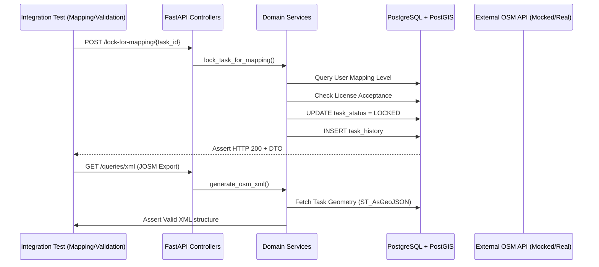

## 1. Criterio de Selección

Para que un archivo de prueba sea considerado parte de este módulo, debe cumplir al menos uno de los siguientes requisitos:
1.  **Manipulación de Estado de Tareas:** El test debe validar la transición de estados de la entidad `Task` (READY, MAPPED, VALIDATED, etc.).
2.  **Integridad de Historial de Tareas:** El test debe verificar que las acciones realizadas sobre una tarea se registren correctamente en `TaskHistory`.
3.  **Lógica Espacial de Tareas:** El test debe validar la división (*splitting*) o transformación de la geometría de las tareas.
4.  **Exposición de Recursos de Mapeador:** El punto de entrada debe ser un endpoint diseñado para el flujo de trabajo del mapper o validador.

---

## 2. Listado de suites de pruebas de integración actuales

El conjunto completo para el módulo **Mapping & Validation** consta de **10 archivos**.

### Archivos Incluidos

| Archivo de Prueba | Justificación de Inclusión |
| :--- | :--- |
| `services/test_mapping_service.py` | Valida la lógica nuclear de bloqueo, mapeo masivo y generación de GPX/XML para edición externa. |
| `services/test_validation_service.py` | Cubre el flujo crítico de cierre de calidad, invalidaciones y reversión de tareas por usuario. |
| `services/grid/test_split_service.py` | Único lugar donde se prueba la integridad geométrica tras la subdivisión de tareas en el flujo de trabajo. |
| `api/tasks/test_actions.py` | Valida los puntos de entrada HTTP para todo el ciclo de vida del estado de la tarea y sus permisos. |
| `api/tasks/test_resources.py` | Prueba la recuperación de metadatos de tareas y la integración con herramientas externas (JOSM/GPX). |
| `api/tasks/test_statistics.py` | Verifica que las acciones de mapeo se traduzcan correctamente en métricas de tiempo y progreso. |
| `api/projects/test_activities.py` | Aunque está en la carpeta de proyectos, valida la **línea de tiempo de acciones de tareas**, esencial para la trazabilidad del mapeo. |
| `api/projects/test_contributions.py` | Evalúa el impacto de las acciones de los usuarios (mapped/validated) sobre el recuento de tareas. |
| `api/users/test_tasks.py` | Valida la relación inversa: recuperar las tareas con las que un usuario ha interactuado. |
| `api/users/test_resources.py` (Sub-tests de locks) | Incluye tests específicos para descubrir tareas bloqueadas por el usuario actual (`queries/tasks/locked/`). |

### Archivos Excluidos

*   `api/projects/test_resources.py`: Se excluye el grueso del archivo porque valida la configuración del "contenedor" (nombre del proyecto, organización, prioridad), no el flujo de la tarea individual.
*   `services/messaging/test_chat_service.py`: Se excluye porque la comunicación social, aunque relacionada con tareas, pertenece al **Módulo de Comunicación**.
*   `api/issues/test_resources.py`: Valida el catálogo de categorías de error, pero no la aplicación de estos a una tarea específica.

---

## 3. Análisis Funcional por Archivo

### A. Gestión de Estado y Permisos (`api/tasks/test_actions.py`)
*   **Objetivo:** Garantizar que solo los usuarios autorizados realicen cambios de estado válidos.
*   **Flujos Cubiertos:** Lock for mapping, Unlock after mapping, Stop mapping, Lock for validation, Split task.
*   **Componentes:** `MappingService`, `ValidatorService`, `TaskStatus` (Enum).

### B. Integridad Geométrica (`services/grid/test_split_service.py`)
*   **Objetivo:** Asegurar que al dividir una tarea, no se pierda área ni se corrompa la topología en PostGIS.
*   **Flujos Cubiertos:** División de tareas cuadradas y no cuadradas (clipping).
*   **Componentes:** `SplitService`, `Shapely`, `PostGIS`.

### C. Trazabilidad y Auditoría (`api/projects/test_activities.py`)
*   **Objetivo:** Validar que el historial de la tarea sea un reflejo fiel de la realidad.
*   **Flujos Cubiertos:** Registro de `LOCKED_FOR_MAPPING`, `STATE_CHANGE` y comentarios de validación.
*   **Componentes:** `TaskHistory`, `User` (ActionedBy).

---

## 4. Diagrama de Interacción de las Pruebas de Integración

Este diagrama muestra cómo los tests de este módulo ejercen múltiples capas y componentes del sistema:



---

## 5. Alcance

El alcance actual de las pruebas de integración para el módulo **Mapping & Validation** es **alto** en cuanto a la lógica de base de datos y transiciones de estado, pero presenta áreas de mejora en integraciones externas.

| Dimensión | Alcance | Nivel de Confianza | Observaciones |
| :--- | :--- | :--- | :--- |
| **Lógica de Estado** | 95% | **Muy Alto** | Cubre casi todas las combinaciones de Lock/Unlock/Stop. |
| **Geometría (PostGIS)** | 80% | **Alto** | Valida splitting y clipping correctamente. |
| **Persistencia (Historial)** | 90% | **Alto** | Se verifica que cada acción deje rastro en `task_history`. |
| **Integración con OSM** | 30% | **Bajo** | Se depende mayormente de la generación de archivos, no de la comunicación en tiempo real con la API de OSM. |
| **Concurrent Locks** | 40% | **Medio** | Faltan escenarios de estrés donde dos usuarios intenten bloquear la misma tarea simultáneamente. |

**Conclusión del Estado Actual:**
Las pruebas de integración existentes proporcionan una base sólida para asegurar que los datos de las tareas no se corrompan y que las reglas de negocio (niveles de mapeo, licencias) se respeten estrictamente. Sin embargo, el sistema depende de la integridad de los archivos GPX/XML generados, lo cual está bien cubierto en `services/test_mapping_service.py`.

## 6. Ejecución de pruebas funcionales previa

Hemos ejecutado las pruebas de integración previamente para cobertura del módulo

```sh
=================================================================== test session starts ===================================================================
platform linux -- Python 3.10.20, pytest-8.3.5, pluggy-1.5.0
rootdir: /usr/src/app
configfile: pyproject.toml
plugins: anyio-4.9.0, cov-7.1.0
collected 170 items

tests/api/integration/services/test_mapping_service.py .......                                                                                      [  4%]
tests/api/integration/services/test_validation_service.py .......                                                                                   [  8%]
tests/api/integration/services/grid/test_split_service.py ...                                                                                       [ 10%]
tests/api/integration/api/tasks/test_actions.py ............................................................................                        [ 54%]
tests/api/integration/api/tasks/test_resources.py .................                                                                                 [ 64%]
tests/api/integration/api/tasks/test_statistics.py .............                                                                                    [ 72%]
tests/api/integration/api/projects/test_activities.py ....                                                                                          [ 74%]
tests/api/integration/api/projects/test_contributions.py ......                                                                                     [ 78%]
tests/api/integration/api/users/test_tasks.py ........                                                                                              [ 82%]
tests/api/integration/api/users/test_resources.py ............................./opt/python/lib/python3.10/site-packages/coverage/inorout.py:561: CoverageWarning: Module backend/services/mapping_service.py was never imported. (module-not-imported); see https://coverage.readthedocs.io/en/7.14.3/messages.html#warning-module-not-imported
  self.warn(f"Module {pkg} was never imported.", slug="module-not-imported")
/opt/python/lib/python3.10/site-packages/coverage/inorout.py:561: CoverageWarning: Module backend/services/validator_service.py was never imported. (module-not-imported); see https://coverage.readthedocs.io/en/7.14.3/messages.html#warning-module-not-imported
  self.warn(f"Module {pkg} was never imported.", slug="module-not-imported")
/opt/python/lib/python3.10/site-packages/coverage/inorout.py:561: CoverageWarning: Module backend/services/grid/split_service.py was never imported. (module-not-imported); see https://coverage.readthedocs.io/en/7.14.3/messages.html#warning-module-not-imported
  self.warn(f"Module {pkg} was never imported.", slug="module-not-imported")
/opt/python/lib/python3.10/site-packages/coverage/inorout.py:561: CoverageWarning: Module backend/models/postgis/task.py was never imported. (module-not-imported); see https://coverage.readthedocs.io/en/7.14.3/messages.html#warning-module-not-imported
  self.warn(f"Module {pkg} was never imported.", slug="module-not-imported")
                                                                     [100%]

===================================================================== tests coverage ======================================================================
____________________________________________________ coverage: platform linux, python 3.10.20-final-0 _____________________________________________________

Name                              Stmts   Miss  Cover   Missing
---------------------------------------------------------------
backend/api/tasks/__init__.py         0      0   100%
backend/api/tasks/actions.py        251     69    73%   105-107, 206-210, 307-309, 331-333, 396, 480, 492, 574, 660, 717-734, 774-791, 831-849, 891-907, 950-966, 1029-1032, 1047, 1210
backend/api/tasks/resources.py      109     46    58%   123-139, 161, 210-231, 401-415, 509-536
backend/api/tasks/statistics.py      24      0   100%
---------------------------------------------------------------
TOTAL                               384    115    70%
=========================================================== 170 passed, 142 warnings in 52.74s ============================================================

```

