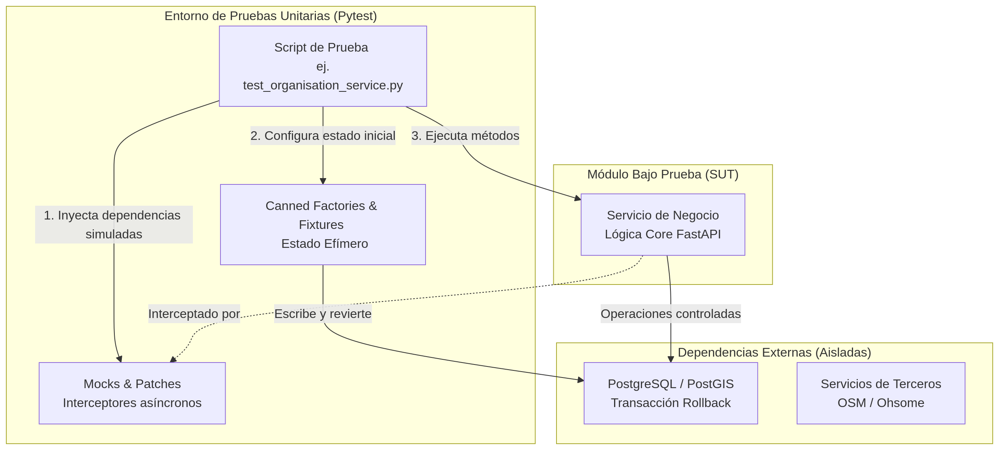

# Especificación de Pruebas Unitarias: Suite de Servicios Core y Lógica de Negocio

**Responsable:** Test Analyst (Integrante 2)  
**Dominio Funcional:** Lógica de Negocio Backend (FastAPI)  
**Estándar de Referencia:** ISO/IEC/IEEE 29119-4 (Especificación de Diseño de Pruebas)  

## 1. Base de Pruebas (Test Basis)

El presente documento establece los fundamentos analíticos y técnicos para el aseguramiento de calidad del módulo de servicios del backend de Tasking Manager. Este módulo representa el núcleo operativo de la arquitectura funcional, siendo el responsable de orquestar la creación de proyectos, la gestión de organizaciones, la administración del ciclo de vida de las tareas cartográficas y la validación de roles. 

Para cumplir con el estándar ISO 29119, esta base de pruebas delimita el alcance estructural del código fuente a evaluar, define la estrategia técnica de aislamiento utilizada en las pruebas existentes y expone los riesgos de negocio que justifican el esfuerzo de validación. El objetivo actual consiste en mapear el comportamiento técnico de estos componentes para habilitar el futuro diseño detallado de casos límite.

### 1.1. Arquitectura Técnica y Estrategia de Aislamiento

Las pruebas unitarias implementadas para el módulo de servicios operan bajo un paradigma de aislamiento estricto. El framework de testing adoptado por el proyecto es `pytest`, el cual interactúa profundamente con el motor asíncrono de FastAPI. Para garantizar que las pruebas del núcleo de negocio evalúen únicamente la lógica algorítmica y no la infraestructura subyacente, el equipo de desarrollo ha estructurado un ecosistema avanzado de *fixtures* y generadores de estado.

El siguiente diagrama ilustra cómo se estructura la ejecución de una prueba unitaria típica dentro de esta suite, garantizando que el servicio evaluado no genere mutaciones persistentes indeseadas ni dependa de latencias de red.

 

*(Propósito del diagrama: Demostrar el modelo de aislamiento de dependencias. Se evidencia cómo las "Canned Factories" y los "Mocks" envuelven al Servicio Core para asegurar la determinidad de la prueba, mitigando el riesgo de falsos positivos en el pipeline de CI/CD).*

### 1.2. Análisis Detallado de Componentes Críticos

El repositorio revela que la lógica de negocio se encuentra fragmentada en servicios altamente especializados ubicados en el directorio `backend/services/`. Entre los componentes más críticos que exigen cobertura estructural se encuentran el servicio de proyectos (`project_service.py`), el servicio de tareas (`task_service.py`) y el servicio de organizaciones (`organisation_service.py`). 

La criticidad del servicio de tareas radica en el manejo de la concurrencia. Cuando múltiples mapeadores intentan bloquear un mismo polígono espacial simultáneamente, el servicio debe prevenir condiciones de carrera (Race Conditions) mediante bloqueos transaccionales seguros. Cualquier brecha funcional en este componente resultaría en la corrupción de los datos de contribución. Por su parte, los servicios de proyectos y organizaciones actúan como guardianes del control de acceso, requiriendo un análisis profundo sobre la segregación de roles.

### 1.3. Comportamiento y Cobertura Actual: Servicio de Organizaciones

Como prueba de concepto del nivel de análisis requerido para esta suite, se ha auditado exhaustivamente el archivo `tests/backend/base/services/test_organisation_service.py`. Este archivo concentra las validaciones orientadas al comportamiento del servicio principal de organizaciones (`OrganisationService`), garantizando que la recuperación y manipulación de entidades respeten las reglas de autorización del sistema.

Dentro de la lógica de negocio, estas pruebas aseguran una correcta segregación de roles. El comportamiento esperado y automatizado dictamina que un usuario regular (mapeador) únicamente puede visualizar e interactuar con las organizaciones en las que ha sido designado explícitamente como administrador local (*manager*). En contraposición, la lógica técnica debe asegurar que un perfil con privilegios globales (`UserRole.ADMIN`) obtenga acceso absoluto a la colección completa de organizaciones, eludiendo las restricciones de asignación directa.

A nivel de implementación, las pruebas existentes dependen fuertemente de la inyección de fábricas de datos conocidas como *canned factories* (específicamente `create_canned_organisation` y `create_canned_user`). Estas herramientas permiten inicializar el estado de la base de datos temporal con entidades precisas antes de ejecutar las aserciones, tal como se observa en la configuración fundamental (fixture) de la clase de pruebas:

```python
    @pytest.fixture(autouse=True)
    async def setup_test_data(self, db_connection_fixture, request):
        assert db_connection_fixture is not None, "Database connection is not available"

        request.cls.test_org = await create_canned_organisation(db_connection_fixture)
        request.cls.test_user = await create_canned_user(db_connection_fixture)
        request.cls.db = db_connection_fixture

        assert self.test_org is not None, "Failed to create test organisation"
        assert self.test_user is not None, "Failed to create test user"
```

A través de esta suite automatizada, el proyecto actualmente previene y mitiga el riesgo de escalada de privilegios. Adicionalmente, las pruebas existentes garantizan que las consultas sobre identificadores inexistentes no desencadenen fallos catastróficos a nivel de framework (HTTP 500), forzando al servicio a capturar la anomalía y emitir una excepción controlada de tipo `NotFound`.

### 1.4. Identificación de Vacíos y Estrategia de Expansión

A pesar de la solidez técnica evidenciada en las pruebas del servicio de organizaciones, el análisis holístico del módulo revela áreas funcionales con baja cobertura. Actualmente, el repositorio exhibe una sólida cobertura sobre los "caminos felices" (Happy Paths) y la validación básica de roles. No obstante, existe un vacío documental y procedimental respecto a escenarios transaccionales límite.

La estrategia a implementar por los Test Designers en la próxima iteración consistirá en aplicar técnicas de diseño de caja negra, como el Análisis de Valores Límite, sobre los algoritmos de división geométrica en el `project_service.py` y técnicas de Tabla de Decisiones para los estados de transición en el `task_service.py`. Estas pruebas serán especificadas funcionalmente en esta Wiki para que los desarrolladores las implementen posteriormente utilizando TDD.

## 2. Condiciones de Prueba (TD2) y Cobertura (TD3)

A partir del análisis funcional, se establecen las siguientes condiciones lógicas transversales que deberán ser garantizadas por los scripts de prueba a lo largo del ciclo de vida del módulo.

| ID Condición | Funcionalidad Core a Evaluar | Técnica ISO 29119-4 Aplicable |
| :--- | :--- | :--- |
| COND-CORE-01 | Visualización de organizaciones limitada al rol de *Manager* frente a rol *Admin*. | Tabla de Decisiones |
| COND-CORE-02 | Captura controlada de excepciones al consultar entidades inexistentes. | Partición de Equivalencia |
| COND-CORE-03 | Prevención de bloqueos simultáneos sobre una misma tarea cartográfica (Concurrencia). | Casos de Uso / Diagrama de Transición de Estados |

## 3. Casos de Prueba (TD4 y TD6)

La siguiente sección registra la trazabilidad de los casos de prueba que ya han sido desarrollados en el código fuente, validando las condiciones analizadas previamente. El diseño exhaustivo de los casos límite faltantes se ejecutará en las siguientes semanas del cronograma funcional.

### 3.1. Pruebas Implementadas Existentes (Test Scripts)

El siguiente registro asegura que los esfuerzos de desarrollo actuales posean un respaldo funcional documentado, permitiendo conectar el requisito de negocio con el comportamiento automatizado.

| ID Caso | ID Condición | Comportamiento Esperado y Validado | Componente Automatizado | Estado |
| :--- | :--- | :--- | :--- | :--- |
| TC-ORG-001 | COND-CORE-02 | Retorna la entidad exacta cuando la consulta se realiza con un ID numérico válido. | `test_organisation_service.py` | Automatizado |
| TC-ORG-002 | COND-CORE-02 | Lanza excepción `NotFound` (HTTP 404) cuando el ID de la organización no existe en base de datos. | `test_organisation_service.py` | Automatizado |
| TC-ORG-003 | COND-CORE-01 | Retorna lista filtrada de organizaciones cuando el usuario posee rol *Manager*, excluyendo las no asignadas. | `test_organisation_service.py` | Automatizado |

### 3.2. Brechas Funcionales (Nuevas Pruebas a Implementar)

A continuación, se documentan las brechas identificadas que requieren ser priorizadas en las próximas asignaciones de TDD.

| ID Caso | ID Condición | Descripción de la Restricción Lógica | Resultado Esperado | Estado QA |
| :--- | :--- | :--- | :--- | :--- |
| TC-TSK-001 | COND-CORE-03 | Mapeador intenta bloquear una tarea que fue bloqueada hace menos de 1 segundo por otro usuario. | Excepción `TaskAlreadyLocked` | Pendiente TDD |
| TC-PRJ-001 | N/A | Administrador intenta crear un proyecto de mapeo sin definir un polígono GeoJSON válido. | Error de validación de entidad (400) | Pendiente TDD |

## 4. Métricas Base de Cobertura de Diseño

*Nota: Estas métricas reflejan únicamente la porción auditada del servicio de organizaciones y evolucionarán a medida que los Test Analysts completen el mapeo del servicio de tareas y proyectos.*

*   Total de Elementos de Cobertura Identificados (T): 5 (Casos TC-ORG-001 al TC-PRJ-001)
*   Total de Elementos Ejecutados/Automatizados (N): 3 (Casos ORG)
*   Cobertura de Diseño Inicial ($N/T * 100\%$): 60%
