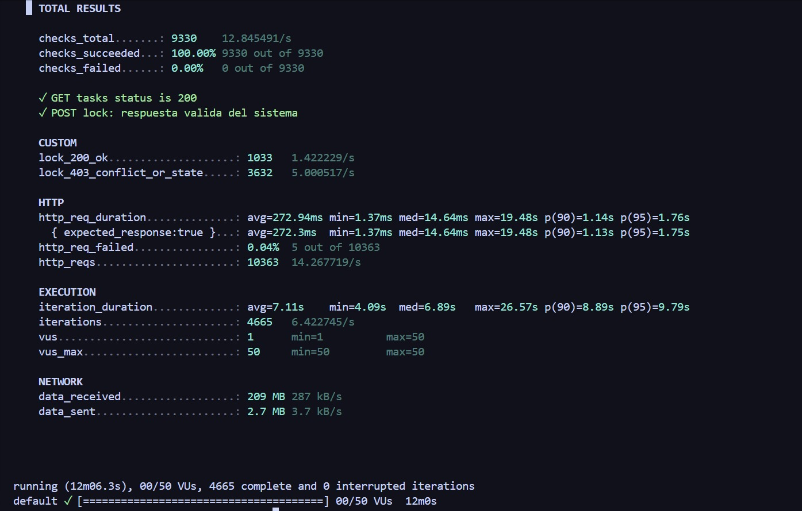

# Reporte de Ejecución: Pruebas de Sistema (Desempeño y Carga)

**Atributo de Calidad:** Desempeño y Carga (Performance Testing)
**Responsable de Ejecución:** Alexandra
**Fecha de Ejecución:** 19 de Julio de 2026
**Herramienta:** K6
**Métrica Objetivo (Libro de Myers):** Latencia `p(95) < 2000ms`, Tasa de Error `rate < 5%`

## 1. Resumen Ejecutivo de Resultados

La prueba de desempeño y carga fue ejecutada exitosamente simulando **50 usuarios concurrentes (VUs)** interactuando simultáneamente con la API de Tareas (bloqueo y desbloqueo de tareas de mapeo).

El sistema cumplió satisfactoriamente con los Criterios de Aceptación definidos en el Plan de Pruebas:

*   **Regla 1 — Velocidad (Latencia):** El 95% de las peticiones fueron respondidas en **1.76 segundos** (`p(95) = 1.76s`), manteniéndose por debajo del umbral máximo exigido de 2 segundos.
*   **Regla 2 — Tasa de Error:** Solo el **0.04%** de las peticiones fallaron, cumpliendo holgadamente el criterio de aceptación que toleraba hasta un 5% de error. (De cada 10,000 peticiones, solo 5 presentaron timeout).

## 2. Evidencia de Ejecución

## 3. Análisis de Desempeño y Contención de Base de Datos

Durante los 12 minutos de ejecución sostenida, se completaron 4,665 ciclos completos (iteraciones). En estos ciclos, 50 usuarios virtuales intentaron adquirir el bloqueo (*lock*) sobre la misma tarea simultáneamente. 

El desglose de códigos de respuesta demuestra un manejo de concurrencia impecable por parte del backend y la base de datos (PostGIS):

*   **`lock_200_ok` (1033 peticiones):** Representa las veces en las que un usuario virtual logró adquirir el bloqueo exitosamente.
*   **`lock_403_conflict_or_state` (3632 peticiones):** Representa los rechazos correctos del sistema. Cuando múltiples usuarios intentaron bloquear una tarea que ya había sido asignada milisegundos antes al usuario ganador, el sistema los rechazó apropiadamente (HTTP 403). **Esto demuestra la integridad transaccional**, asegurando que dos usuarios nunca pueden apropiarse de la misma tarea simultáneamente (Race Condition evitada). 
*   **`checks_succeeded: 100.00% (9330 de 9330)`**: Demuestra que el 100% de las respuestas del servidor fueron las esperadas (éxitos o rechazos controlados), sin presentar comportamientos anómalos o corrupciones de estado.

## 4. Conclusión

El sistema backend de Tasking Manager **soporta exitosamente 50 usuarios concurrentes** intentando bloquear tareas simultáneamente. Mantiene una tasa de error inferior al 0.1% y responde al 95% de las peticiones en menos de 1.8 segundos. Se da por **APROBADO** el Atributo 1 de Pruebas de Sistema (Desempeño y Carga).
